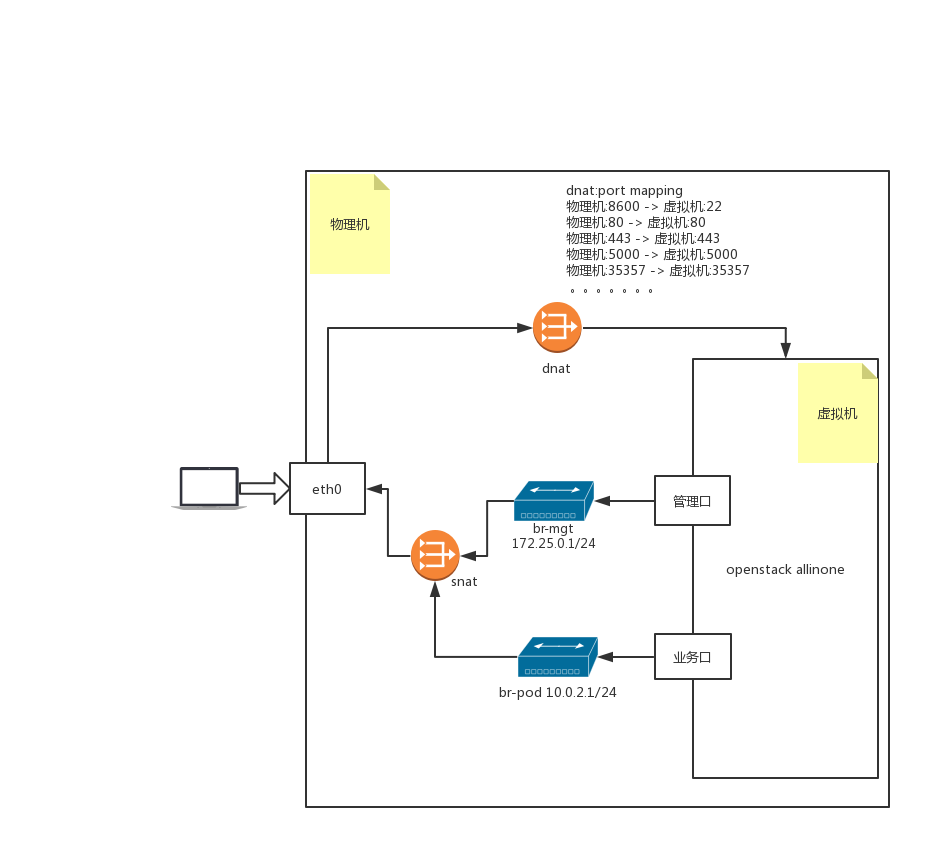

# lab-openstack

## lab-01 OpenStack API

1. API Quick Start
	- [OpenStack CLI Overview](https://docs.openstack.org/newton/user-guide/common/cli-overview.html)
		- [Install the OpenStack command-line clients](https://docs.openstack.org/newton/user-guide/common/cli-install-openstack-command-line-clients.html)

				# Ubuntu or Debian
				apt install python-dev python-pip

				# Red Hat Enterprise Linux, CentOS, or Fedora
				yum install python-devel python-pip

				# pip
				pip install python-openstackclient
		- [Set environment variables using the OpenStack RC file](https://docs.openstack.org/newton/user-guide/common/cli-set-environment-variables-using-openstack-rc.html)

				export OS_USERNAME=username
				export OS_PASSWORD=password
				export OS_TENANT_NAME=projectName
				export OS_AUTH_URL=https://identityHost:portNumber/v2.0
				# The following lines can be omitted
				export OS_TENANT_ID=tenantIDString
				export OS_REGION_NAME=regionName
				export OS_CACERT=/path/to/cacertFile
		- **[Demo]: List endpoints**

				openstack endpoint list
		- **[Demo]: List vm instances**

				openstack server list
		- **[Question]: How to create a server in a specific network?**
	- API vs CLI
		- **[Demo]: Show CLI's backend requests**

				openstack endpoint list -v --debug
		- **[Demo]: TcpDump**

				man tcpdump | less -Ip examples

				# HTTP GET
				tcpdump -s 0 -A 'tcp dst port 80 and tcp[((tcp[12:1] & 0xf0) >> 2):4] = 0x47455420'

				# HTTP POST
				tcpdump -s 0 -A 'tcp dst port 80 and (tcp[((tcp[12:1] & 0xf0) >> 2):4] = 0x504f5354)'

				# HTTP Response Head & Data
				tcpdump -A -s 0 'tcp port 80 and (((ip[2:2] - ((ip[0]&0xf)<<2)) - ((tcp[12]&0xf0)>>2)) != 0)'
				tcpdump -X -s 0 'tcp port 80 and (((ip[2:2] - ((ip[0]&0xf)<<2)) - ((tcp[12]&0xf0)>>2)) != 0)'
1. API Design
	- [Authentication]()
	- Compute
	- Storage
	- Network
1. Network Monitor Tools
	- Chrome Developer tools
	- Postman
	- Fiddler
	- Netmon & Wireshark

## lab-02 Automated Operations and Maintenance Framework

1. Fabric Quick Start
	- Auto-Mantanence Frameworks
	- SSH client configuration
	- Fabric Hello World
1. Fabric in Details
	- Fabric Common Steps
	- Deploy a website with Fabric
1. Ansible as a Plus
	- Ansible Hello World
	- Idempotency
1. Ansible Common Concepts
	- Inventory
	- Playbook
	- Role
	- Variables ( Global / Default )
	- Templates / Files
	- Handler
1. Ansible Common Modules
	- ping
	- shell
	- template
	- copy
1. AWX
	- AWX & Tower
	- AWX Hello World

## lab-03 OpenStack Ansible Provider

1. Ansible Cloud Provider
	- Azure
	- AWS
1. OpenStack Ansible Provider
	- OpenStack Ansible Hello World
	- Compute
	- Storage
	- Network
1. Demo: Deploy OpenShift in OpenStack

## lab-04 OpenStack kolla-ansible

1. Docker Quick Start
	- Docker Hello World
	- Docker Concepts
1. Debug in Docker Container
	- Docker logs
1. Kolla-Ansible Quick Start
	- Kolla-Achitecture
	- Build an environment with Ansible
		- Topology

			
		- [Ansible Scripts: Build OpenStack Environment](https://github.com/99cloud/lab-openstack/tree/master/src/ansible-build-openstack-env)
	- Install kolla-ansible in all-in-one mode
1. Kolla-Ansible Maintenance
	- Kolla-ansible multi-node installation
	- Scaling up

## lab-05 OpenStack Debug

1. Debug with DevStack
	- DevStack Installation
	- DevStack Debugging
1. Debug with Kolla-Ansible
	- Kolla-Ansible Logs
	- Kolla-Ansible Debugging