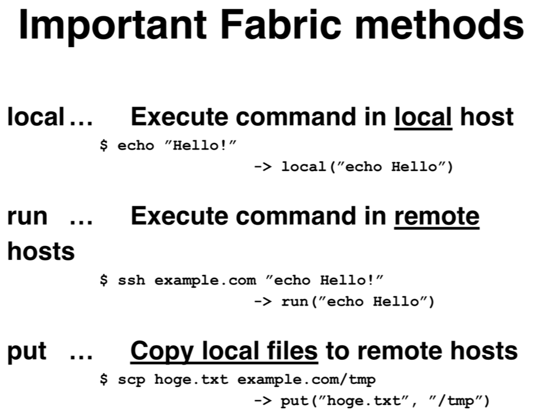
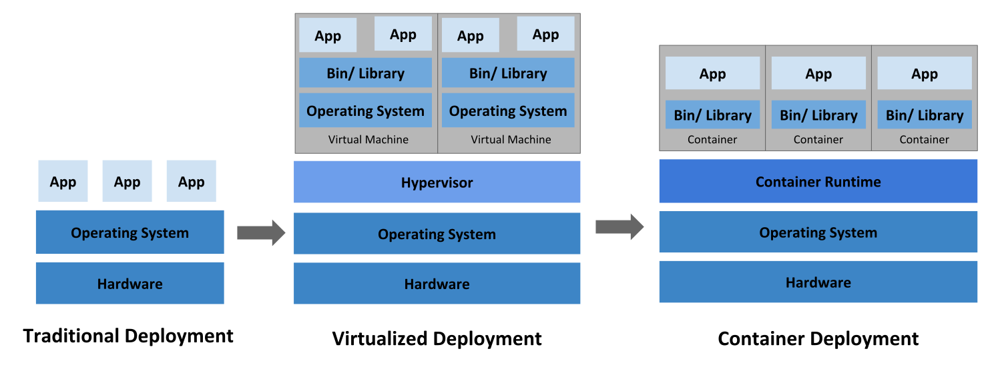
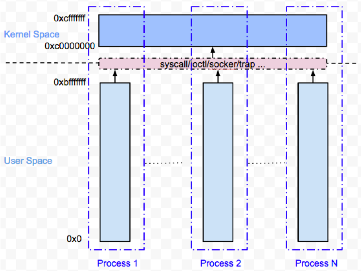

# lab-openstack

## Plan Table

| Date | Time | Content |
| ---- | ---- | ------- |
| 第 1 天 | 上午 | lab-01 OpenStack API |
| | 下午 | lab-02 Automated Operations and Maintenance Framework|
| 第 2 天 | 上午 | lab-03 OpenStack Ansible Provider |
| | 下午 | lab-04 OpenStack kolla-ansible |
| | | lab-05 OpenStack Debug |

## lab-01 OpenStack API

1. API Quick Start
	- [OpenStack CLI Overview](https://docs.openstack.org/newton/user-guide/common/cli-overview.html)
		- [Install the OpenStack command-line clients](https://docs.openstack.org/newton/user-guide/common/cli-install-openstack-command-line-clients.html)

				# Ubuntu or Debian
				apt install python-dev python-pip

				# Red Hat Enterprise Linux, CentOS, or Fedora
				yum install python-devel python-pip

				# pip
				pip install python-openstackclient
		- [Set environment variables using the OpenStack RC file](https://docs.openstack.org/newton/user-guide/common/cli-set-environment-variables-using-openstack-rc.html)

				export OS_USERNAME=username
				export OS_PASSWORD=password
				export OS_TENANT_NAME=projectName
				export OS_AUTH_URL=https://identityHost:portNumber/v2.0
				# The following lines can be omitted
				export OS_TENANT_ID=tenantIDString
				export OS_REGION_NAME=regionName
				export OS_CACERT=/path/to/cacertFile
		- [Demo]: List endpoints

				openstack endpoint list
		- [Demo]: List vm instances

				openstack server list
		- [Question]: How to create a server in a specific network?
	- API vs CLI
		- [Demo]: Show CLI's backend requests

				openstack endpoint list -v --debug
		- [Demo]: TcpDump examples

				man tcpdump | less -Ip examples

				# HTTP GET
				tcpdump -s 0 -A 'tcp dst port 80 and tcp[((tcp[12:1] & 0xf0) >> 2):4] = 0x47455420'

				# HTTP POST
				tcpdump -s 0 -A 'tcp dst port 80 and (tcp[((tcp[12:1] & 0xf0) >> 2):4] = 0x504f5354)'

				# HTTP Response Head & Data
				tcpdump -A -s 0 'tcp port 80 and (((ip[2:2] - ((ip[0]&0xf)<<2)) - ((tcp[12]&0xf0)>>2)) != 0)'
				tcpdump -X -s 0 'tcp port 80 and (((ip[2:2] - ((ip[0]&0xf)<<2)) - ((tcp[12]&0xf0)>>2)) != 0)'
1. API Design
	- [Authentication](https://docs.openstack.org/api-ref/identity/v3/), [stein version](https://docs.openstack.org/keystone/stein/api_curl_examples.html)
		- [Demo]: Get unscope token

				curl -i \
				  -H "Content-Type: application/json" \
				  -d '
				{ "auth": {
				    "identity": {
				      "methods": ["password"],
				      "password": {
				        "user": {
				          "name": "admin",
				          "domain": { "id": "default" },
				          "password": "94DAVjeokdwZ9OKmJ7cVmw9Gfb9aLlDbpddPYNdo"
				        }
				      }
				    }
				  }
				}' \
				  "http://172.25.0.100:35357/v3/auth/tokens"
		- [Demo]: Get endpoint list with unscope token
	- [Compute](https://docs.openstack.org/api-ref/compute/)
		- [Demo]: List servers
		- [Demo]: Launch a new server
	- [Block Storage](https://docs.openstack.org/api-ref/block-storage/v3/index.html)
		- [Demo]: Create a block storage
		- [Demo]: Attach to a specific server instance
	- [Network](https://docs.openstack.org/api-ref/network/v2/index.html)
		- [Demo]: Create a network
		- [Demo]: Create a subnet
		- [Question]: Create a router
1. Network Monitor Tools
	- Chrome Developer tools
		- [Demo]: Capture & Parse the HTTP requests
	- Postman
		- [Demo]: Send HTTP requests
		- [Question]: Get a token & Query endpoint list
	- Fiddler
		- [Demo]: Collect trace
		- [Demo]: Play back
	- Netmon & Wireshark
		- [Demo]: TCP handshake
		- [Demo]: TLS handshake
		- [Demo]: HTTP response data parser

## lab-02 Automated Operations and Maintenance Framework

1. Fabric Quick Start
	- Auto-Maintenance Frameworks
		- Ansible vs Others

			

		- Framework Differences

			
	- SSH client configuration

			Host training-01
			    HostName        training-01.maodouzi.net
			    User            root
			    IdentityFile    ~/.ssh/id_rsa_openstack
	
			Host training-01_aio
			    HostName        training-01.maodouzi.net
			    Port            8600
			    User            root
			    IdentityFile    ~/.ssh/id_rsa_openstack
	- SSH Proxy

			ProxyCommand    ssh fq -W %h:%p
			ProxyCommand    bash -c 'h=%h;ssh bastion -W ${h##prefix-}:%p'
	- Fabric Hello World

			$ cat fabfile.py
			
			from fabric.api import run 
			def hello(): 
			    run("hostname") 

			$ fab -H testhost hello
			
			[testhost] Executing task 'hello'
			[testhost] run: hostname
			[testhost] out: example.hostname.com 
			Done.
1. Fabric in Details
	- Fabric Concepts

		
	- Fabric Common Steps

		
		
		
	- [Demo]: [Deploy a website with Fabric](https://github.com/wu-wenxiang/Project-Python-Webdev/tree/master/u1604-fabric)
1. Ansible as a Plus
	- Ansible Architecture

		
	- Ansible Hello World
	- Idempotency
1. Ansible Common Concepts
	- Inventory
	- Playbook
	- Role
	- Variables ( Global / Default )
	- Templates / Files
	- Handler
1. Ansible Common Modules
	- ping
	- shell
	- template
	- copy
	- cron
	- mount
	- service
	- sysctl
	- user
	- stat
	- get_url
	- yum/apt
1. Demos
	- [Demo]: [Deploy a website with Ansible](https://github.com/wu-wenxiang/Project-Python-Webdev/tree/master/u1604-ansible)
1. AWX
	- AWX & Tower

		
	- AWX Hello World
1. Tereform
	- Tereform Hello World
		- [Demo]: OpenStack launch an instance

## lab-03 OpenStack Ansible Provider

1. [Ansible Cloud Provider](https://docs.ansible.com/ansible/latest/modules/list_of_cloud_modules.html)
	- Azure
		- [Demo]: Register DNS in Azure
		- [Demo]: Deploy openshift in Azure
	- Aliyun
1. OpenStack Ansible Provider
	- OpenStack Ansible Hello World
		- [Demo]: Get token
		- [Demo]: List endpoints
	- Compute
		- [Demo]: Create a server instance
	- Block Storage
		- [Demo]: Create a block storage
	- Network
		- [Demo]: Create a network
1. Demo: Deploy OpenShift in OpenStack

## lab-04 OpenStack kolla-ansible

1. Docker Quick Start
	- Docker Hello World
	- Docker Concepts
		- Virtualization Evolution

			

		- Docker Underlying Tech

			

		- Linux Container Namespaces

			

		- Docker Architecture

			
1. Debug in Docker Container
	- [Demo]: Check Docker logs
	- [Demo]: Start Container with different cmds
1. Kolla-Ansible Quick Start
	- Kolla-Achitecture
	- Build an environment with Ansible
		- Topology

			
		- [Ansible Scripts: Build OpenStack Environment](https://github.com/99cloud/lab-openstack/tree/master/src/ansible-build-openstack-env)
	- Install kolla-ansible in all-in-one mode
1. Kolla-Ansible Maintenance
	- Kolla-ansible multi-node installation
	- Scaling up

## lab-05 OpenStack Debug

1. Debug with DevStack
	- DevStack Installation
		- [Demo]: Devstack Installation
	- DevStack Debugging
		- [Demo]: Debug with DevStack
1. Debug with Kolla-Ansible
	- Kolla-Ansible Logs
		- [Demo]: Check logs
	- Kolla-Ansible Debugging
		- [Demo]: Kolla-Ansible Debugging
1. [Optional] RDO
	- RDO Installation