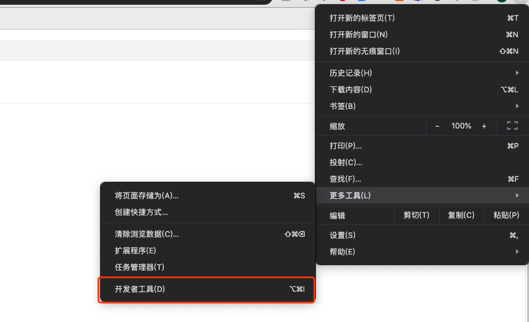
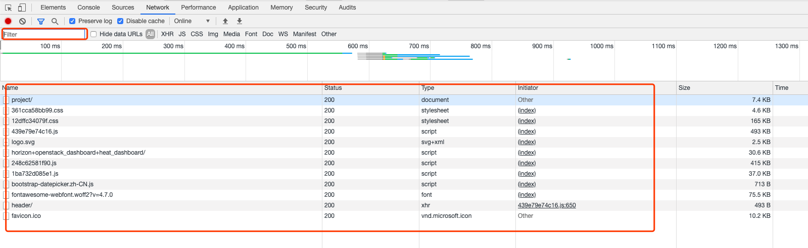
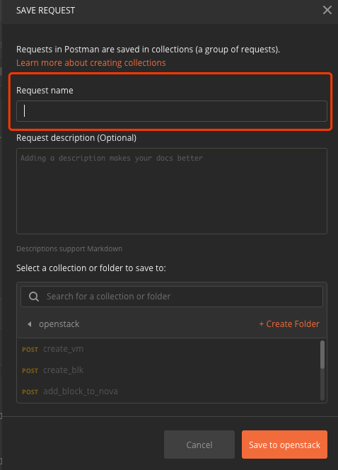
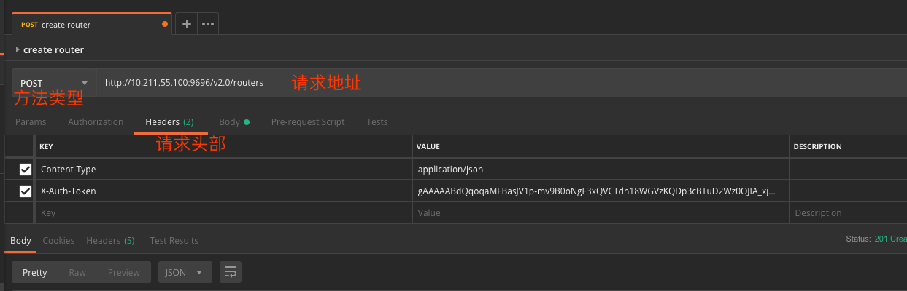
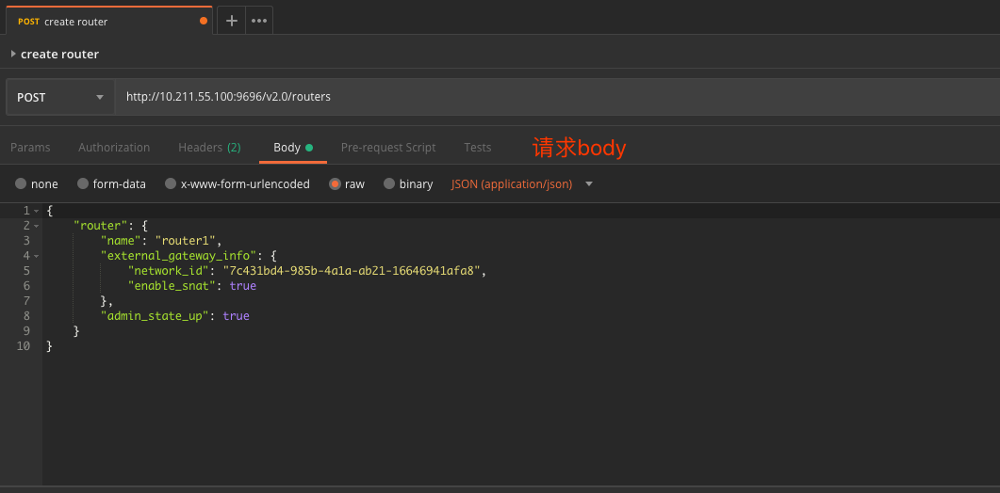
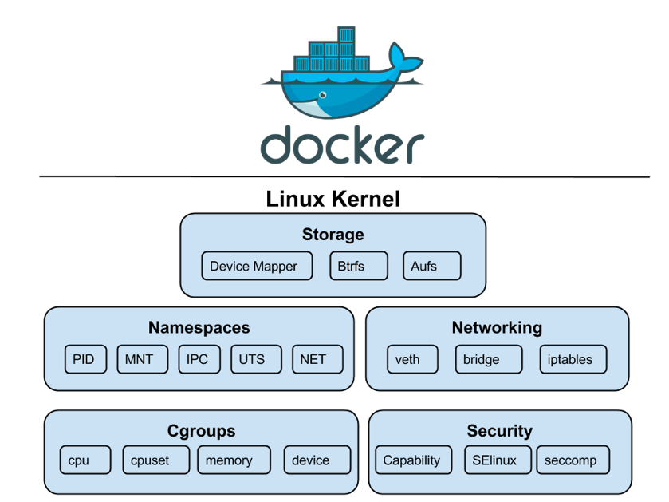

# lab-openstack

## Catalog

| Date | Time | Title | Content |
| ---- | ---- | ----- | ------- |
| 第 1 天 | 上午 | [lab-00 Prerequisites](#lab-00-prerequisites--catalog-) | [KVM Commands](#kvm-commands--catalog-) |
| | | | [SSH Tools](#ssh-tools--catalog-) |
| | | [lab-01 OpenStack API](#lab-01-openstack-api--catalog-) | [API Quick Start](#api-quick-start--catalog-) |
| | | | [API Design](#api-design--catalog-) |
| | | | [Network Monitor Tools](#network-monitor-tools--catalog-) |
| | 下午 | [lab-02 Automation Frameworks](#lab-02-automation-frameworks--catalog-) | [Fabric Quick Start](#fabric-quick-start--catalog-) |
| | | | [Fabric in Details](#fabric-in-details--catalog-) |
| | | | [Ansible as a Plus](#ansible-as-a-plus--catalog-) |
| | | | [Ansible Common Concepts](#ansible-common-concepts--catalog-) |
| | | | [Ansible Common Modules](#ansible-common-modules--catalog-) |
| | | | [Ansible Demo](#ansible-demo--catalog-) |
| | | | [[Optional] AWX](#optional-awx--catalog-) |
| | | | [Tereform](#tereform--catalog-) |
| 第 2 天 | 上午 | [lab-03 OpenStack Ansible Provider](#lab-03-openstack-ansible-provider--catalog-) | [Ansible Cloud Provider](#ansible-cloud-provider--catalog-) |
| | | | [OpenStack Ansible Provider](#openstack-ansible-provider--catalog-) |
| | 下午 | [lab-04 OpenStack kolla-ansible](#lab-04-openstack-kolla-ansible--catalog-) | [Docker Quick Start](#docker-quick-start--catalog-) |
| | | | [Debug in Docker Container](#debug-in-docker-container--catalog-) |
| | | | [Kolla-Ansible Quick Start](#kolla-ansible-quick-start--catalog-) |
| | | | [Kolla-Ansible Installation & Maintenance](#kolla-ansible-installation--maintenance--catalog-) |
| | | [lab-05 OpenStack Debug](#lab-05-openstack-debug--catalog-) | [Debug with DevStack](#debug-with-devstack--catalog-) |
| | | | [Debug with Kolla-Ansible](#debug-with-kolla-ansible--catalog-) |
| | | | [[Optional] RDO](#optional-rdo--catalog-) |

## lab-00 Prerequisites ( [Catalog](#catalog) )

### KVM Commands ( [Catalog](#catalog) )

1. List all vms

        virsh list --all

1. List a specific vm's snaphosts

        virsh snapshot-list <vm_name>
        virsh snapshot-list kolla-aio

1. Revert a vm by a specific snapshots

        virsh snapshot-revert <vm_name> --snapshotname <snapshot_name>
        virsh snapshot-revert kolla-aio --snapshotname kolla-aio.common_aio

1. Delete a vm by a specific snapshots with its name

        virsh snapshot-delete <vm_name> --snapshotname <snapshot_name>
        virsh snapshot-delete kolla-aio --snapshotname kolla-aio.common_aio

1. Remove a vm

        # Destroy a vm
        virsh snapshot-destroy <vm_name>
        virsh snapshot-destroy kolla-aio

        # Clear a specific vm's all snapshots

        virsh snapshot-list <vm_name> | awk '{print $1}' | xargs -i virsh snapshot-delete <vm_name> --snapshotname {}
        virsh snapshot-list kolla-aio | awk '{print $1}' | xargs -i virsh snapshot-delete kolla-aio --snapshotname {}

        # Remove a vm
        virsh undefine <vm_name>
        virsh undefine kolla-aio

### SSH Tools ( [Catalog](#catalog) )

1. [Putty](https://www.putty.org/) Config
    - Text font
    - Console log line number
    - Login user
    - [Optional]: Private cert

## lab-01 OpenStack API ( [Catalog](#catalog) )

### API Quick Start ( [Catalog](#catalog) )

1. [OpenStack CLI Overview](https://docs.openstack.org/newton/user-guide/common/cli-overview.html)
    - [Install the OpenStack command-line clients](https://docs.openstack.org/newton/user-guide/common/cli-install-openstack-command-line-clients.html)

            # Ubuntu or Debian
            apt install python-dev python-pip

            # Red Hat Enterprise Linux, CentOS, or Fedora
            yum install python-devel python-pip

            # pip
            pip install python-openstackclient
    - [Set environment variables using the OpenStack RC file](https://docs.openstack.org/newton/user-guide/common/cli-set-environment-variables-using-openstack-rc.html)

            export OS_USERNAME=username
            export OS_PASSWORD=password
            export OS_TENANT_NAME=projectName
            export OS_AUTH_URL=https://identityHost:portNumber/v2.0
            # The following lines can be omitted
            export OS_TENANT_ID=tenantIDString
            export OS_REGION_NAME=regionName
            export OS_CACERT=/path/to/cacertFile
    - [Demo]: List endpoints

            openstack endpoint list
    - [Demo]: List vm instances

            openstack server list
    - [Question]: How to create a server in a specific network?
1. API vs CLI
    - [Demo]: Show CLI's backend requests

            openstack endpoint list -v --debug
    - [Demo]: TcpDump examples

            man tcpdump | less -Ip examples

            # HTTP GET
            tcpdump -s 0 -A 'tcp dst port 80 and tcp[((tcp[12:1] & 0xf0) >> 2):4] = 0x47455420'

            # HTTP POST
            tcpdump -s 0 -A 'tcp dst port 80 and (tcp[((tcp[12:1] & 0xf0) >> 2):4] = 0x504f5354)'

            # HTTP Response Head & Data
            tcpdump -A -s 0 'tcp port 80 and (((ip[2:2] - ((ip[0]&0xf)<<2)) - ((tcp[12]&0xf0)>>2)) != 0)'
            tcpdump -X -s 0 'tcp port 80 and (((ip[2:2] - ((ip[0]&0xf)<<2)) - ((tcp[12]&0xf0)>>2)) != 0)'

### API Design ( [Catalog](#catalog) )

1. [Authentication](https://docs.openstack.org/api-ref/identity/v3/), [stein version](https://docs.openstack.org/keystone/stein/api_curl_examples.html)
    - [Demo]: Get unscope token

        ```bash
        curl -i \
          -H "Content-Type: application/json" \
          -d '
        { "auth": {
            "identity": {
              "methods": ["password"],
              "password": {
                "user": {
                  "name": "admin",
                  "domain": { "id": "default" },
                  "password": "94DAVjeokdwZ9OKmJ7cVmw9Gfb9aLlDbpddPYNdo"
                }
              }
            }
          }
        }' \
          "http://172.25.0.100:35357/v3/auth/tokens"
        ```
    - [Demo]: Get endpoint list with unscope token

        ```bash
        curl -s  -H "X-Auth-Token: ${TOKEN}"  http://192.168.1.25:5000/v3/endpoints | python -m json.tool
        ```
1. [Compute](https://docs.openstack.org/api-ref/compute/)
    - [Demo]: List servers

        ```bash
        [root@openstack ~]# curl -s  -H "X-Auth-Token: ${TOKEN}"  http://192.168.1.25:8774/v2.1/ed009b94405443b393a132bb75ae1de8/servers | python -m json.tool
        #http://192.168.1.25:8774/v2.1/ is your nova endponit
        #ed009b94405443b393a132bb75ae1de8 is your project id
        ```
    - [Demo]: Launch a new server

        ```bash
        curl -X POST \
          http://10.211.55.100:8774/v2.1/f3816430aded4dbd92b3faeda1a87e0b/servers \
          -H 'Content-Type: application/json' \
          -H 'X-Auth-Token: ${TOKEN}' \
          -d '{
            "server" : {
                "accessIPv4": "1.2.3.4",
                "accessIPv6": "80fe::",
                "name" : "new-server-test",
                "imageRef" : "eb901df6-801f-466f-8983-b55454b17cf5",
                "flavorRef" : "8ffeec2e-fc2d-496a-af53-5020849d630a",
                "networks" : [{
                    "uuid" : "0f2d90bc-da6d-4a0d-867e-e1a204e11f9f"
                }],
                "security_groups": [
                    {
                        "name": "default"
                    }
                ]
            }
        }'
        ```
1. [Block Storage](https://docs.openstack.org/api-ref/block-storage/v3/index.html)
    - [Demo]: Create a block storage

        ```bash
        curl -X POST \
          http://10.211.55.100:8776/v3/f3816430aded4dbd92b3faeda1a87e0b/volumes \
          -H 'Content-Type: application/json' \
          -H 'X-Auth-Token: ${TOKEN}' \
          -d '{
            "volume": {
                "size": 10,
                "availability_zone": null,
                "source_volid": null,
                "description": "test volume",
                "multiattach": false,
                "snapshot_id": null,
                "backup_id": null,
                "name": null,
                "imageRef": null,
                "volume_type": null,
                "metadata": {},
                "consistencygroup_id": null
            }
        }'
        ```
    - [Demo]: Attach to a specific server instance

        ```bash
        curl -X POST \
          http://10.211.55.100:8776/v3/f3816430aded4dbd92b3faeda1a87e0b/volumes/07178089-7017-4d53-bb02-65b0a1b02bb5/action \
          -H 'Content-Type: application/json' \
          -H 'X-Auth-Token: ${TOKEN}' \
          -d '{
            "os-attach": {
                "instance_uuid": "173d8d22-ce8e-4414-b286-008e33471d74",
                "mountpoint": "/dev/vdb"
            }
        }'
        ```
1. [Network](https://docs.openstack.org/api-ref/network/v2/index.html)
    - [Demo]: Create a network

        ```bash
        curl -X POST \
          http://10.211.55.100:9696/v2.0/networks \
          -H 'Content-Type: application/json' \
          -H 'X-Auth-Token: ${TOKEN}' \
          -d '{
            "network": {
                "name": "sample_network",
                "admin_state_up": true,
                "mtu": 1400
            }
        }'
        ```
    - [Demo]: Create a subnet

        ```bash
        curl -X POST \
          http://10.211.55.100:9696/v2.0/subnets \
          -H 'Content-Type: application/json' \
          -H 'X-Auth-Token: ${TOKEN}' \
          -d '{
            "subnet": {
                "network_id": "6f0b2c56-48ae-4981-89b2-bb5d1decb7ed",
                "ip_version": 4,
                "cidr": "192.168.199.0/24"
            }
        }'
        ```
    - [Question]: Create a router

### Network Monitor Tools ( [Catalog](#catalog) )

1. Chrome Developer tools
    - [Demo]: Capture & Parse the HTTP requests

        

        

        
1. Postman
    - [Demo]: Send HTTP requests

        

        

        

        

        

        ```bash
        #head内容如下
        X-Auth-Toke: gAAAAABdQqoqaMFBasJV1p-mv9B0o3xQVCTdhGQDp3cBTuD2Wz0OJIA_xjmZG9XzTw7H7Za1dv-PAyacGe6StIkdrE1sj8P9C4fS0wTp9gDExt1m1QZ2RSj0im5OLwF0fX14VH7fiQvytS3D3aaMkQ
        # token 可以通过openstack token issue 获取
        # Content-Type是postman自动添加的
        # 请求地址如下
        POST http://10.211.55.100:9696/v2.0/routers
        # http://10.211.55.100:9696 为neutron的endpoint，可以通以openstack endpoint list获取
        # /v2.0/routers 是api接口 可以通过openstack网站上获取
        # 请求的body如下
        {
            "router": {
                "name": "router1",
                "external_gateway_info": {
                    "network_id"7c431bd4-985b-4a1a-ab21-166fa8",
                    "enable_snat": true
                },
                "admin_state_up": true
            }
        }
        # network_id 为provider网络的id，可以通过openstack network list 获取到
        # 其他的属性可以参考openstack的neutron api获取
        ```

    - [Question]: Get a token & Query endpoint list
1. Fiddler
    - [Demo]: Collect trace
    - [Demo]: Play back
1. Netmon & Wireshark
    - [Demo]: TCP handshake
    - [Demo]: TLS handshake
    - [Demo]: HTTP response data parser

## lab-02 Automation Frameworks ( [Catalog](#catalog) )

### Fabric Quick Start ( [Catalog](#catalog) )

1. Auto-Maintenance Frameworks
    - Ansible vs Others

        

    - Framework Differences

        
1. SSH client configuration

        Host training-01
            HostName        training-01.maodouzi.net
            User            root
            IdentityFile    ~/.ssh/id_rsa_openstack

        Host training-01_aio
            HostName        training-01.maodouzi.net
            Port            8600
            User            root
            IdentityFile    ~/.ssh/id_rsa_openstack
1. SSH Proxy

        ProxyCommand    ssh fq -W %h:%p
        ProxyCommand    bash -c 'h=%h;ssh bastion -W ${h##prefix-}:%p'
1. Fabric Hello World

        $ cat fabfile.py

        from fabric.api import run
        def hello():
            run("hostname")

        $ fab -H testhost hello

        [testhost] Executing task 'hello'
        [testhost] run: hostname
        [testhost] out: example.hostname.com
        Done.

### Fabric in Details ( [Catalog](#catalog) )

1. Fabric Concepts

    
1. Fabric Common Steps

    

    
1. [Demo]: [Deploy a website with Fabric](https://github.com/wu-wenxiang/Project-Python-Webdev/tree/master/u1604-fabric)

### Ansible as a Plus ( [Catalog](#catalog) )

1. Ansible Architecture

    
1. Ansible Hello World
1. Idempotency

### Ansible Common Concepts ( [Catalog](#catalog) )

1. Inventory
1. Playbook
1. Role
1. Variables ( Global / Default )
1. Templates / Files
1. Handler

### Ansible Common Modules ( [Catalog](#catalog) )

1. ping
1. shell
1. template
1. copy
1. cron
1. mount
1. service
1. sysctl
1. user
1. stat
1. get_url
1. yum/apt

### Ansible Demo ( [Catalog](#catalog) )

1. [Demo]: [Deploy a website with Ansible](https://github.com/wu-wenxiang/Project-Python-Webdev/tree/master/u1604-ansible)
1. [Demo]: Deploy OpenShift

### [Optional] AWX ( [Catalog](#catalog) )

1. AWX & Tower

    
1. AWX Hello World

### Tereform ( [Catalog](#catalog) )

1. Tereform Hello World
    - [Demo]: OpenStack launch an instance

## lab-03 OpenStack Ansible Provider ( [Catalog](#catalog) )

### [Ansible Cloud Provider](https://docs.ansible.com/ansible/latest/modules/list_of_cloud_modules.html) ( [Catalog](#catalog) )

1. Azure
    - [Demo]: Register DNS in Azure
    - [Demo]: Deploy openshift in Azure
1. Aliyun

### OpenStack Ansible Provider ( [Catalog](#catalog) )

1. OpenStack Ansible Hello World
    - [Demo]: Get token

        ```yaml
        - name:
            hosts: localhost
            tasks: Get token
            - name: Retrieve an auth token
                auth:
                auth_url: http://172.16.120.251:5000/v3
                username: admin
                password: 94DAVjeokdwZ9OKmJ7cVmw9Gfb9aLlDbpddPYNdo
                user_domain_name: default
            - name: Show auth token
                debug:
                var: auth_token
        ```

1. Compute
    - [Demo]: Create a server instance

        ```yaml
        - name: Create a server instance
          hosts: localhost
          tasks:
            - name: Launch a instance
              os_server:
                auth:
                  auth_url: http://172.16.120.251:5000/v3
                  username: admin
                  password: 94DAVjeokdwZ9OKmJ7cVmw9Gfb9aLlDbpddPYNdo
                  user_domain_name: default
                state: present
                name: new-server-test
                image: eb901df6-801f-466f-8983-b55454b17cf5
                flavor: 8ffeec2e-fc2d-496a-af53-5020849d630a
                network: 0f2d90bc-da6d-4a0d-867e-e1a204e11f9f
                security_groups: default
        ```
    - [Demo]: List server instance

        ```yaml
        - name: List server instance
          hosts: localhost
          tasks:
            - name: List server instance
              os_server_facts:
                auth:
                  auth_url: http://172.16.120.251:5000/v3
                  username: admin
                  password: 94DAVjeokdwZ9OKmJ7cVmw9Gfb9aLlDbpddPYNdo
                  user_domain_name: default
                server: new-server-test
        ```
1. Block Storage
    - [Demo]: Create a block storage

        ```yaml
        - name: Create a block storage
          hosts: localhost
          tasks:
            - name: Create a volume
              os_volume:
                auth:
                  auth_url: http://172.16.120.251:5000/v3
                  username: admin
                  password: 94DAVjeokdwZ9OKmJ7cVmw9Gfb9aLlDbpddPYNdo
                  user_domain_name: default
                state: present
                size: 10
                display_name: "test volume"
        ```
1. Network
    - [Demo]: Create a network

        ```yaml
        - name: Create a network
            hosts: localhost
            tasks:
            - name: Create a network
                os_network:
                auth:
                    auth_url: http://172.16.120.251:5000/v3
                    username: admin
                    password: 94DAVjeokdwZ9OKmJ7cVmw9Gfb9aLlDbpddPYNdo
                    user_domain_name: default
                state: present
                name: sample_network
        ```

## lab-04 OpenStack kolla-ansible ( [Catalog](#catalog) )

### Docker Quick Start ( [Catalog](#catalog) )

1. Docker Hello World
1. Docker Concepts
    - Virtualization Evolution

        

    - Docker Underlying Tech

        

    - Linux Container Namespaces

        

    - Docker Architecture

        

### Debug in Docker Container ( [Catalog](#catalog) )

1. View stdout history with the logs command.

        $ docker run -d --name=logtest alpine /bin/sh -c “while true; do sleep 2; df -h; done”
        35f6353d2e47ab1f6c34073475014f4ab5e0b131043dca4454f67be9d8ef1253
        $ docker logs logtest
        Filesystem Size Used Available Use% Mounted on
        none 93.7G 2.0G 87.0G 2% /
        tmpfs 3.8G 0 3.8G 0% /dev
        tmpfs 3.8G 0 3.8G 0% /sys/fs/cgroup
        ... etc ...

    - This history is available even after the container exits
    - as long as its file system is still present on disk (until it is removed with docker rm).
    - The data is stored in a json file buried under /var/lib/docker.
    - The log command takes options that allow you to follow this file, basically tail -f, as well as choose how many lines the command returns (tail -n).
1. Stream stdout with the attach command.
If you want to see what is written to stdout in real time then the attach command is your friend.

        $ docker run -d --name=logtest alpine /bin/sh -c “while true; do sleep 2; df -h; done”
        26a329f1e7074f0c0f89caf266ad145ab427b1bcb35f82557e78bafe053faf44
        $ docker attach logtest
        Filesystem Size Used Available Use% Mounted on
        none 93.7G 2.0G 87.0G 2% /
        tmpfs 3.8G 0 3.8G 0% /dev
        tmpfs 3.8G 0 3.8G 0% /sys/fs/cgroup
        … etc …
        Filesystem Size Used Available Use% Mounted on
        none 93.7G 2.0G 87.0G 2% /
        tmpfs 3.8G 0 3.8G 0% /dev
        tmpfs 3.8G 0 3.8G 0% /sys/fs/cgroup
        … etc …
    - By default this command attaches stdin and proxies signals to the remote process. Options are available to control both of these behaviors.
    - To detach from the process use the default `ctrl-p ctrl-q` sequence.
    - Note that running a command in a loop the way I am above can make detaching a little wonky, but it works fine for normal stuff.
1. Execute arbitrary commands with exec.
Maybe the most powerful all-around tool in your kit, the exec command allows you to run arbitrary commands inside a running container.

        $ docker run -d --name=exectest alpine watch "echo 'This is a test.' >> /var/log/test.log"
        70ddfdf5169e755177a812959808973c92974dba2531c42a21ad9e50c8a4804c
        $ docker exec exectest cat /var/log/test.log
        This is a test.
        This is a test.
        This is a test.
        This is a test.

        # You can even use exec to get an interactive shell in the container.

        $ docker run -d --name=exectest alpine watch “echo ‘This is a test.’ >> /var/log/test.log”
        91e46bf5d19d4239a2f30af06669d4263580a01187d2290c33d7dee110f76356
        $ docker exec -it exectest /bin/sh
        / # ls -al /var/log
        total 12
        drwxr-xr-x 2 root root 4096 Mar 23 05:37 .
        drwxr-xr-x 10 root root 4096 Mar 23 05:37 ..
        -rw-r — r — 1 root root 192 Mar 23 05:38 test.log
        / # exit
        $
    - Note that exec only works while the container is running. So for a container that is crashing you’ll need to fall back on the logs command.
1. Override the ENTRYPOINT.
    - Every docker image has an entrypoint and command, whether defined in the dockerfile at build time or as an option to the docker run command at run time. The relationship between entrypoint and command can be a little confusing, and there are different ways to use them, but here is one setup that follows best practices and gives you a lot of customization ability.
    - Let’s say you are running a django app. First, you define the python process that runs the app as the entry point. This will make sure it is pid 1 inside the container. You can do this in the dockerfile.
    - `ENTRYPOINT ["python", "manage.py", "runserver"]`
    - You can also do it on the command line when docker run is called, and that is where the cool comes in. If the entry point is specified on the command line then it overrides any entry point set in the dockerfile when the image was built. This can be a powerful tool. Imagine a situation where the django image in this example was crashing due to a configuration problem. Instead of running manage.py you want to get a shell and poke around.
    - `docker run -d -p 80:80 --entrypoint /bin/sh /myrepo/mydjangoapp`
    - Now you can jump in, check the config, even try to run the manage.py command interactively to see what happens.
1. Add options with the CMD.
    - Back to that confusing relationship between ENTRYPOINT and CMD. Here’s one way to look at it: the ENTRYPOINT defines the process that runs as PID 1 in the container, and the CMD adds options to it.
    - If you don’t specify an ENTRYPOINT but you do specify a CMD then the implicit entrypoint is /bin/sh -c. CMD, like ENTRYPOINT, can be specified on the command line when docker run is called, which makes it another powerful tool for modifying container behavior. However, the usage is a little different.
    - `docker run -d -p 80:8000 /myrepo/mydjangoapp 0.0.0.0:8000`
    - Anything that appears after the image name in the docker run command is passed to the container and treated as CMD arguments, basically as if it were specified in the dockerfile like this:

            ENTRYPOINT ["python", "manage.py", "runserver"]
            CMD ["0.0.0.0:8000"]
    - Additional arguments can be passed as space-delimited parameters to the docker run call. This is a very convenient and flexible way to reconfigure an image for debugging purposes, by passing an option to increase log verbosity, for example.
1. Pause and unpause a container.
    - I doubt you’ll have use for this one very often, but it’s cool so I’m throwing it in here anyway. Using the docker pause command you can pause all of the processes inside a container.

            $ docker run -d --name=pausetest alpine /bin/sh -c “while true; do sleep 2; date; done”
            e81e1bc519e4eb2e30a1c1e57198f0060147fa749ff8f93ba4f69bdf8a114311
    - The container is just echoing the date to stdout, so we can watch it with the attach command.

            $ docker attach pausetest
            Wed Mar 23 06:21:40 UTC 2016
            Wed Mar 23 06:21:42 UTC 2016
    - Now pause the container, wait a bit, then unpause it.

            $ docker pause pausetest
            pausetest
            $ docker unpause pausetest
            pausetest
    - And back in our other window where attach is running…

            mark@viking:~/workspace/cluster-iperf$ docker attach pausetest
            Wed Mar 23 06:21:40 UTC 2016
            Wed Mar 23 06:21:42 UTC 2016
            Wed Mar 23 06:22:06 UTC 2016
            Wed Mar 23 06:22:08 UTC 2016
    - Actually I don’t have to stretch my imagination too much to come up with scenarios where this would be useful. It might be nice to freeze the current state of a server while I eat lunch or something.
1. Get process stats with the top command.
    - The docker top command is exactly what it sounds like: top that runs in the container.

            $ docker run -d — name=toptest alpine:3.1 watch “echo ‘Testing top’”
            fc54369116fe993ae45620415fb5a6376a3069cdab7c206ac5ce3b57006d4241
            $ docker top toptest
            UID PID … TIME CMD
            root 26339 … 00:00:00 watch “echo ‘Testing top’”
            root 26370 … 00:00:00 sleep 2
    - Some columns removed to make it fit here. There is also a docker stats command that is basically top for all the containers running on a host.
1. View container details with the inspect command.
    - The **inspect** command returns information about a container or an image. Here’s an example of running it on the toptest container from the last example above.

            $ docker inspect toptest
            [
              {
                “Id”: “fdb3008e70892e14d183f8 ... 020cc34fec9703c821”,
                “Created”: “2016–03–23T17:45:01.876121835Z”,
                “Path”: “/bin/sh”,
                “Args”: [
                  “-c”,
                  “while true; do sleep 2; echo ‘Testing top’; done”
                ],
                … and lots, lots more.
              }
            ]
    - I’ve skipped the bulk of the output because there’s a lot of it. Some of the more valuable bits of intelligence you can get are:
        - Current state of the container. (In the “State” property.)
        - Path to the log history file. (In the “LogPath” field.)
        - Values of set environment vars. (In the “Config.Env” field.)
        - Mapped ports. (In the “NetworkSettings.Ports” field.)
        - Probably the most valuable use of inspect for me in the past has been getting the values of environment vars.
        - Even with largely automated deployments I’ve run into issues in the past where the wrong arg was passed to a command and a container ended up running with vars set to incorrect values. When one of your cloud containers starts choking commands like inspect can be a quick cure.
1. View image layers with the history command.
    - This one is more of a build time diagnostic tool, but the questions it answers sometimes come up in debugging situations as well. The docker history command shows the individual layers that make up an image, along with the commands that created them, their size on disk, and hashes.
    - `$ docker history alpine`
    - The returned table is quite wide so I won’t try to illustrate it here. If you run into a situation where the contents of your image aren’t what you expect, this command may solve your puzzle for you.
1. Run one process in each container.
    - This last one is less of a debugging tip, and more of a best practice that will definitely make debugging, and reasoning about the state of your container a lot easier. Docker containers are meant to run a single process that is PID 1 inside the sandbox. You can make that process a shell and spin up a bunch of stuff in the background, or you can make it supervisord and do the same, but it’s not really what containers are good at and it hobbles systems meant to manage and monitor them.
    - The main benefit of running one process per container is that it’s easier to reason about the state of the container at run time. The container comes up when the process comes up and dies when it dies, and platforms like Docker Compose, kubernetes, and Amazon ECS can see that and restart it. They can also monitor the health (liveness and readiness) of a single-process container, but it is much more difficult to define declaratively what either of those things means when they depend on multiple processes being in good health inside the container.

### Kolla-Ansible Quick Start ( [Catalog](#catalog) )

1. Kolla-Achitecture, reference: [Building a Containerized OpenStack Lab](https://networkop.co.uk/blog/2017/09/08/os-lab-docker/)

    
1. Build an environment with Ansible
    - Topology map

        
    - [Ansible Scripts: Build OpenStack Environment](https://github.com/99cloud/lab-openstack/tree/master/src/ansible-build-openstack-env)

### Kolla-Ansible Installation & Maintenance ( [Catalog](#catalog) )

1. [OpenStack Stein Kolla Reference](https://docs.openstack.org/kolla-ansible/stein/)
1. [Demo]: [kolla-ansible installation in all-in-one mode](https://github.com/99cloud/lab-openstack/blob/master/doc/installation-kolla-all-in-one.md)
1. [Demo]: [kolla-ansible installation in multi-node mode](https://github.com/99cloud/lab-openstack/blob/master/doc/installation-kolla-multinode.md)
1. [Demo]: [kolla-ansible maintenance](https://github.com/99cloud/lab-openstack/blob/master/doc/maintenance-kolla.md)
    - OpenStack Upgrade
    - OpenStack Nodes Scaling up

## lab-05 OpenStack Debug ( [Catalog](#catalog) )

### Debug with DevStack ( [Catalog](#catalog) )

1. DevStack Installation
    - [Demo]: Devstack Installation
1. DevStack Debugging
    - [Demo]: Debug with DevStack

### Debug with Kolla-Ansible ( [Catalog](#catalog) )

1. Kolla-Ansible Logs
    - [Demo]: Check logs
        - 常用的查看log方法是查看 docker logs container_name 来查看容器的前台进程日志
        - 所有的log存在`/var/lib/docker/volumes/kolla_logs/_data/{project_name}`也就是服务进程的后台日志
1. Kolla-Ansible Debugging
    - [Demo]: Kolla-Ansible Debugging
        - 如果是bootstrap容器失败，那么需要检查数据库连接，并且手动登录到数据库，删除对应的库，重新deploy
        - kolla-ansible部署中，加上一个tee或者保存一下日志是个比较好的方法
        - 当容器起不来的时候，可以修改/etc/kolla/{service}/下面的config.json,把command中的启动命令修改成sleep infinity等命令，那么可以exec到容器里进行代码的调试

### [Optional] RDO ( [Catalog](#catalog) )

1. [Demo]: [RDO Installation](https://github.com/99cloud/lab-openstack/blob/master/doc/installation-rdo-all-in-one.md)
