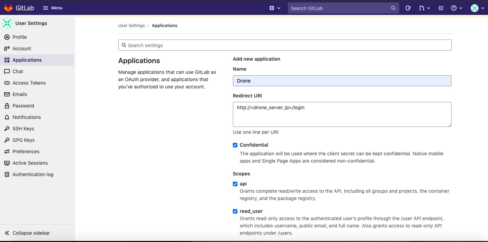
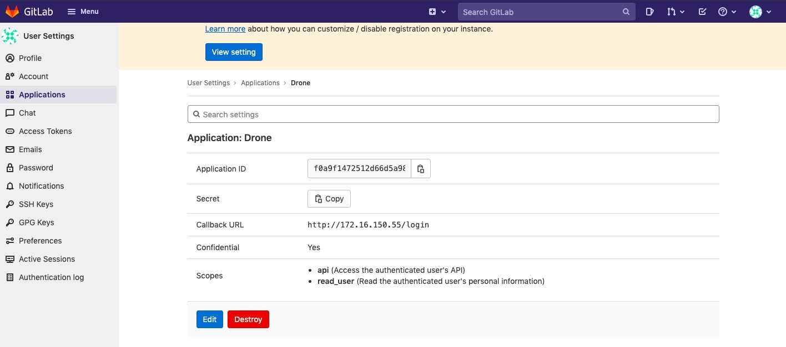

# gitlab + drone 部署

## 1. 准备

本文档为 all-in-one 部署方式

| CPU/核 | 内存/G | 根磁盘/G | 数据盘/G | 数据盘挂载目录 | 网卡/张 |
| ----- | ---- | ----- | ----- | ------- | ---- |
| 8     | 16   | 100   | 无     | 无       | 1    |

## 2. 环境安装

1. 安装 yum-utils 包（提供 yum-config-manager 实用程序）并设置稳定存储库

   ```bash
   yum update -y
   yum install -y yum-utils
   yum-config-manager --add-repo https://download.docker.com/linux/centos/docker-ce.repo
   ```

2. 安装最新版本 docker engine

   ```bash
   yum install docker-ce docker-ce-cli containerd.io
   ```

3. 启用 docker

   ```bash
   systemctl start docker
   systemctl enable docker
   ```

4. 安装所需依赖包

   ```console
   yum install gcc libffi-devel make wget -y
   yum group install 'Development Tools' -y
   ```

## 3. gitlab 安装

> 官方文档：<https://docs.gitlab.com/ee/install/docker.html#installation>

1. 下载 gitlab-ce 社区版镜像

   ```bash
   docker pull gitlab/gitlab-ce:14.4.2-ce.0
   ```

2. 设置卷位置并安装 gitlab，本文中建议的数据卷 mount 路径在 `/srv/gitlab`

   ```bash
   export GITLAB_HOME=/srv/gitlab

   docker run --detach   --hostname gitlab.example.com   --publish 9001:443 --publish 80:80  --publish 7001:22  --name gitlab   --restart always   --volume $GITLAB_HOME/config:/etc/gitlab   --volume $GITLAB_HOME/logs:/var/log/gitlab   --volume $GITLAB_HOME/data:/var/opt/gitlab   gitlab/gitlab-ce:14.4.2-ce.0
   ```

3. 编辑 /srv/gitlab/config/gitlab.rb 文件，完成后重启 gitlab 容器

   ```conf
   # external_url 'GENERATED_EXTERNAL_URL'
   external_url 'http://<gitlab_ip>'

   gitlab_rails['gitlab_shell_ssh_port'] = 7001
   ```

4. 检查启动情况

   ```bash
   docker logs gitlab
   # 此时应看到启动过程中没有错误信息

   netstat -putln
   # 此时应能看到 gitlab 开启的端口信息
   ```

5. 验证

   打开 `http://<gitlab_ip>` 网页

## 4. drone 安装

### 4.1 gitlab 配置

- 在 `User Settings -> Applications` 中添加 New application，并获得 `Application ID` 和 `Secret`

  > **注:** 在 AIO scenaio 的情况下，URI 为设置 `http://<drone_ip>:8003/login`

  

  

- 在 `Admin Area -> Network` 中设置 Outbound requests

  

### 4.2 拉取 drone 镜像并启动服务

> **注：**\
> $GITLAB_CLIENT_ID 为步骤1中获取的 Application ID\
> $GITLAB_CLIENT_SECRET 为步骤1中获取的 Secret\
> DRONE_RPC_SECRET=$(openssl rand -hex 16)\
> ADMIN_USER_TOKEN=$(openssl rand -hex 16)

```bash
docker pull drone/drone:2.4.0

docker run \
--volume=/srv/docker/drone:/var/lib \
--env=DRONE_GITLAB_SERVER=http://<gitlab_ip>:80 \
--env=DRONE_GITLAB_CLIENT_ID=$GITLAB_CLIENT_ID \
--env=DRONE_GITLAB_CLIENT_SECRET=$GITLAB_CLIENT_SECRET \
--env=DRONE_RPC_SECRET=$DRONE_RPC_SECRET \
--env=DRONE_SERVER_HOST=<drone_server_ip>:8003 \
--env=DRONE_SERVER_PROTO=http \
--env=DRONE_USER_CREATE=username:<drone_admin_username>,admin:true,token:$ADMIN_USER_TOKEN \
--publish=8003:80 --publish=9003:443 \
--restart=always \
--detach=true \
--name=drone drone/drone:2.4.0
```

登录 gitlab，打开 `http://<drone_server_ip>:8003` 网页，跳转 drone 验证页面

点击 `continue` 按钮，跳转 gitlab 授权页，自动重定向到 drone 注册页面，完成注册即可登录

### 4.3 drone CLI 安装与配置

```bash
# 安装
curl -L https://github.com/harness/drone-cli/releases/latest/download/drone_linux_amd64.tar.gz | tar zx
sudo install -t /usr/local/bin drone

# 配置
export DRONE_SERVER=http://<drone_server_ip>:8003
export DRONE_TOKEN=$ADMIN_USER_TOKEN

# 验证
drone info
```

问题处理：

- 对 drone 某个非 admin 用户进行 admin 授权

```bash
# CLI
export DRONE_SERVER=http://<drone_server_ip>:8003
export DRONE_TOKEN=$ADMIN_USER_TOKEN
drone user update <username> --admin
```

### 4.5 drone docker runner 安装

> **注：** $DRONE_RPC_SECRET 与 drone server 中设置的一致

```bash
docker pull drone/drone-runner-docker:1.7.0

docker run -d -v /var/run/docker.sock:/var/run/docker.sock \
-e DRONE_RPC_PROTO=http \
-e DRONE_RPC_HOST=<drone_server_ip>:8003 \
-e DRONE_RPC_SECRET=$DRONE_RPC_SECRET \
-e DRONE_RUNNER_CAPACITY=2 \
-e DRONE_RUNNER_NAME=<drone_runner_name> \
-p 8004:80 --restart always --name runner \
drone/drone-runner-docker:1.7.0
```

### 4.6 drone exec runner 安装

1. 下载并安装 drone runner exec

   ```bash
   curl -L https://github.com/drone-runners/drone-runner-exec/releases/download/v1.0.0-beta.9/drone_runner_exec_linux_amd64.tar.gz | tar zx
   sudo install -t /usr/local/bin drone-runner-exec
   ```

2. 配置并启动 drone runner exec 服务

   > **注：** $DRONE_RPC_SECRET 与 drone server 中设置的一致

   ```bash
   mkdir -p /etc/drone-runner-exec
   mkdir -p /var/log/drone-runner-exec

   echo "DRONE_RPC_PROTO=http" >> /etc/drone-runner-exec/config
   echo "DRONE_RPC_HOST=<drone_server_ip>:8003" >> /etc/drone-runner-exec/config
   echo "DRONE_RPC_SECRET=$DRONE_RPC_SECRET" >> /etc/drone-runner-exec/config
   echo "DRONE_RUNNER_CAPACITY=4" >> /etc/drone-runner-exec/config
   echo "DRONE_RUNNER_NAME=<drone_exec_name>" >> /etc/drone-runner-exec/config
   echo "DRONE_DEBUG=true" >> /etc/drone-runner-exec/config
   echo "DRONE_LOG_FILE=/var/log/drone-runner-exec/log.txt" >> /etc/drone-runner-exec/config

   drone-runner-exec service install
   drone-runner-exec service start
   ```

3. 验证

   ```bash
   cat /var/log/drone-runner-exec/log.txt

   # log 正常输出
   # starting the server
   # successfully pinged the remote server
   ```

## 5. demo

gitlab 上创建名为 test 的项目

登录 drone，同步 gitlab 项目，进入 `test -> Settings` 中，点击 activate 按钮激活并配置

- 自动触发

  本地拉取 test 项目，添加 test/.drone.yml 文件，执行 `git push`，查看 drone 界面，显示 EXECUTIONS 已完成

  ```yaml
  # .drone.yml 示例文档
  kind: pipeline
  type: docker
  name: tools-drone

  steps:
    - name: test
      image: alpine
      commands:
        - echo hello
    trigger:
      event:
        - push
        - custom
  ```

- 手动触发

  在 drone 界面中，进入 `test -> NEW BUILD` 中，填写参数并创建
