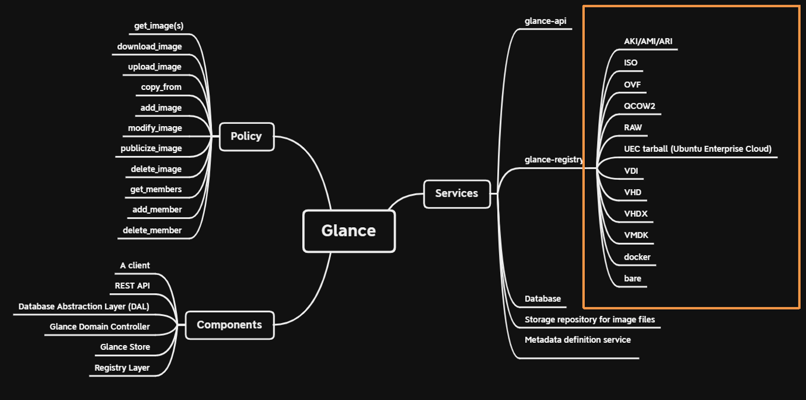
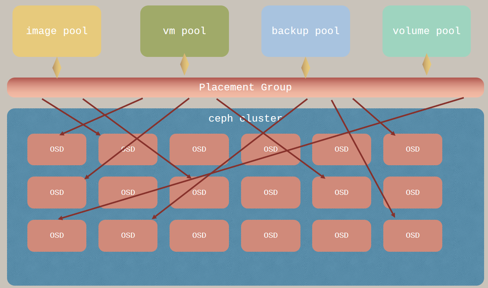

# OpenStack-Administration

## Prefix

- 授课时长：
    - 上午：9:30 至 11:30
    - 下午：13:30 至 16:30
- Prerequisite
    - vim 基础操作 -- 编辑、修改、保存文件
    - 网络基础知识 -- 网段 cidr、vlan、vxlan、配置 linux 网卡等等
    - 基础的 linux 知识 -- 权限、文件系统、服务
    - systemd 的基础操作 -- 重启、关闭、启动、重载、查看 systemd 的服务

## Catalog

| Date | Time | Title | Content |
| ---- | ---- | ----- | ------- |
| 第 1 天 | 上午 | [1. OpenStack 概述]() | [OpenStack 从何而来？]() |
| | | | [OpenStack 的组件架构是怎样的？]() |
| | | | [云计算的技术发展趋势是怎样的？]() |
| | | | [OpenStack 的参考资料有哪些？]() |
| | | [Lesson 02：管理身份认证服务 - Keystone](#) | [Keystone 的概念空间中有哪些对象？](#) |
| | | | [Keystone 能提供哪些服务？]() |
| | 下午 | [Lesson 03：管理看板服务 - Horizon]() | [如何通过 Dashboard 来管理 OpenStack 平台？](#) |
| | | | [如何配置 Horizon 来⽀持多 Domain 登录？](#) |
| | | [Lesson 04：管理计算服务 - Nova](#) | [理解虚拟化](#) |
| | | | [学习规划硬件计算资源（ 算你需要买多少服务器 ）](#) |
| | | | [管理 flavor](#) |
| | | | [管理 compute instance（ 如启动、关闭、终⽌ ）](#) |
| | | | [管理Nova⽤户密钥对（ keypair ）](#) |
| | | | [启动⼀个新实例](#) |
| | | | [关闭⼀个实例](#) |
| | | | [终⽌实例](#) |
| | | | [配置⼀个拥有 floating IP 的实例]() |
| | | | [管理项⽬的安全组规则]() |
| | | | [分配安全组给实例]() |
| | | | [分配 floating IP 给实例]() |
| | | | [从实例上分离 floating IP]() |
| 第 2 天 | 上午 | | [理解虚拟机从镜像启动和从云盘启动的区别](#) |
| | | | [nova 管理虚拟机的静态数据的位置](#) |
| | | | [devstack 服务的管理](#) |
| | | [Lesson 05：管理镜像服务 - Glance](#) | [理解 OpenStack 中使⽤的镜像](#) |
| | | | [上传⼀个镜像](#) |
| | | | [管理镜像类型和后端](#) |
| | | | [管理镜像（ 如添加、更新、移除 ）](#) |
| | 下午 | [Lesson 06：管理块存储 - Cinder]() | [理解 Cinder 的作⽤](#) |
| | | | [统⼀的存储解决⽅案 Ceph 的简介](#) |
| | | | [管理卷](#) |
| | | | [创建块存储的卷组](#) |
| | | | [创建⼀个新的卷并将其安装到 Nova 实例上](#) |
| | | | [管理配额](#) |
| | | | [管理卷的配额](#) |
| | | | [管理卷的备份](#) |
| | | | [备份和恢复卷](#) |
| | | [Lesson 07：管理对象存储 - Swift](#) | [理解 Swift 的使⽤场景](#) |
| | | | [Ring 的设计简介](#) |
| | | | [管理对象存储的](#) |
| | | | [管理到期的对象](#) |
| | | [Lesson 08：管理⽹络服务 - Neutron](#) | [理解 Neutron 的作⽤](#) |
| | | | [⽣产环境中的实施⽅案](#) |
| | | | [⽹络加速的技术 dpdk、sr-iov 的介绍](#) |
| | | | [理解节点的内部⽹络的实现](#) |
| | | | [管理⽹络资源（ 如路由、⼦⽹ ）](#) |
| | | | [创建外部⽹络](#) |
| | | | [创建路由](#) |
| | | | [在虚拟环境中管理⽹络服务](#) |
| | | | [管理安全组规则](#) |
| 第 3 天 | 上午 | [Lesson 09：编排服务 - Heat](#) | [Heat 的模版中的讲解](#) |
| | | | [通过⼀个模版创建 OpenStack 的资源](#) |
| | | | [更新⼀个模版](#) |
| | | | [创建互相依赖 yaml 模版]() |
| | 下午 | [Lesson 10：模拟管理员练习题]() | [模拟题讲解](#) |
| | | | [模拟题练习]() |

## Lesson 01：OpenStack Introduction ( [Catalog](#catalog) )

云计算最初的概念是”网络即是电脑”, 尔后 Amazon 推出的弹性云计算 (EC2) 提供用户使用资源并且收费, 大致顶定了云计算的商业用途。OpenStack 是一个开源的云平台, 他属于云计算当中我们常说的 IAAS(infrastructure as a service), 简单的讲他是来管理我们的硬件设施的, 我们在我们的设备上部署 Linux 与 OpenStack, 然后由 OpenStack 来帮助我们决定哪些虚拟机应该启动在哪些物理的计算节点上


    


### Virtualization & OpenStack ( [Catalog](#catalog) )

1. 什么是虚拟化？虚拟化的发展历程如何？60-70 IBM / 80-90 VMWare / 2005-2010 Amazon / 2010 NASA Nebula & RackSpace Cloud Storage
1. 云计算的类型有几种类型？IaaS / PaaS / SaaS，只有 IaaS 是必须基于虚拟化的

### OpenStack Infrastructure ( [Catalog](#catalog) )

1. OpenStack 哪些是核心项目？Keystone / Nova / Cinder / Neutron / Glance
1. [Design](https://docs.openstack.org/arch-design/design.html)

    

1. [Logical architecture](https://docs.openstack.org/install-guide/get-started-logical-architecture.html)

    

1. [Conceptual architecture](https://docs.openstack.org/ocata/admin-guide/common/get-started-conceptual-architecture.html)

    

1. OpenStack 的发展过程？模块化 & 服务化，核心项目 & 集成项目 => Big Tent
1. 平均6个月版本更新, 每个版本维护18个月, bugfix
1. [stackalytics](https://www.stackalytics.com/)
1. [Source code](https://opendev.org/openstack)
1. [launchpad](https://bugs.launchpad.net/)
1. [review](https://review.opendev.org/)

    

### The Trend of Cloud Computing ( [Catalog](#catalog) )

1. 私有云、公有云、混合云的发展趋势如何？Azure / Aliyun / HW
1. IaaS & CaaS 谁会是未来的主流？
1. OpenStack 的发展趋势？

#### 裸机资源的管理:

1. Ironic 裸机节点纳管, 精准的编排与调度, 实现裸机云

#### 容器化:

1. Docker Containerd CRIO, 到的 Kubernetes 容器管理平台, 弥补 openstack 原生云
1. kolla-ansible 布署容器化 openstack
1. openstack-helm 基于 kubernetes 管理平台部署 openstack

#### 相容于主流资源池化:

1. 数据池化  SDS -- Ceph and Cinder-volume
    - 高性能 高可用性 高可扩展性 支持三种存储接口(文件, 块, 物件)
1. 网络资源池化 SDN -- Neutron Server
    - 控制转发分离 集中控制 虚拟化

### OpenStack Reference ( [Catalog](#catalog) )

1. 官方文档在哪里？
1. 有哪些推荐的入门书？《每天五分钟玩转 OpenStack》，《OpenStack 设计与实现》

### reference ( [Catalog](#catalog) )

#### How openstack service implements communication?

1.   infra: restful api
1.   inner: message queue


#### Restful api

OpenStack 是由很多个核心组件组合而成，每个组件都负责他们自己的一小块的功能比如负责提供计算服务的是Nova，提供网络服务的是 Neutron, 他们各自都有属于自己的管理接口，所谓管理接口就是一个基于 http 请求的一个 Web 服务，主要是用于接受命令行工具或者组件的 http 请求。访问管理接口的过程, 使用者发出请求 (request) 以 RESTful 的风格,基于 http 网络协议, 传送送到处理RESTful 封包的接口, 又称 REST API, 完成对数据库的增删查找.


#### Message queue


    

    


#### message for openstack oslo.messageing

1. Event Notification

    将讯息发送到总线上面, 对此类讯息感兴趣的服务进程会去获取此讯息, 做进一步的处理

    举例来说: 计量服务的 Ceilometer 就是监听总线获取其他服务的事件, 进而实现计量与监控

1. Remote Procedure Call(RPC)

    - Cast: 异步执行远程方法,调用者不会等待结果返回
    - Call: 同步执行远程方法,调用者会等待结果返回

    

#### database and sqlachemy

Openstack 以 Python 语法实现 IaaS 架构, 在各组件调度资源的过程, 需要一数据库记录所有平台管理资料底层后台数据库琳琅满目 MySQL Mariadb PostgreSQL Sqlite3 等上层开发需要使用 Python 语法实现, 基于这样环境 Openstack 使用 SQLAchemy 来管理数据库, SQLAchemy 是一个以 Python 语法写成向下对数据库键值进行修改的工具 


## Lesson 02：Keystone

1. keystone 在 openstack 扮演什么角色
**用户的身份认证服务包括组件和组件之间的身份认证**
**为 OpenStack 提供目录服务**
**规则服务**

参考官方文件

https://docs.openstack.org/keystone/latest/

### Keystone Concepts

1. 什么是 User / Group / Project / Tenant / domain？
    - User: 最基本的用户, 一个通常意义上的账号有用户名和密码还有一些相关的比如邮件等信息, 在 OpenStack 中只是创建一个用户是不可以使用OpenStack中的资源的
    - group: 组顾名思义就是一个用户的集合, 一般我们会把一个用户关联到一个项目中, 每次关联的时候都要设置一个角色比较麻烦, 有了组以后我们可以把组加到租户当中去并关联一个角色, 以后所以加入到这个组当中的用户就继承了这个组在这个租户当中的角色
    - project/tenant: project 顾名思义是项目的意思或者用我们熟知的话就是租户, 在本书中我们都会称之为项目而不是租户, 租户是 OpenStack 中一个核心的概念, 基本上所有的资源都是按照租户隔离, 比如网络、实例、路由等资源, 所以我们可以想象一个用户必须要先关联到一个项目中去才能正确使用 OpenStack 资源
    - domain: 在 OpenStack 当中域是用来实现真正的多项目/租户模>式的一种方法, 在没有域出现之前 OpenStack 有着一个权限的场景, 当你把一个用户任何一个项目/租户当中去的时候，你如果关联的是  admin 的角色的话, 这个时候这个用户突然就成为了 OpenStack 超级管理员, 这并非我们所希望的场景, 使用了域以后我们就可以实现真正意义上的多项目/租户模式了, 把一个用户加到 default 以外的域中的项目并关联到 admin 的时候, 这个用户就不再是整个 OpenStack 的管理员了, 他只能管理这个域下面的所有的项目/租户, 当然你要开启多项目/租户模式你得替换掉 /etc/keystone/policy.json 文件来开启
    - 
1. 什么是服务终端 service endpoint？
    - 服务终点即一个服务提供的地址比如 http://192.168.100.20:5000/v3, 这就是一个服务终点, 服务终点是用来提供基于 http 请求的 API 方法的一个地址
1. 什么是目录服务？
    - 之前提到OpenStack有很多个核心组件组合而成的, 每个组件都有一个或多个管理接口, 每个管理接口提供服务都是以 web 服务的形式出现的, 那么他们都有一个服务的终点地址比如 keystone 的(http://ip:5000/v3), 我们怎么才能找到每个组件的终端呢？因为这些服务可以很方便的迁移到任何网络可达的物理服务器上, 所有这里我们要一个机制来集中管理服务的终点, 就像服务终点的路由器一样, 更好理解的是像 dns
1. 什么是 tokenid ? 
    - 令牌, 由 keystone 认证后发放, 可以透过此令牌在其他 opesntack service 发出请求提供服务
    - 发放与使用流程
        - Client obtains token from the Keystone (by user password)
        - Client sends request to Nova API to launch VM instance
        - Nova API verifies token in Keystone
        - Nova requests Keystone to get all available quotas for project/user. Nova calculates amount of used resources and allows or permits operation
        - Nova API calls nova-compute via RPC to launch VM instance.
    - 

1. 什么是 Role / Policy？
    - keystone 遇到不同的使用者做出不同请求的问题 ( 例如: 创建虚拟机 删除云盘 ) 要透过 role 跟 policy 协作来满足需求, 每一个调度请求都会有一个对应的 policy 里面存有多向属性, 其中一个就是 role。 再来, 每个被创建的使用者都会被绑定一个 role (admin / member), 当使用者发出请求调度服务的时后, keystone 收到后会确认这个服务的policy role 是不是这个使用者可以有权利访问的, 如果有才可以继续, 反之拒绝
    - 

### Keystone Capablities

1. Keystone 怎么处理服务注册和服务发现？
    - 练习: 如何添加一个新的服务终端?
    - 我们为 OpenStack 写了一个新的服务, 并且已经和开发团队约定好我们的服务以 Rest API 的方式部署, 我们的服务名称叫 myService, 我们的服务终端的地址为 http://172.25.0.10:3838。

    ```console
    $ openstack service create --name myService --description "helloworld" myService
    $ openstack endpoint create --region RegionOne myService public/internal/admin http://172.25.0.10:3838
    ```

1. Keystone 怎么处理组织和用户管理？用户、用户组、项目、配额
    - 练习: 

    ```console
    # 创建一个用户
    $ openstack user create --password johnpassword john

    # 更新一个用户
    $ openstack user set --password newpassword john

    # 删除一个用户
    $ openstack user delete john

    # 用户列表
    $ openstack user list

    # 查看详细
    $ openstack user show john

    # 将用户关联到项目/租户
    $ openstack role add --user john --project demo admin 
    ```

1. Keystone 怎么处理认证、鉴权和授权？角色、RBAC、Cloud Admin / Domain Admin
    - 练习: 只允许admin创建云盘

    ```console
    # 检查/etc/cinder/ 路径下面有无policy,如果没有就新增一个
    $ oslopolicy-sample-generator --namespace cinder --format json --output-file policy.json
    $ sudo cp policy.json /etc/cinder/policy.json

    # 添加或是修改policy路径到cinder.conf
    [oslo_policy]
    policy_file = /etc/cinder/policy.json

    # 修改policy rule权限
    "context_is_admin": "role:admin"
    "volume:create": "rule:context_is_admin",

    # 重启服务
    $ systemctl restart devstack@c-api
    ```

## Lesson 03：Horizon

### Horizon Concepts

Horizon 为 OpenStack 提供了界面管理服务, 让 OpenStack 管理员和用户都能来通过界面的方式来管理 OpenStack, 而不是纯粹的命令行管理, 因为一般用户很难接受使用命令行的方式来使用和管理他们在 OpenStack 中创建的资源

一般 Horizon 会安装在 OpenStack 的控制器上面, 我们只需要打开浏览器输入 http://controllerip/dashboard 即可访问你的的 Horizon 的界面。

### Horizon capability

- Django 是 python 的开源的做 web 技术, 基于mvc框架 (model、view、controller) 的 web framework。
- AngulaJS 前端 javascript 脚本, 是谷歌研发的, 为了在浏览器端来提高用户互动体验的一套 javascript 框架。

### 检验 Dashboard 的运⾏

### 配置 Horizon 来⽀持多 Domain 登录

练习: 透过 Horizion 创建一台虚拟机

### 管理 flavor

### 管理Nova⽤户密钥对（ keypair ）

### 管理网络

### 管理项⽬的安全组规则

### 分配安全组规则给实例

### 理解虚拟机从镜像启动和从云盘启动的区别

### 启动⼀个新实例

### 管理 compute instance（ 如启动、关闭、终⽌ ）

### 分配 floating IP 给实例

### 从实例上分离 floating IP

### nova 管理虚拟机的静态数据的位置

```console
$ vi /etc/nova/nova.conf
...
instances_path = /opt/stack/data/nova/instances
state_path = /opt/stack/data/nova
```

### devstack 服务的管理

## Lesson 04：Nova

### 理解虚拟化

1. 对物理资源进行池化，允许单个物理硬件创建多个模拟环境或专用资源

1. 是什么实现了虚拟化? Hypervisor

1. Hypervisor 是什么? a piece of software or driver which run on the physical device 

1. Hypervisor function

- 将物理资源池化
- 分配资源给虚拟机
- 管理虚拟机生命周期

1. 虚拟化的类型

- Type1: installed directly on top of physical, named as bare metal hypervisors (ex: VMware ESXi, Microsoft Hyper-V, KVM)
- Type2: installed on Host OS which sits between physical serer and hypervisor, named as hosted hypervisors(VMware Workstation, VirtualBox)

    - 
	
### 介绍硬件加速虚拟化 KVM 

- kvm: kernel virtual machine 他属于硬件加速的虚拟化，他依赖于 cpu 的虚拟化功能 intel—vt 或者 amd—v 等技术, 可以对 NUMA 的框架的 CPU 做定制的调优
- qemu-kvm: 帮助 kvm 进行 io 模拟的虚拟机监控器，主要负责模拟 io(input/output)

    - 

    - 

    - 
	
### nova Concepts

1. 我们回到 nova ，之前提到 openstack 使用的 hypervisor 是用 kvm , 除此之外还可以支持其他的 hypervisor 比如 virtual box、vmware、xen、qemu 当我们的计算的节点的 cpu 不支持硬件加速的时候我们可以使用 qemu 来代替

    - 

1. 虚拟机属性？
    - User:
    - region: 物理地域的区分，比如我们在大连部署了一套 openstack 另外在上海部署了另外一套 openstack，他们的除了管理界面和keystone是共享的其他的资源都是独立
    - available zone: 可用区域是对用户可见，比如我们使用阿里云的时候我们会去选需要哪个机房的服务器, openstack 预设的可用域是 nova
    - host aggregation: 我们把一组比较有特性的计算节点归类到一个分组中我们叫做 host aggregation, 比如把 I7 cpu 的计算节点归类到一个 host aggregation 中，结合 flavor 这个 host aggregation 下的计算节点只有特定租户下的用户才可以在上面启动虚拟机，host aggregation 用户是不可见的，是管理员来设置的，他会影响 nova scheduler 的算法
    - flavor: 预建的虚拟机配置的列表。
    - Host Group: 集群标签虚拟机, 可选择亲和或是反亲和, 来决定在哪台宿主机孵化

1. host aggregation 示例:
    - AggregateCoreFilter: 针对HostAggregate设置一个metadata(Key，Value)，比如设置cpu_allocation_ratio=10, 超过则该宿主机被过滤
    - SameHostFilter: 在指定虚拟机所在主机上分配虚拟机

    - 

1. nova 核心组件
    - nova-api: 和其他核心项目组件一样都一个管理接口
    - nova-scheduler: 将虚拟机分配到具体的计算节点的服务
	- nova-conductor: 负责虚拟机的监控与分配整逻辑实现
    - nova-compute: 运行在计算节点上的服务，负责调度libvirt启动虚拟机的服务
    - RabbitMQ: 是世界上比较主流的消息队列被广泛使用比

    - 
    - 	

### Nova Capablities

1. nova 计算资源池的划分方式
    ```console
	# 首先创建一个 host aggregation 叫 vip_host_aggr 做并创建一个 available zone 叫做 demo
	$ nova aggregate-create [vip_host_aggr] [vip_zone]
	
	# 创建一个 host aggregation 叫 regular_host_aggr 并将它加入到 available zone vip_zone 和 regular_zone 中, 程序会自动判断是新建 az 还是关联现有 az
	$ nova aggregate-create [regular_host_aggr] [regular_zone]
	
	# 将计算节点加入到各自的 host aggregation 中去
	$ nova aggregate-add-host [vip_host_aggr] [I7_compute_node]
	$ nova aggregate-add-host [regular_host_aggr] [I5_compute_node]
	
	# 为 vip_host_aggr 设置特殊的属性来和 flavor 产生关联
	$ nova aggregate-set-metadata [vip_host_aggr] [ForVip=true]
    $ nova aggregate-set-metadata [regular_host_aggr] [ForRegular=true]
	
    # 为了 vip 租户创建一个 flavor
    $ openstack flavor create --private-ram 256 --disk 1 --vcpus 4 m1.flavor_vip
	$ nova flavor-access-add [m1.flavor_vip] [project_vip]
	$ nova flavor-key m1.flavor_vip set ForVip=true
	
    # 到此, 完成 vip i7 调度的关联创建, 接下来说明如何使用
    $ source project_vip_userrc
    $ openstack server create --flavor m1.flavor_vip ……
	```

1. nova cloud-init 服务
    - 当虚拟机在 OpenStack 启动过的时候，一些信息比如 SSH key、语言设置、主机名都是放在 nova 的 metadata 服务中的，这样可以方便虚拟机的迁移
    - linux 安装 cloud-init daemon: 我们使用的镜像中预装的软件，为了执行预启动的脚本
    ```console
	# 举例: 创建使用者
	$ cat > create_user.yaml << EOF
	#cloud-config
	groups:
	  - ubuntu: [root,sys]
	  - cloud-users
	users:
	  - default
	  - name: foobar
	    gecos: Foo B. Bar
	    primary_group: foobar
	    groups: users
	    selinux_user: staff_u
	    expiredate: '2032-09-01'
	    ssh_import_id: foobar
	    lock_passwd: false
	    passwd: $6$j212wezy$7H/1LT4f9/N3wpgNunhsIqtMj62OKiS3nyNwuizouQc3u7MbYCarYeAHWYPYb2FT.lbioDm2RrkJPb9BZMN1O/
	  - name: barfoo
	    gecos: Bar B. Foo
	    sudo: ALL=(ALL) NOPASSWD:ALL
	    groups: users, admin
	    ssh_import_id: None
	    lock_passwd: true
	    ssh_authorized_keys:
	      - <ssh pub key 1>
	      - <ssh pub key 2>
	  - name: cloudy
	    gecos: Magic Cloud App Daemon User
	    inactive: '5'
	    system: true
	  - name: fizzbuzz
	    sudo: False
	    ssh_authorized_keys:
	      - <ssh pub key 1>
	      - <ssh pub key 2>
	  - snapuser: joe@joeuser.io
	  - name: nosshlogins
	    ssh_redirect_user: true
	EOF
	```

    - 

1. nova 创建虚拟机
    ```console
	$ openstack server create --image [cirros] --flavor [m1.mysmall] --security-group [default] --key-name [mykey] --nic net-id=[network_id] [instance1]
    # 为虚拟机绑定 floating ip
	$ openstack ip floating create [public]
    $ openstack ip floating add [192.168.100.231] [instance1]
	$ opesntack server stop [instance1]
	```

### Nova Summary

    - 

### 学习规划硬件计算资源（ 算你需要买多少服务器 ）

## Lesson 05：Glance

### 理解 OpenStack 中使⽤的镜像

1. glance 是为 nova 提供镜像服务，以便成功的启动实例，这些镜像是预建的，一般都会预装 cloud-init 的组件，你可以访问 http://docs.openstack.org/zh_CN/image-guide/content/ch_obtaining_images.html 来获得更多镜像，默认 glance 会把镜像都放在本地文件系统/var/lib/glance/images/，默认 glance 会把镜像存放在本地文件夹中，当然这样就没有高可用性了，所以 glance 支持对存储后端的配置，我们可以将存储的后台改为 ceph、swift 甚至 aws 的 s3

### glance Concepts

1. 镜像是一个物件存储

1. 镜像格式
    - raw: 无格式的镜像
    - vhd: 常用的格式，经常被 VMWare, Xen, Microsoft, VirtualBox 来使用的格式
    - vmdk: 另一种被很多虚拟机监控器常用到的格式
    - vdi: 被 VirtualBox 和 Qemu 支持的格式
    - iso: 一个归档的格式的光盘镜像格式
    - qcow2: 被 Qemu 使用的格式，支持复制中写入
    - aki: 表示镜像是亚马逊的 Amazon kernel image
    - ami: 表示镜像是亚马逊的 Amazon ramdisk image
    - ari: 表示镜像是亚马逊的 Amazon machine image

1. glance 核心组件
    - glance-api: 和其他核心项目组件一样都一个管理接口
    - glance-registry: 在 v2 版本, 提供存储镜像 metadata 与查找的服务, 在 v3 版本被 glance-api 取代 

    - 

1. glance summary

    - 

### glance Capablities

1. 从本地上传镜像
    ```console
	$ openstack image create --file cirros—disk_x86_64.img  --container-format bare --disk-format qcow2 myimage
	```
	
1. 更新镜像
    ```console
	$ openstack image set --min-ram 8 myimage
	```

1. 删除镜像
    ```console
	$ openstack image delete myimage
	```
1. 创建快照
    ```console
    $ openstack server image create --name [instance_snapshot] [instance1]
    ```

### 管理镜像类型和后端

### 管理镜像（ 如添加、更新、移除 ）

## Lesson 06：Cinder

### 理解 Cinder 的作⽤

1. Cinder 为 OpenStack 提供磁盘的服务，当然在 openstack 最小化安装中，您可以选择不安装 cinder，所有的虚拟机的磁盘的数据都会写入到这个虚拟机所启动在的计算节点上的本地磁盘中，就像你使用 kvm 启动一个虚拟机一样有一个虚拟机磁盘文件。但是这样会面临数据丢失的风险，如果这个计算节点上的硬盘坏掉了，那么这个虚拟机的数据就完全丢失了，显然在生产环境中这种情况是非常致命的，所以我们需要 san 的机制将虚拟机的磁盘和计算节点分离开，这样既安全又方便迁移，存储设备很多所以 cinder 需要支持各种存储设备的文件系统. 类似 AWS 的 EBS

### Cinder Concepts

1. cinder 为虚拟机提供管理块存储服务

1. cinder 所支持的存储的文件系统
    - lvm/iscsi
    - ThinLVM
    - NFS
    - NET APP NFS
    - Gluster
    - Dell Equall Logic
    - RBD

1. cinder 核心组件
    - cinder api: 一个基于 http 的管理服务接口，用于接收命令行或者其他组件的的调用
    - cinder scheduler: 服务负责对提供块存储服务器分配任务, 当然如果集成了存储的后台有自己的调度的话他的作用就不太重要了
    - cinder volume: 服务负责和存储设备打交道，当它收到 scheduler 发来的消息后，它要处理新建、修改、删除等操作
    - cinder backup: 负责通过驱动和备份的后台打交道, 是我们在使用备份的命令的时候，能在正确的位置备份数据

    - 
	
1. cinder summary

    - 

### 统⼀的存储解决⽅案 Ceph 的简介

1. Ceph 作为 SDS 的解决方案已经是大家公认的做法了，当成本有限的时候 SDS 可以带来很好性能和成本之间的平衡, 一般我们的做法是将 glance、cinder 都集成到 ceph 当中

    - 
    - 

### 管理卷

1. cinder-volume 可以类比 nova-compute，运行在存储节点（ 定期主动上报容量 ）。cinder-api 运行在控制节点。cinder-schedule（ 默认用空闲容量计算权重 ）类比 nova-schedule（ 默认用空闲内存计算权重 ）。
1. cinder-provider（ 类比 hypervisor ）是独立的，cinder-volume 通过 driver（ 使用哪个 provider 通过 cinder.conf 确定 ） 和 provider 通信。如果有两个 provider，就需要两个不同的 cinder-volume。
1. Create Volume from Source：image / backup / snapshot ？ 增量还是全量？
1. Attach 方案就是 iSCSI，cinder-volume 初始化，nova-compute 来连接。
1. volume -> Image，可以
1. backup：容灾（ restore 是创建空白 volume & copy 数据过去 ），snapshot：便捷回溯
1. nova 的 snapshot 是对系统盘全量备份，生成 image 保存到 glance。Cinder 的 snapshot 依赖与 volume，有 snapshot 的 volume 不可以删除。通常 snapshot 和 volume 放在一起（ volume provider ）
1. NFS provider 里，volume 就是文件

### cinder Capablities

1. 创建一个附加卷
    ```console
	$ openstack volume create ——size 2 myvol
	```

1. 创建一个启动卷, 这样一来虚拟机的root disk就在云盘上了，就不用担心因为计算节点的硬盘损坏带来的数据丢失的风险
    ```console
	$ openstack volume create --size 2 --image [cirros] [myvol]
	```
	
1. 为虚拟机添加一附加卷
    ```console
    $ openstack server add volume [vol1] [instance1]
	#注意! 虚拟机添加一新的磁盘并不会主动 mount
    $ mkfs.ext3 /dev/vdb
    $ mount /dev/vdb /mnt
    ```
	
1. 从虚拟机删除一附加卷
    ```console
    $ openstack server remove  volume [vol1] [instance1]
    ```

1. 创建一个卷的备份
    ```console
	$ openstack backup create --container [cinder-backup] --name [myvol_backup] [myvol]
	```
1. 从备份中恢复
    ```console
	$ openstack volume backup restore [myvol_backup] [myvol1]
	```
1. 创建一卷的快照
    ```console
	$ openstack volume snapshot create --name [myvol_ss] [myvol]
	```
	
1. 从快照中创建新卷
    ```console
	$ openstack volume create --snapshot [myvol_ss] --size 2 [myvol2]
	```

### 备份与快照的差别
1. qcow2 快照 copy-on-write

    - 

1. 透过 snapshot 做 rollback 和 rebuild
    ```console
	$ openstack server image create --name my-snapshot --wait my-vm
    $ openstack image show --fit-width my-snapshot
	$ openstack server rebuild --image my-snapshot my-vm
	```	
	
### 创建块存储的卷组

### 创建⼀个新的卷并将其安装到 Nova 实例上

### 管理配额

### 管理卷的配额

### 管理卷的备份

### 备份和恢复卷

## Lesson 07：Swift

### 理解 Swift 的使⽤场景

### Ring 的设计简介

### 管理对象存储的

### 管理到期的对象

## Lesson 08：Neutron

### 理解 Neutron 的作⽤

1. 一个优秀的 SDN 落地方案

1. neutron 是 OpenStack 项目中负责提供网络服务的组件，它基于软件定义网络的思想，实现了网络虚拟化下的资源管理，在实现上充分利用了 Linux 系统上的各种网络相关的技术, 并支持很多第三方的插件

### 网络概念

1. OSI 架构介绍

    - 
	
    - 封包由上到下依序包装  由下到上依序解包
	- 先解包最外层的封包

1. 网络中的术语

    - tap: 虚拟的网络设备, 处理二层数据帧
    - tun: 虚拟的网络设备, 处理三层数据包
    - veth: 虚拟的网络线
    - hub: 负责网络总线连接
    - bridge: 也称作交换机 (switch) 根据 mac table 转发数据, 如 linuxbridge, OpenVSwitch
    - router: 处理转发三层子网上的报文, 原理是根据内部的路由转发表将从一个网络接口中收到的数据包转发到另一个网络接口
    - network namespace: 逻辑上是网络堆栈的一个副本，它有自己的路由、防火墙规则和网络设备, 默认情况下，子进程继承其父进程的 network namespace

1. arp broadcast, TCP handshacking, Linux Bridge, OVS Bridge

1. 创建两台虚机能互通的网络

    - 

    ```console
	# add the namespaces
    $ ip netns add ns1
    $ ip netns add ns2
    # create the veth pair
    $ ip link add tap1 type veth peer name tap2
    # move the interfaces to the namespaces
    $ ip link set tap1 netns ns1
    $ ip link set tap2 netns ns2
    # bring up the links
    $ ip netns exec ns1 ip link set dev tap1 up
    $ ip netns exec ns2 ip link set dev tap2 up
    # now assign the ip addresses
	$ ip netns exec ns1 ip addr add 192.168.0.2/24 dev tap1
	$ ip netns exec ns2 ip addr add 192.168.0.3/24 dev tap2
	# ping to each other
	$ ip netns exec ns1 ping 192.168.0.3
	```

1. 透过 linux bridge 创建两台虚机能互通的网络

    - 
	
    ```console
    $ ip netns add ns1
    $ ip netns add ns2
    # create the switch
    $ BRIDGE=br-test
    $ brctl addbr $BRIDGE
    $ brctl stp   $BRIDGE off
    $ ip link set dev $BRIDGE up
    #### PORT 1
    # create a port pair
    $ ip link add tap1 type veth peer name br-tap1
    # attach one side to linuxbridge
    $ brctl addif br-test br-tap1 
    # attach the other side to namespace
    $ ip link set tap1 netns ns1
    # set the ports to up
    $ ip netns exec ns1 ip link set dev tap1 up
    $ ip link set dev br-tap1 up
    #### PORT 2
    # create a port pair
    $ ip link add tap2 type veth peer name br-tap2
    # attach one side to linuxbridge
    $ brctl addif br-test br-tap2
    # attach the other side to namespace
    $ ip link set tap2 netns ns2
    # set the ports to up
    $ ip netns exec ns2 ip link set dev tap2 up
    $ ip link set dev br-tap2 up
    # now assign the ip addresses
	$ ip netns exec ns1 ip addr add 192.168.0.2/24 dev tap1
	$ ip netns exec ns2 ip addr add 192.168.0.3/24 dev tap2
	# ping to each other
	$ ip netns exec ns1 ping 192.168.0.3
	```	

1. 透过 OVS Bridge 创建两台虚机能互通的网络

    - 
	
    ```console
    # add the namespaces
    $ ip netns add ns1
    $ ip netns add ns2
    # create the switch
    $ BRIDGE=ovs-test
    $ ovs-vsctl add-br $BRIDGE
    #### PORT 1
    # create a port pair
    $ ip link add tap1 type veth peer name ovs-tap1
    # attach one side to ovs
    $ ovs-vsctl add-port $BRIDGE ovs-tap1 
    # attach the other side to namespace
    $ ip link set tap1 netns ns1
    # set the ports to up
    $ ip netns exec ns1 ip link set dev tap1 up
    $ ip link set dev ovs-tap1 up
    #### PORT 2
    # create a port pair
    $ ip link add tap2 type veth peer name ovs-tap2
    # attach one side to ovs
    $ ovs-vsctl add-port $BRIDGE ovs-tap2 
    # attach the other side to namespace
    $ ip link set tap2 netns ns2
    # set the ports to up
    $ ip netns exec ns2 ip link set dev tap2 up
    $ ip link set dev ovs-tap2 up
    # now assign the ip addresses
	$ ip netns exec ns1 ip addr add 192.168.0.2/24 dev tap1
	$ ip netns exec ns2 ip addr add 192.168.0.3/24 dev tap2
	# ping to each other
	$ ip netns exec ns1 ping 192.168.0.3
	```	

1. 透过 neutron 创建两台虚机能互通的网络
    - Neutron ML2.OVS_agent, L3_agent, dhcp_agent 疯了...

    - 

### neutron Concepts

1. neutron 核心组件
    - neutron-server: 提供 API 接口，并把对 API 的调用请求传给已经配置好的插件进行后续处理. 插件需要访问数据库来维护各种配置数据和对应关系，例如路由器、网络、子网、端口、floating ip、安全组等等
    - (neutron-)plugin: 维护逻辑网络状态, 调用 agent, 处理 sever 请求
    - neutron-agent: 负责在 network-provider 上实现网络拓璞, 处理 plugin 请求
    - network-provider: 网络设备, 可以是物理或是虚拟, 提供网络服务
    - neutron-dhcp-agent: 通过 dnsmasq 进程（轻量级服务器，可以提供 dns、dhcp、tftp 等服务）来实现的，该进程绑定到 dhcp 命名空间中的 br-int 的接口上, 可以查看相关的进程
    - neutron-l3-agent: 负责项目(租户)网络和 floating ip 之间的地址转换的服务，它通过 Linux iptables 的 SNAT、DNAT 来完成地址的双向转换

    - 
	
1. Plugin 和 Agents

    - Q: plugin 和 agents 是否是一对? 是的
    - A:  plugin 有分core plugin 和 service plugin, service_plugins = router, core_plugin = ml2
	
	- Q: 一个plugin 可管理多个agents? 看neutron.conf
	- A:  dhcp_agents_per_network = 1 max_l3_agents_per_router = 3
	
	- Q: 一个plugin 可以支援多种不同的agents吗? 可以
    - A: ml2
	
1. ml2 plugin 介绍

    - ML2 提供 neutron 异构部署的可能性, 可以在不同的节点部署不同的网络架构
	- Type Driver: 决定逻辑网络类型
    - Techanism Driver: 决定如何在 provider 实现网络类型的办法
	
    - 
	
	```console
	$ cat plugins/ml2/ml2_conf.init
    [ml2]
    tenant_network_types = vxlan
    extension_drivers = port_security
    mechanism_drivers = openvswitch,linuxbridge
    type_drivers = local,flat,vlan,gre,vxlan,geneve

    [ml2_type_flat]
    flat_networks = public,

    [ml2_type_vlan]
    network_vlan_ranges = public

    [agent]
    tunnel_types = vxlan
    root_helper_daemon = sudo /usr/local/bin/neutron-rootwrap-daemon /etc/neutron/rootwrap.conf
    root_helper = sudo /usr/local/bin/neutron-rootwrap /etc/neutron/rootwrap.conf

    [ovs]
    datapath_type = system
    bridge_mappings = public:br-ex
    tunnel_bridge = br-tun
    local_ip = 172.16.60.17
	```

### ⽣产环境中的实施⽅案

1. Linux Bridge 支持 vlan & vxlan

### 理解节点的内部⽹络的实现

1. neutron 术语
    - br-int: 综合网桥当我们使用 ovs 的时候，ovs 会根据配置文件创建一个综合网桥，目的是把虚拟机的流量引向这座综合网桥
    - qbr: 也是网桥, 不过针对 Security group 通常在 linux bridge 上实现 iptables
    - br-tun: ovs 的虚拟网桥, 接收 br-int 透过穿遂技术与对象 br-tun 形成通道, 实现虚拟三层网络
    - br-ex: 使用ovs的时候，负责openstack南北向的流量，会和一张物理网卡绑定
    - GRE: General Routing Encapsulation，一种通过封装来实现隧道的方式
    - qvb: neutron的veth, 使用 Linux Bridge 作为插件的时候使用的虚拟接口
    - qvo: neutron的veth, 使用 ovs 作为插件的时候使用的虚拟接口。
    - iptables: Linux 上常见的实现安全策略的防火墙软件，实例通过 br-ex 前都会通过 iptables 实现 Nat 地址转换
    - namespace: 用来实现隔离的一套机制，不同 namespace 中的资源之间彼此不可见

    - 
	
    - 
	
    - 

### Distributed Virtual Router

1. Before
    - Neutron Routing: Neutron Server 透过 Linux IP Stack 和 iptables 執行 L3 轉發和 NAT Neutron Server 与 Network Node交互实现 高可用性
    - 问题: 网路管理的过程当中 某Neutron Node宕机会如何? 会成为NAT的阻塞点!!

    - 

1. After
    - 把原本 Network node 的工作分散到了 Compute Node 上
    - 南北流量 Floating IP 可选择在计算节点上处理
	- 东西流量不用可选择不用经过网路节点上
    - 大幅降低网络节点工作量,提升性能,带宽与高容错率

    - 

    ```console 
	cat /etc/neutron.conf
	# System-wide flag to determine the type of router that tenants can create.
    # Only admin can override. (boolean value)
    router_distributed = true

    cat l3_Agent.ini
	# Possible values:
    # dvr - <No description provided>
    # dvr_snat - <No description provided>
    # legacy - <No description provided>
    # dvr_no_external - <No description provided>
    agent_mode = dvr_snat

    cat L2_agent.ini
	enable_distributed_routing = True 
	```

### ⽹络加速的技术 dpdk、sr-iov、TSN 的介绍

1. DPDK 是什么? 
1. 为什么要整 DPDK? OVS had kernel overhead and kernel bottleneck

    - 
	
1. 实现 DPDK 需满足以下
    - 需要特别网卡, 包含的驱动如: e1000, ixgbe i40e
    - 需要特别分配cpu，大页内存(Huge memory)，和 DPDK NIC 给 DPDK 使用

    - 
	
1. sr-iov 是什么?
1. 为什么要搞 sr-iov? Network controller is transparent to physical device

    - 

1. 实现 DPDK 需满足以下
    - 需要特别网卡, 包含的驱动如: e1000, ixgbe i40e
	- 底层创建 PF 跟 VF

1. TSN 是什么?
1. 怎么又来了一个, 他能做什么? Time synchronization
1. TSN标准 (IEEE 802.1 IEEE 1588)
    - 提高同步性能
	- 数据帧抢占优先
	- 提升规划的通信!!
	- 无缝冗余(HSR)
	- 高速通道带宽预留

1. 示例
    - 边缘云跟边缘传感设备
    - p2p4l, phc2sys: LinuxPTP项目提供的时间同步工具
    - tc(traffic control): IPROUTE2提供，控制数据帧的
    - TSN Sender/Receiver: 发送与接收TSN数据

    - 

### neutron Capablities

1. 创建外部网络
    ```console
	$ openstack network create --provider-network-type [flat] --provider-physical-network [public] --external [public]
	```
	
1. 创建外部网络的子网
    ```console
    $ openstack subnet create --subnet-range [192.168.100.0/24] --gateway [192.168.100.1] --no-dhcp --network [public] [pubsub]
	```

1. 将租户网络和外部链接
    ```console 
	$ openstack router create [虚拟路由器名字]
	$ neutron router-gateway-set [虚拟路由器名字] [外部网络的名称]
    $ neutron router-interface-add [虚拟路由器名字] [租户网络的名称]
	```

### 管理⽹络资源（ 如路由、⼦⽹ ）

### 创建外部⽹络

### 创建路由

### 在虚拟环境中管理⽹络服务

### 管理安全组规则

### Debug

1. 场景：创建一个 port，固定 IP & MAC，MAC 11:22:33:44:55:66，创建 VM，指定这个 Port，会报错。

    ```bash
    journalctl -f -u devstack@n-cond.service
    journalctl -f -u devstack@n*
    journalctl -f -u devstack@n* > ~/a.txt
    ```

    ```
    Jul 28 16:48:10 test-coa-5 nova-conductor[7519]: 2020-07-28 16:48:10.626 8393 ERROR nova.scheduler.utils [req-9b59c38d-c943-4d56-82ca-5cf9f1b5bfe9 cee4ec5181d24cc2a3a3c4975c3277a2 4452a8c2601b482fb13639c8839c80f9 - default default] [instance: a5a972b4-b779-4931-94c3-c43956f4d7ee] Error from last host: test-coa-5 (node test-coa-5): [u'Traceback (most recent call last):\n', u'  File "/opt/stack/nova/nova/compute/manager.py", line 1996, in _do_build_and_run_instance\n    filter_properties)\n', u'  File "/opt/stack/nova/nova/compute/manager.py", line 2237, in _build_and_run_instance\n    instance_uuid=instance.uuid, reason=six.text_type(e))\n', u"RescheduledException: Build of instance a5a972b4-b779-4931-94c3-c43956f4d7ee was re-scheduled: XML error: expected unicast mac address, found multicast '11:22:33:44:55:66'\n"]
    ```

## Lesson 09：Heat

### Heat 的模版中的讲解

### 通过⼀个模版创建 OpenStack 的资源

### 更新⼀个模版

### 创建互相依赖 yaml 模版

## Lesson 10：Quiz

### 模拟题讲解

### 模拟题练习