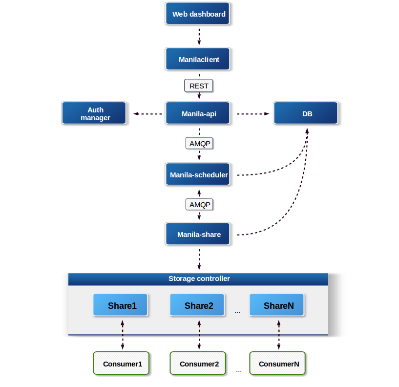
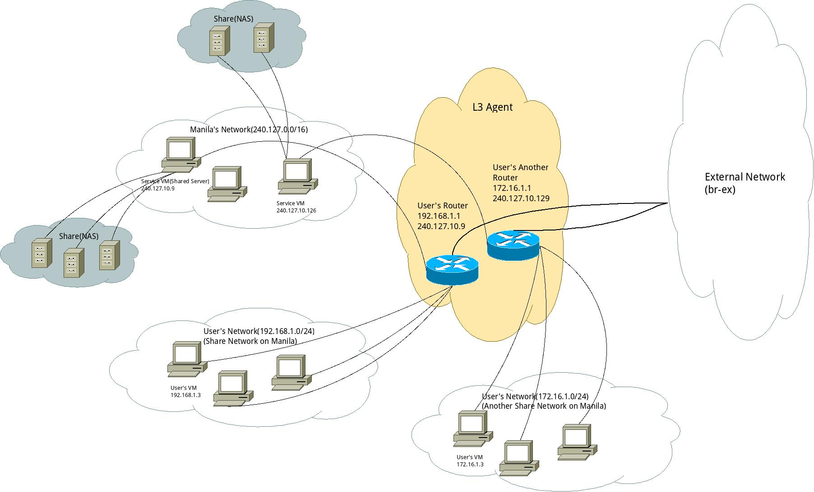
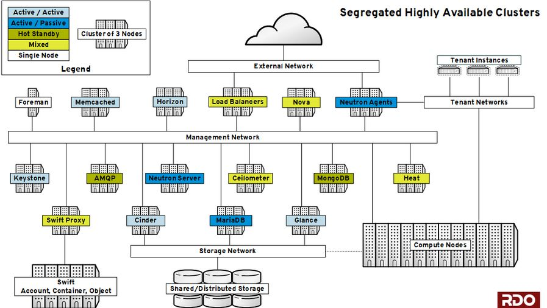
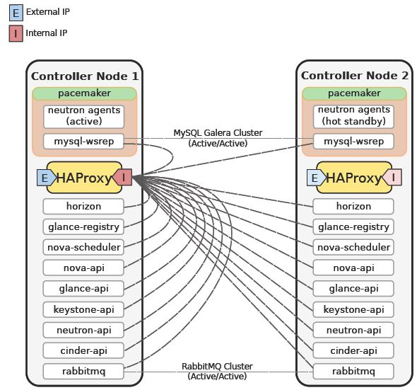
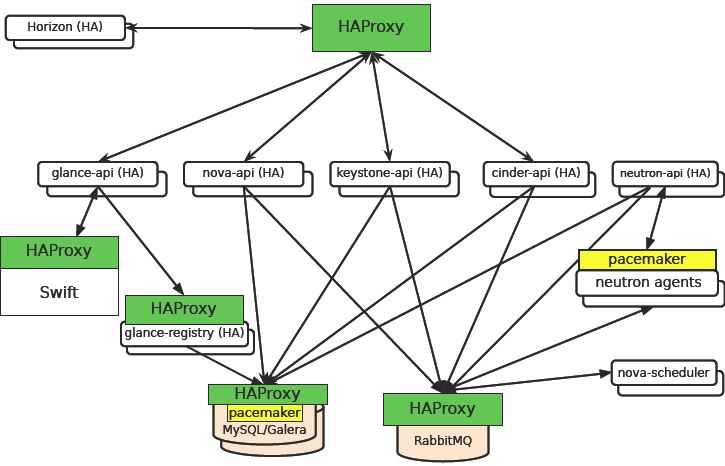
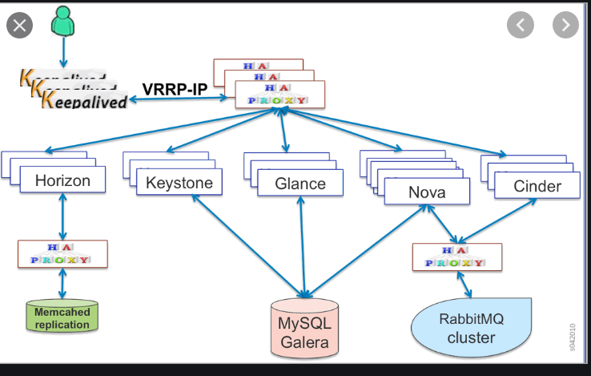
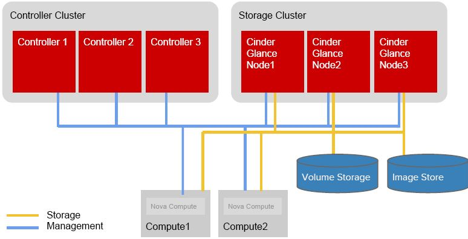
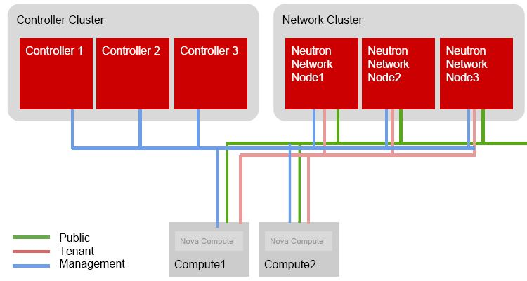
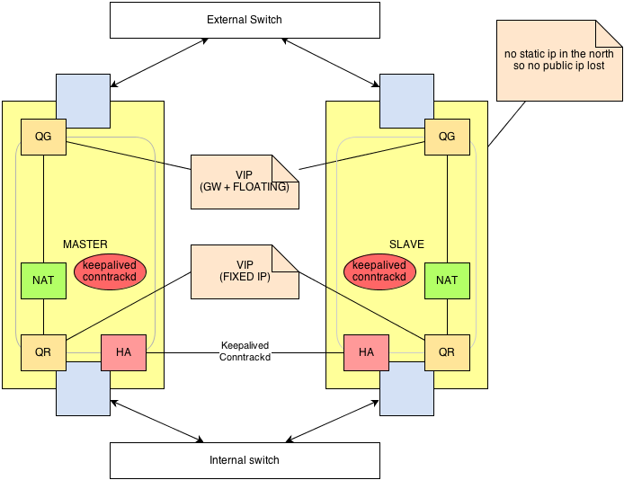
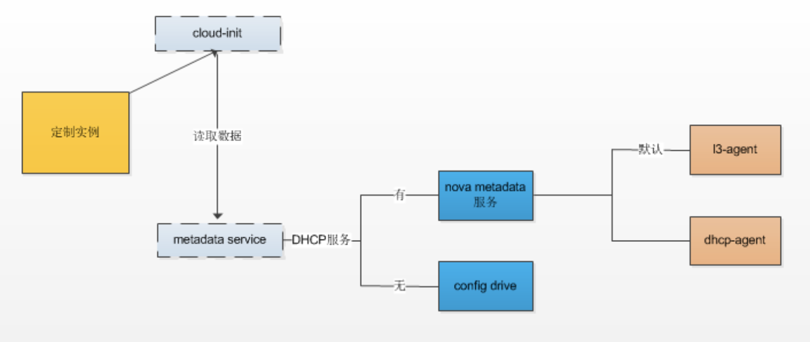

# 部署和运维

## Neturon 与 SDN

- [Neutron 的概念空间中有哪些对象？](https://docs.openstack.org/mitaka/install-guide-ubuntu/neutron-concepts.html)
    - network：local / flat / vlan / vxlan / gre
    - subnet
    - router
    - port / VIF / tap
- Neutron 解决什么问题？
    - 二层交换
    - 三层路由
    - 负载均衡 / 防火墙 / VPN 等增值服务
- Neutron 由哪些模块组成？

    

- 怎么理解 Plugin 和 Agent 的关系？plugin 定义了网络对象的特征，agent 负责具体实现。
- 有哪些 Agent？L2 / DHCP / L3（ routing / FW / SG ） / LB
- 有几种类型的 Plugin？Core Plugin / Service Plugin
- Core Plugin 具体解决什么问题？二层交换问题，network / subnet / port
- 为什么要提出 ML2 Core Plugin？传统 Core Plugin 无法同时使用多种 network provider & 各类 core plugin 的数据库访问代码雷同
- 怎么理解 ML2 中的 type driver 和 mechanism driver？
    - type driver：local / flat / vlan / vxlan / gre
    - mechanism driver
        - Agent based：Linux Bridge / OpenVswitch
        - Controller based：OpenDaylight / VMWare NSX
        - 物理交换机：Cisco Nexus / Arista / Mellanox
    - Linux Bridge 支持 local / flat / vlan / vxlan
    - OpenVswitch 多支持一种 gre
- 怎么理解 Service Plugin？router / LB / SG
- 基于 Linux Bridge 的网络模型是怎样的？
- 基于 OVS 的网络模型是怎样的？
- 如何查看流表？流表的基本操作（ 增删查改 ）？
- 安全组在底层的实现是怎样的？
- FWaaS 在底层的实现是怎样的？
- VXLAN 模型是什么？在 OpenStack 底层是怎么实现的？适用于哪些场合？
- GRE 模型是什么？在 OpenStack 底层是怎么实现的？适用于哪些场合？
- DPDK 怎么支持？
- SRIOV 怎么支持？
- IPv6 的支持情况如何？后端怎么启用 IPv6 支持？前端用户怎么使用（ API & 命令行 ）？

## Manila

- [Manila 提供什么服务？](https://docs.openstack.org/manila/latest/#what-is-manila) Providing Shared Filesystems as a service，[NAS 存储](https://baike.baidu.com/item/NAS/3465615)。对照的 AWS 服务是什么？[Amazon Elastic File System (EFS)](https://aws.amazon.com/cn/efs/)
- Manila 支持哪些文件共享协议？主要是 [NFS，CIFS](https://www.dell.com/community/%E5%85%A5%E9%97%A8%E7%BA%A7%E5%92%8C%E4%B8%AD%E7%AB%AF/%E5%88%86%E4%BA%AB-CIFS%E5%92%8CNFS%E7%9A%84%E5%8C%BA%E5%88%AB/td-p/6934849)，通过不同的[后端驱动](https://docs.openstack.org/manila/latest/admin/index.html#supported-share-back-ends)实现。还有[其它协议](https://docs.openstack.org/manila/latest/admin/shared-file-systems-share-management.html)。
- [Manila 的概念空间里有什么对象？](https://docs.openstack.org/manila/latest/admin/shared-file-systems-key-concepts.html)
    - **Share**：The fundamental resource unit allocated by the Shared File System service. It represents an allocation of a persistent, readable, and writable filesystems. Compute instances access these filesystems
    - **Share Instance**：This concept is tied with share and represents created resource on specific back end, when share represents abstraction between end user and back-end storages.
    - **Snapshot**
    - **Storage Pools**：The storage may present one or more logical storage resource pools that the Shared File Systems service will select as a storage location when provisioning shares
    - **Share Type**：An abstract collection of criteria used to characterize share
    - **Share Access Rules**：Define which users can access a particular share
    - **Security Services**：Allow granular client access rules for administrators，[参考](https://docs.openstack.org/manila/latest/admin/shared-file-systems-security-services.html)
    - **Share Server**：A logical entity that hosts the shares created on a specific share network
- [Manila 由几个模块组成？](https://docs.openstack.org/security-guide/shared-file-systems/intro.html)

    

    - **manila-api**
    - **manila-data**：类似 nova-conductor，This service is responsible for managing data operations which may take a long time to complete and block other services if not handled separately.
    - **manila-scheduler**：Responsible for scheduling and routing requests to the appropriate manila-share service. It does that by picking one back-end while filtering all except one back-end.
    - **manila-share**：类似 nova-compute，Responsible for managing Shared File Service devices, specifically the back-end devices.
- Manila 的网络架构和实现原理

    

    - [Manila 的配置](https://docs.openstack.org/openstack-ansible-os_manila/latest/configure-manila.html)

        ```console
        stack@u1804:~$ sudo systemctl list-unit-files | grep devstack | grep m-
        devstack@m-api.service                 enabled        
        devstack@m-dat.service                 enabled        
        devstack@m-sch.service                 enabled        
        devstack@m-shr.service                 enabled        
        stack@u1804:~$ sudo systemctl status devstack@m-shr.service 
        ● devstack@m-shr.service - Devstack devstack@m-shr.service
        Loaded: loaded (/etc/systemd/system/devstack@m-shr.service; enabled; vendor preset: enabled)
        Active: active (running) since Tue 2020-08-18 08:58:16 UTC; 5h 50min ago
        Main PID: 1219 (manila-share)
            Tasks: 2 (limit: 19147)
        CGroup: /system.slice/system-devstack.slice/devstack@m-shr.service
                ├─1219 /usr/bin/python3.6 /usr/local/bin/manila-share --config-file /etc/manila/manila.conf
                └─3028 /usr/bin/python3.6 /usr/local/bin/manila-share --config-file /etc/manila/manila.conf
        ```

    - Manila 的 Service Network（ Service Instance 关联 ），也就是 Shared Server 所在的网络

        ```console
        stack@u1804:~/devstack$ source openrc admin
        WARNING: setting legacy OS_TENANT_NAME to support cli tools.
        stack@u1804:~/devstack$ openstack network list
        +--------------------------------------+------------------------+----------------------------------------------------------------------------+
        | ID                                   | Name                   | Subnets                                                                    |
        +--------------------------------------+------------------------+----------------------------------------------------------------------------+
        | 0705036a-f5a5-41e1-88fa-14bc5fa13aa6 | manila_service_network | 8d4f56cf-c82c-446c-8817-8aed1279d6b6                                       |
        | 1aa70332-b97d-4f14-80f2-04ec8387ddf5 | public                 | ba63556f-b447-4a9f-9f27-36b7d76c50ed, ddbd2f40-d296-49ee-9504-35f5a7fa470c |
        | 5f8e24d7-a32b-4971-b4bd-341bc619aa41 | testNetwork            | 687ff53a-601a-4408-a063-34453e210d76                                       |
        | 740ed6af-0010-4ff3-8301-f46a07f0a792 | admin_net              | 58748bed-5d8d-4bb9-8506-ec0d05ead9d9                                       |
        | c0277473-3625-486a-a791-153f9c9c178f | heat-net               | 267b253e-c3f5-42da-9d7a-8198d162153d                                       |
        | c8d68c7a-142a-4653-a4e0-df4682898882 | private                | d7f86a85-2ff3-4fd8-874c-5abb8a8c637d, f99974a0-07ac-4e9d-9f79-f0a22940fe5f |
        | da6ad9d1-3341-44bb-84db-dcad14fcd305 | shared                 | a5e8bf95-752c-4e59-924e-73eb47af9334                                       |
        +--------------------------------------+------------------------+----------------------------------------------------------------------------+
        ```

    - Manila 的 Client Network（ Share Network ）
- [实验] Manila 共享存储的配置和使用具体操作步骤
    - UI：Admin 中查看
    - [API](https://docs.openstack.org/api-ref/shared-file-system/)
    - [命令行](https://docs.openstack.org/manila/latest/cli/index.html)

## OpenStack 高可用部署

- [商用中较为流行的 OpenStack HA 方案有哪些？](https://www.cnblogs.com/sammyliu/p/4741967.html)
    - 红帽：RDO 方案，分散式控制节点，硬件成本大，性能好

        

        该配置最少需要五台机器：

        - 一台（物理或者虚拟）服务器部署 nfs server，dhcp，dns
        - 一台物理服务器来作为计算节点
        - 三台物理服务器组成 pacemaker 集群，创建多个虚机，安装各种应用

        特征：

        - 每个集群使用三个节点，全部采用 A/A 模式，除了 cinder-volume 和 LBaas。RedHat 不认为 A/P 模式是真正的 HA。
        - 提供使用 Pacemaker 或者 Keepalived 两套方案。
        - 将 API 和内部无状态组件按功能组分布到各个专有集群，而不是放在一个集群上。
        - Cinder 这里标识为 A/A HA，但是不包括 cinder-volume
    - Marantis：集中式控制节点，控制节点上运行服务多，可能会影响其性能，但是在小规模云环境中节省了硬件成本。

        

        

- 基础设施的 HA 方案推荐怎么做？
    - [MariaDB: Galera + Haproxy](https://computingforgeeks.com/how-to-setup-mariadb-galera-cluster-on-ubuntu-with-haproxy/)
    - [Rabbitmq Cluster HA](https://www.rabbitmq.com/ha.html)
    - [Ceph HA](https://www.jamescoyle.net/how-to/1244-create-a-3-node-ceph-storage-cluster)
    - [Elasticsearch 也是自身的 HA](https://blog.ruanbekker.com/blog/2019/04/02/setup-a-5-node-highly-available-elasticsearch-cluster/)
- 控制节点的 HA 方案推荐怎么做？
    - [社区的方案](https://docs.openstack.org/ha-guide/control-plane-stateless.html#api-services)：Keepalive + HAProxy

        

- 计算节点的 HA 方案推荐怎么做？

    

    

    部署方式如下：

    - 使用 Pacemaker 集群作为控制平面
    - 将计算节点做为 Partial members 加入到 Pacemaker 集群中，受其管理和监控。这时候，其数目不受 Corosync 集群内节点总数的限制。

    HA 实现细节：

    - Pacemaker 通过 pacemaker_remote 按照顺序（neutron-ovs-agent -> ceilometer-compute -> nova-compute) 来启动计算节点上的各种服务。前面的服务启动失败，后面的服务不会被启动。
    - Pacemaker 监控和每个计算节点上的 pacemaker_remote 的连接，来检查该节点是否处于活动状态。发现它不可以连接的话，启动恢复（recovery）过程。
    - Pacemaker 监控每个服务的状态，如果状态失效，该服务会被重启。重启失败则触发防护行为（fencing action）；当所有服务都被启动后，虚机的网络会被恢复，因此，网络只会短时间受影响。

    当一个节点失效时，恢复（recovery）过程会被触发，Pacemaker 会依次：

    1. 运行 'nova service-disable'
    1. 将该节点关机
    1. 等待 nova 发现该节点失效了
    1. 将该节点开机
    1. 如果节点启动成功，执行 'nova service-enable'
    1. 如果节点启动失败，则执行 ‘nova evacuate’ 把该节点上的虚机移到别的可用计算节点上。

    其中：

    - 步骤（1）和 （5）是可选的，其主要目的是防止 nova-scheduler 将新的虚机分配到该节点。
    - 步骤（2）保证机器肯定会关机。
    - 步骤（3）中目前 nova 需要等待一段较长的超时时间才能判断节点 down 了。可以通过 [Nova API 将节点状态直接设置为 down](https://docs.openstack.org/api-ref/compute/?expanded=update-forced-down-detail#compute-services-os-services)。

    其余一些前提条件：

    - 虚机必须部署在 cinder-volume 或者共享的临时存储比如 RBD 或者 NFS 上，这样虚机 evaculation 将不会造成数据丢失。
    - 计算节点需要有防护机制，比如 IPMI，硬件狗 等
- 网络节点的 HA 方案推荐怎么做？
    - [L3 HA](https://wiki.openstack.org/wiki/Neutron/L3_High_Availability_VRRP)

        

        - keepalive 跑在 vrouter 的 namespace 里面
        - 一主一备两个 vrouter 的 namespace，备 vrouter 里面的qr 口，qg 口在备的状态都没配 IP，主备切换就把 IP 配上，然后发个免费 ARP 出来

    - [DVR](https://docs.openstack.org/neutron/latest/admin/deploy-ovs-ha-dvr.html)，[wiki](https://wiki.openstack.org/wiki/Neutron/DVR)：DVR 的设计思想是在计算节点上起 L3 服务，缓解网络节点压力

        

        

    - vlan 网络 & L3 在物理交换机

## 虚机注入的方式

- Cloudinit 解决什么问题？cloud-init 是一款 linux 工具，当VM 系统启动时，cloud-init 从 nova metadata 服务或者 config drive 中获取 metadata，完成包括但不限于下面的定制化工作：
    1. 设置 default locale
    1. 设置 hostname
    1. 添加 ssh keys 到 .ssh/authorized_keys
    1. 设置用户密码
    1. 配置网络
- 在 DHCP 启动的情况下，如何强制走 config drive 读取 metadata？[config_drive 参数](https://docs.openstack.org/api-ref/compute/?expanded=create-server-detail#create-server)
- Cloudinit 的 workflow 是怎样的？

    

    1. Generator (`cloud-config.target`)：读取配置文件 `cloud.cfg`
    1. Local (`cloud-init-local.service`)：定位“本地”数据源和配置网络
    1. Network (`cloud-init.service`)：读取`cloud_init_modules` 模块的指定配置
    1. Config (`cloud-config.service`)：读取`cloud_config_modules` 模块的指定配置
    1. Final (`cloud-final.service`)：分别读取`cloud_final_modules` 模块的指定配置
- [怎么写 user data script？](https://cloudinit.readthedocs.io/en/latest/topics/format.html)
- [怎么 trouble shooting？](https://cloud.tencent.com/developer/article/1501295)
- Windows 上使用[cloudbase-init](https://cloudbase.it/cloudbase-init/)

## 虚机镜像存储方式，需要解决分布式读写延迟对业务的影响

- Glance 上传 / 下载 速度慢：看是不是管理网带宽小影响
- Glance 上传下载时，虚拟机 IO 时候被影响：查看 ceph 的 performance，ceph tuning

## 客户的最佳实践和遇到的问题

- 安全问题，[Keystone 密码问题](https://docs.openstack.org/keystone/latest/admin/configuration.html#security-compliance-and-pci-dss)
- 监控方案：[Zabbix vs Prometheus](https://www.metricfire.com/blog/prometheus-vs-zabbix/)
- 计费方案：[CloudKitty](https://docs.openstack.org/cloudkitty/latest/)
- 定时任务
- workflow
- 消息中心
- 审计日志：[MiddleWare](https://docs.openstack.org/keystonemiddleware/latest/audit.html)
