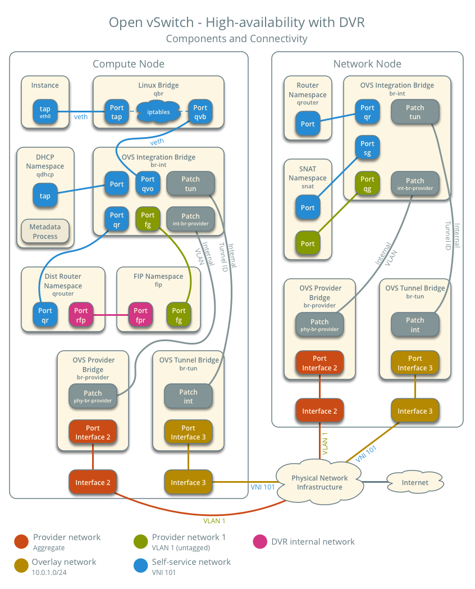

# 部署和运维

## 1. Neturon 与 SDN

- [Neutron 的概念空间中有哪些对象？](https://docs.openstack.org/mitaka/install-guide-ubuntu/neutron-concepts.html)
    - network：local / flat / vlan / vxlan / gre
    - subnet
    - router
    - port / VIF / tap
- Neutron 解决什么问题？
    - 二层交换
    - 三层路由
    - 负载均衡 / 防火墙 / VPN 等增值服务
- Neutron 由哪些模块组成？

    

- 怎么理解 Plugin 和 Agent 的关系？plugin 定义了网络对象的特征，agent 负责具体实现。
- 有哪些 Agent？L2 / DHCP / L3（ routing / FW / SG ） / LB
- 有几种类型的 Plugin？Core Plugin / Service Plugin
- Core Plugin 具体解决什么问题？二层交换问题，network / subnet / port
- 为什么要提出 ML2 Core Plugin？传统 Core Plugin 无法同时使用多种 network provider & 各类 core plugin 的数据库访问代码雷同
- 怎么理解 ML2 中的 type driver 和 mechanism driver？
    - type driver：local / flat / vlan / vxlan / gre
    - mechanism driver
        - Agent based：Linux Bridge / OpenVswitch
        - Controller based：OpenDaylight / VMWare NSX
        - 物理交换机：Cisco Nexus / Arista / Mellanox
    - Linux Bridge 支持 local / flat / vlan / vxlan
    - OpenVswitch 多支持一种 gre
- 怎么理解 Service Plugin？router / LB / SG
- 基于 Linux Bridge 的网络模型是怎样的？
- 基于 OVS 的网络模型是怎样的？
- 如何查看流表？流表的基本操作（ 增删查改 ）？
- 安全组在底层的实现是怎样的？
- FWaaS 在底层的实现是怎样的？
- VXLAN 模型是什么？在 OpenStack 底层是怎么实现的？适用于哪些场合？
- GRE 模型是什么？在 OpenStack 底层是怎么实现的？适用于哪些场合？
- DPDK 怎么支持？
- SRIOV 怎么支持？
- IPv6 的支持情况如何？后端怎么启用 IPv6 支持？前端用户怎么使用（ API & 命令行 ）？

## 2. Manila

- [Manila 提供什么服务？](https://docs.openstack.org/manila/latest/#what-is-manila) Providing Shared Filesystems as a service，[NAS 存储](https://baike.baidu.com/item/NAS/3465615)。对照的 AWS 服务是什么？[Amazon Elastic File System (EFS)](https://aws.amazon.com/cn/efs/)
- Manila 支持哪些文件共享协议？主要是 [NFS，CIFS](https://www.dell.com/community/%E5%85%A5%E9%97%A8%E7%BA%A7%E5%92%8C%E4%B8%AD%E7%AB%AF/%E5%88%86%E4%BA%AB-CIFS%E5%92%8CNFS%E7%9A%84%E5%8C%BA%E5%88%AB/td-p/6934849)，通过不同的[后端驱动](https://docs.openstack.org/manila/latest/admin/index.html#supported-share-back-ends)实现。还有[其它协议](https://docs.openstack.org/manila/latest/admin/shared-file-systems-share-management.html)。
- [Manila 的概念空间里有什么对象？](https://docs.openstack.org/manila/latest/admin/shared-file-systems-key-concepts.html)
    - **Share**：The fundamental resource unit allocated by the Shared File System service. It represents an allocation of a persistent, readable, and writable filesystems. Compute instances access these filesystems
    - **Share Instance**：This concept is tied with share and represents created resource on specific back end, when share represents abstraction between end user and back-end storages.
    - **Snapshot**
    - **Storage Pools**：The storage may present one or more logical storage resource pools that the Shared File Systems service will select as a storage location when provisioning shares
    - **Share Type**：An abstract collection of criteria used to characterize share
    - **Share Access Rules**：Define which users can access a particular share
    - **Security Services**：Allow granular client access rules for administrators，[参考](https://docs.openstack.org/manila/latest/admin/shared-file-systems-security-services.html)
    - **Share Server**：A logical entity that hosts the shares created on a specific share network
- [Manila 由几个模块组成？](https://docs.openstack.org/security-guide/shared-file-systems/intro.html)

    

    - **manila-api**
    - **manila-data**：类似 nova-conductor，This service is responsible for managing data operations which may take a long time to complete and block other services if not handled separately.
    - **manila-scheduler**：Responsible for scheduling and routing requests to the appropriate manila-share service. It does that by picking one back-end while filtering all except one back-end.
    - **manila-share**：类似 nova-compute，Responsible for managing Shared File Service devices, specifically the back-end devices.
- Manila 的网络架构和实现原理

    

    - [Manila 的配置](https://docs.openstack.org/openstack-ansible-os_manila/latest/configure-manila.html)

        ```console
        stack@u1804:~$ sudo systemctl list-unit-files | grep devstack | grep m-
        devstack@m-api.service                 enabled        
        devstack@m-dat.service                 enabled        
        devstack@m-sch.service                 enabled        
        devstack@m-shr.service                 enabled        
        stack@u1804:~$ sudo systemctl status devstack@m-shr.service 
        ● devstack@m-shr.service - Devstack devstack@m-shr.service
        Loaded: loaded (/etc/systemd/system/devstack@m-shr.service; enabled; vendor preset: enabled)
        Active: active (running) since Tue 2020-08-18 08:58:16 UTC; 5h 50min ago
        Main PID: 1219 (manila-share)
            Tasks: 2 (limit: 19147)
        CGroup: /system.slice/system-devstack.slice/devstack@m-shr.service
                ├─1219 /usr/bin/python3.6 /usr/local/bin/manila-share --config-file /etc/manila/manila.conf
                └─3028 /usr/bin/python3.6 /usr/local/bin/manila-share --config-file /etc/manila/manila.conf
        ```

    - Manila 的 Service Network（ Service Instance 关联 ），也就是 Shared Server 所在的网络

        ```console
        stack@u1804:~/devstack$ source openrc admin
        WARNING: setting legacy OS_TENANT_NAME to support cli tools.
        stack@u1804:~/devstack$ openstack network list
        +--------------------------------------+------------------------+----------------------------------------------------------------------------+
        | ID                                   | Name                   | Subnets                                                                    |
        +--------------------------------------+------------------------+----------------------------------------------------------------------------+
        | 0705036a-f5a5-41e1-88fa-14bc5fa13aa6 | manila_service_network | 8d4f56cf-c82c-446c-8817-8aed1279d6b6                                       |
        | 1aa70332-b97d-4f14-80f2-04ec8387ddf5 | public                 | ba63556f-b447-4a9f-9f27-36b7d76c50ed, ddbd2f40-d296-49ee-9504-35f5a7fa470c |
        | 5f8e24d7-a32b-4971-b4bd-341bc619aa41 | testNetwork            | 687ff53a-601a-4408-a063-34453e210d76                                       |
        | 740ed6af-0010-4ff3-8301-f46a07f0a792 | admin_net              | 58748bed-5d8d-4bb9-8506-ec0d05ead9d9                                       |
        | c0277473-3625-486a-a791-153f9c9c178f | heat-net               | 267b253e-c3f5-42da-9d7a-8198d162153d                                       |
        | c8d68c7a-142a-4653-a4e0-df4682898882 | private                | d7f86a85-2ff3-4fd8-874c-5abb8a8c637d, f99974a0-07ac-4e9d-9f79-f0a22940fe5f |
        | da6ad9d1-3341-44bb-84db-dcad14fcd305 | shared                 | a5e8bf95-752c-4e59-924e-73eb47af9334                                       |
        +--------------------------------------+------------------------+----------------------------------------------------------------------------+
        ```

    - Manila 的 Client Network（ Share Network ）
- [实验] Manila 共享存储的配置和使用具体操作步骤
    - UI：Admin 中查看
    - [API](https://docs.openstack.org/api-ref/shared-file-system/)
    - [命令行](https://docs.openstack.org/manila/latest/cli/index.html)

## 3. OpenStack 高可用部署

- [商用中较为流行的 OpenStack HA 方案有哪些？](https://www.cnblogs.com/sammyliu/p/4741967.html)
    - 红帽：RDO 方案，分散式控制节点，硬件成本大，性能好

        

        该配置最少需要五台机器：

        - 一台（物理或者虚拟）服务器部署 nfs server，dhcp，dns
        - 一台物理服务器来作为计算节点
        - 三台物理服务器组成 pacemaker 集群，创建多个虚机，安装各种应用

        特征：

        - 每个集群使用三个节点，全部采用 A/A 模式，除了 cinder-volume 和 LBaas。RedHat 不认为 A/P 模式是真正的 HA。
        - 提供使用 Pacemaker 或者 Keepalived 两套方案。
        - 将 API 和内部无状态组件按功能组分布到各个专有集群，而不是放在一个集群上。
        - Cinder 这里标识为 A/A HA，但是不包括 cinder-volume
    - Marantis：集中式控制节点，控制节点上运行服务多，可能会影响其性能，但是在小规模云环境中节省了硬件成本。

        

        

- 基础设施的 HA 方案推荐怎么做？
    - [MariaDB: Galera + Haproxy](https://computingforgeeks.com/how-to-setup-mariadb-galera-cluster-on-ubuntu-with-haproxy/)
    - [Rabbitmq Cluster HA](https://www.rabbitmq.com/ha.html)
    - [Ceph HA](https://www.jamescoyle.net/how-to/1244-create-a-3-node-ceph-storage-cluster)
    - [Elasticsearch 也是自身的 HA](https://blog.ruanbekker.com/blog/2019/04/02/setup-a-5-node-highly-available-elasticsearch-cluster/)
- 控制节点的 HA 方案推荐怎么做？
    - [社区的方案](https://docs.openstack.org/ha-guide/control-plane-stateless.html#api-services)：Keepalive + HAProxy

        

- 计算节点的 HA 方案推荐怎么做？

    

    

    部署方式如下：

    - 使用 Pacemaker 集群作为控制平面
    - 将计算节点做为 Partial members 加入到 Pacemaker 集群中，受其管理和监控。这时候，其数目不受 Corosync 集群内节点总数的限制。

    HA 实现细节：

    - Pacemaker 通过 pacemaker_remote 按照顺序（neutron-ovs-agent -> ceilometer-compute -> nova-compute) 来启动计算节点上的各种服务。前面的服务启动失败，后面的服务不会被启动。
    - Pacemaker 监控和每个计算节点上的 pacemaker_remote 的连接，来检查该节点是否处于活动状态。发现它不可以连接的话，启动恢复（recovery）过程。
    - Pacemaker 监控每个服务的状态，如果状态失效，该服务会被重启。重启失败则触发防护行为（fencing action）；当所有服务都被启动后，虚机的网络会被恢复，因此，网络只会短时间受影响。

    当一个节点失效时，恢复（recovery）过程会被触发，Pacemaker 会依次：

    1. 运行 'nova service-disable'
    1. 将该节点关机
    1. 等待 nova 发现该节点失效了
    1. 将该节点开机
    1. 如果节点启动成功，执行 'nova service-enable'
    1. 如果节点启动失败，则执行 ‘nova evacuate’ 把该节点上的虚机移到别的可用计算节点上。

    其中：

    - 步骤（1）和 （5）是可选的，其主要目的是防止 nova-scheduler 将新的虚机分配到该节点。
    - 步骤（2）保证机器肯定会关机。
    - 步骤（3）中目前 nova 需要等待一段较长的超时时间才能判断节点 down 了。可以通过 [Nova API 将节点状态直接设置为 down](https://docs.openstack.org/api-ref/compute/?expanded=update-forced-down-detail#compute-services-os-services)。

    其余一些前提条件：

    - 虚机必须部署在 cinder-volume 或者共享的临时存储比如 RBD 或者 NFS 上，这样虚机 evaculation 将不会造成数据丢失。
    - 计算节点需要有防护机制，比如 IPMI，硬件狗 等
- 网络节点的 HA 方案推荐怎么做？
    - [L3 HA](https://wiki.openstack.org/wiki/Neutron/L3_High_Availability_VRRP)

        

        - keepalive 跑在 vrouter 的 namespace 里面
        - 一主一备两个 vrouter 的 namespace，备 vrouter 里面的qr 口，qg 口在备的状态都没配 IP，主备切换就把 IP 配上，然后发个免费 ARP 出来

    - [DVR](https://docs.openstack.org/neutron/latest/admin/deploy-ovs-ha-dvr.html)，[wiki](https://wiki.openstack.org/wiki/Neutron/DVR)：DVR 的设计思想是在计算节点上起 L3 服务，缓解网络节点压力

        

        

    - vlan 网络 & L3 在物理交换机

## 4. 虚机注入的方式

- Cloudinit 解决什么问题？cloud-init 是一款 linux 工具，当VM 系统启动时，cloud-init 从 nova metadata 服务或者 config drive 中获取 metadata，完成包括但不限于下面的定制化工作：
    1. 设置 default locale
    1. 设置 hostname
    1. 添加 ssh keys 到 .ssh/authorized_keys
    1. 设置用户密码
    1. 配置网络
- 在 DHCP 启动的情况下，如何强制走 config drive 读取 metadata？[config_drive 参数](https://docs.openstack.org/api-ref/compute/?expanded=create-server-detail#create-server)
- Cloudinit 的 workflow 是怎样的？

    

    1. Generator (`cloud-config.target`)：读取配置文件 `cloud.cfg`
    1. Local (`cloud-init-local.service`)：定位“本地”数据源和配置网络
    1. Network (`cloud-init.service`)：读取`cloud_init_modules` 模块的指定配置
    1. Config (`cloud-config.service`)：读取`cloud_config_modules` 模块的指定配置
    1. Final (`cloud-final.service`)：分别读取`cloud_final_modules` 模块的指定配置
- [怎么写 user data script？](https://cloudinit.readthedocs.io/en/latest/topics/format.html)
- [怎么 trouble shooting？](https://cloud.tencent.com/developer/article/1501295)
- Windows 上使用[cloudbase-init](https://cloudbase.it/cloudbase-init/)

## 5. 虚机镜像存储方式，需要解决分布式读写延迟对业务的影响

- Glance 上传 / 下载 速度慢：看是不是管理网带宽小影响
- Glance 上传下载时，虚拟机 IO 时候被影响：查看 ceph 的 performance，ceph tuning

## 6. 客户的最佳实践和遇到的问题

- 安全问题，[Keystone 密码问题](https://docs.openstack.org/keystone/latest/admin/configuration.html#security-compliance-and-pci-dss)
- 监控方案：[Zabbix vs Prometheus](https://www.metricfire.com/blog/prometheus-vs-zabbix/)
- 计费方案：[CloudKitty](https://docs.openstack.org/cloudkitty/latest/)
- 定时任务
- workflow
- 消息中心
- 审计日志：[MiddleWare](https://docs.openstack.org/keystonemiddleware/latest/audit.html)

## 7. Prometheus

### 7.1 Qick Start

- [参考官方安装文档](https://prometheus.io/docs/prometheus/latest/installation/)，[github](https://github.com/prometheus/prometheus/)
    - [基于 Docker](https://prometheus.io/docs/prometheus/latest/installation/#using-docker)

        ```bash
        docker run -p 9090:9090 prom/prometheus

        docker run -p 9090:9090 -v ~/prometheus.yml:/etc/prometheus/prometheus.yml prom/prometheus
        ```

        思考，用容器启动怎么启动在后台？

    - 获取默认配置文件

        ```bash
        curl -LO https://github.com/prometheus/prometheus/releases/download/v2.22.0/prometheus-2.22.0.linux-amd64.tar.gz

        tar zxvf prometheus-2.22.0.linux-amd64.tar.gz
        ```

        ```console
        $ cat prometheus-2.22.0.linux-amd64/prometheus.yml 
        
        # my global config
		global:
		  scrape_interval:     15s # Set the scrape interval to every 15 seconds. Default is every 1 minute.
		  evaluation_interval: 15s # Evaluate rules every 15 seconds. The default is every 1 minute.
		  # scrape_timeout is set to the global default (10s).

		# Alertmanager configuration
		alerting:
		  alertmanagers:
		  - static_configs:
		    - targets:
		      # - alertmanager:9093

		# Load rules once and periodically evaluate them according to the global 'evaluation_interval'.
		rule_files:
		  # - "first_rules.yml"
		  # - "second_rules.yml"

		# A scrape configuration containing exactly one endpoint to scrape:
		# Here it's Prometheus itself.
		scrape_configs:
		  # The job name is added as a label `job=<job_name>` to any timeseries scraped from this config.
		  - job_name: 'prometheus'

		    # metrics_path defaults to '/metrics'
		    # scheme defaults to 'http'.

		    static_configs:
		    - targets: ['localhost:9090']
        ```

    - Download node_exporter

        ```bash
        wget https://github.com/prometheus/node_exporter/releases/download/v1.0.1/node_exporter-1.0.1.linux-amd64.tar.gz
        screen -t node_exporter
        ./node_exporter

        docker run -d -p 9100:9100 prom/node-exporter
        ```

    - 访问http://localhost:9100/metrics，可以看到当前 node exporter 获取到的当前主机的所有监控数据

        

    - 为了能够让 Prometheus Server 能够从当前 node exporter 获取到监控数据，这里需要修改 Prometheus 配置文件。编辑 prometheus.yml 并在 scrape_configs 节点下添加以下内容，然后重新启动 Prometheus Server

        ```yaml
        scrape_configs:
		  - job_name: 'prometheus'
		    static_configs:
		      - targets: ['localhost:9090']
		  # 采集node exporter监控数据
		  - job_name: 'node'
		    static_configs:
		      - targets: ['localhost:9100']
        ```

        思考，如果 prometheus 用容器运行，在对接时 node exporter 时会出现什么问题？Targets 能看到什么错？localhost 应该改成什么？

    - [基于 Ansible](https://github.com/cloudalchemy/ansible-prometheus)，[demo](https://github.com/cloudalchemy/demo-site/#applications)

### 7.2 数据类型

#### 7.2.1 Counter：只增不减的计数器

Counter 类型的指标其工作方式和计数器一样，只增不减（除非系统发生重置）。常见的监控指标，如 http_requests_total，node_cpu 都是 Counter 类型的监控指标。一般在定义 Counter 类型指标的名称时推荐使用 _total 作为后缀。

Counter是一个简单但有强大的工具，例如我们可以在应用程序中记录某些事件发生的次数，通过以时序的形式存储这些数据，我们可以轻松的了解该事件产生速率的变化。 PromQL 内置的聚合操作和函数可以让用户对这些数据进行进一步的分析：

例如，通过 rate() 函数获取HTTP请求量的增长率：`rate(http_requests_total[5m])`

查询当前系统中，访问量前10的HTTP地址：`topk(10, http_requests_total)`

#### 7.2.2 Gauge：可增可减的仪表盘

与 Counter 不同，Gauge 类型的指标侧重于反应系统的当前状态。因此这类指标的样本数据可增可减。常见指标如：node_memory_MemFree（主机当前空闲的内容大小）、node_memory_MemAvailable（可用内存大小）都是 Gauge 类型的监控指标。

通过 Gauge 指标，用户可以直接查看系统的当前状态：`node_memory_MemFree`

对于 Gauge 类型的监控指标，通过 PromQL 内置函数 delta() 可以获取样本在一段时间返回内的变化情况。例如，计算 CPU 温度在两个小时内的差异：`delta(cpu_temp_celsius{host="zeus"}[2h])`

还可以使用 deriv() 计算样本的线性回归模型，甚至是直接使用 predict_linear() 对数据的变化趋势进行预测。例如，预测系统磁盘空间在 4 个小时之后的剩余情况：`predict_linear(node_filesystem_free{job="node"}[1h], 4 * 3600)`

#### 7.2.3 使用 Histogram 和 Summary 分析数据分布情况

除了 Counter 和 Gauge 类型的监控指标以外，Prometheus 还定义了 Histogram 和 Summary 的指标类型。Histogram 和 Summary 主用用于统计和分析样本的分布情况。

在大多数情况下人们都倾向于使用某些量化指标的平均值，例如 CPU 的平均使用率、页面的平均响应时间。这种方式的问题很明显，以系统 API 调用的平均响应时间为例：如果大多数 API 请求都维持在 100ms 的响应时间范围内，而个别请求的响应时间需要 5s，那么就会导致某些 WEB 页面的响应时间落到中位数的情况，而这种现象被称为长尾问题。

为了区分是平均的慢还是长尾的慢，最简单的方式就是按照请求延迟的范围进行分组。例如，统计延迟在0~10ms之间的请求数有多少而10~20ms之间的请求数又有多少。通过这种方式可以快速分析系统慢的原因。

Histogram 和 Summary 都是为了能够解决这样问题的存在，通过Histogram 和 Summary 类型的监控指标，我们可以快速了解监控样本的分布情况。

例如，指标 prometheus_tsdb_wal_fsync_duration_seconds 的指标类型为 Summary。 它记录了 Prometheus Server 中 wal_fsync 处理的处理时间，通过访问 Prometheus Server 的 /metrics地址，可以获取到以下监控样本数据：

```
# HELP prometheus_tsdb_wal_fsync_duration_seconds Duration of WAL fsync.
# TYPE prometheus_tsdb_wal_fsync_duration_seconds summary
prometheus_tsdb_wal_fsync_duration_seconds{quantile="0.5"} 0.012352463
prometheus_tsdb_wal_fsync_duration_seconds{quantile="0.9"} 0.014458005
prometheus_tsdb_wal_fsync_duration_seconds{quantile="0.99"} 0.017316173
prometheus_tsdb_wal_fsync_duration_seconds_sum 2.888716127000002
prometheus_tsdb_wal_fsync_duration_seconds_count 216
```

从上面的样本中可以得知当前 Prometheus Server 进行 wal_fsync 操作的总次数为 216 次，耗时 2.888716127000002s。其中中位数（quantile=0.5）的耗时为 0.012352463，9分位数（quantile=0.9）的耗时为 0.014458005s。

在 Prometheus Server 自身返回的样本数据中，我们还能找到类型为 Histogram 的监控指标 prometheus_tsdb_compaction_chunk_range_bucket。

```
# HELP prometheus_tsdb_compaction_chunk_range Final time range of chunks on their first compaction
# TYPE prometheus_tsdb_compaction_chunk_range histogram
prometheus_tsdb_compaction_chunk_range_bucket{le="100"} 0
prometheus_tsdb_compaction_chunk_range_bucket{le="400"} 0
prometheus_tsdb_compaction_chunk_range_bucket{le="1600"} 0
prometheus_tsdb_compaction_chunk_range_bucket{le="6400"} 0
prometheus_tsdb_compaction_chunk_range_bucket{le="25600"} 0
prometheus_tsdb_compaction_chunk_range_bucket{le="102400"} 0
prometheus_tsdb_compaction_chunk_range_bucket{le="409600"} 0
prometheus_tsdb_compaction_chunk_range_bucket{le="1.6384e+06"} 260
prometheus_tsdb_compaction_chunk_range_bucket{le="6.5536e+06"} 780
prometheus_tsdb_compaction_chunk_range_bucket{le="2.62144e+07"} 780
prometheus_tsdb_compaction_chunk_range_bucket{le="+Inf"} 780
prometheus_tsdb_compaction_chunk_range_sum 1.1540798e+09
prometheus_tsdb_compaction_chunk_range_count 780
```

与 Summary 类型的指标相似之处在于 Histogram 类型的样本同样会反应当前指标的记录的总数(以 _count 作为后缀)以及其值的总量（以_sum 作为后缀）。不同在于 Histogram 指标直接反应了在不同区间内样本的个数，区间通过标签 len 进行定义。
同时对于 Histogram 的指标，我们还可以通过 histogram_quantile()函数计算出其值的分位数。不同在于 Histogram 通过 histogram_quantile 函数是在服务器端计算的分位数。 而 Sumamry 的分位数则是直接在客户端计算完成。因此对于分位数的计算而言，Summary 在通过 PromQL 进行查询时有更好的性能表现，而 Histogram 则会消耗更多的资源。反之对于客户端而言 Histogram 消耗的资源更少。在选择这两种方式时用户应该按照自己的实际场景进行选择。

### 7.3 使用 PromQL 查询监控数据

#### 7.3.1 PromQL Quick Start

PromQL 是 Prometheus 自定义的一套强大的数据查询语言，除了使用监控指标作为查询关键字以为，还内置了大量的函数，帮助用户进一步对时序数据进行处理。

例如使用 rate() 函数，可以计算在单位时间内样本数据的变化情况即增长率，因此通过该函数我们可以近似的通过 CPU 使用时间计算 CPU 的利用率：`rate(node_cpu[2m])`

如果要忽略是哪一个 CPU 的，只需要使用 without 表达式，将标签CPU 去除后聚合数据即可：`avg without(cpu) (rate(node_cpu[2m]))`

那如果需要计算系统 CPU 的总体使用率，通过排除系统闲置的 CPU 使用率即可获得：`1 - avg without(cpu) (rate(node_cpu{mode="idle"}[2m]))`

##### 7.3.1.1 查询时间序列

直接使用监控指标名称查询时，可以查询该指标下的所有时间序列。如：`http_requests_total`，等同于：`http_requests_total{}`。该表达式会返回指标名称为 `http_requests_total` 的所有时间序列：

```
http_requests_total{code="200",handler="alerts",instance="localhost:9090",job="prometheus",method="get"}=(20889@1518096812.326)
http_requests_total{code="200",handler="graph",instance="localhost:9090",job="prometheus",method="get"}=(21287@1518096812.326)
```

PromQL 还支持用户根据时间序列的标签匹配模式来对时间序列进行过滤，目前主要支持两种匹配模式：完全匹配和正则匹配。
PromQL 支持使用 = 和 != 两种完全匹配模式：

- 通过使用 label=value 可以选择那些标签满足表达式定义的时间序列；
- 反之使用 label!=value 则可以根据标签匹配排除时间序列；

例如，如果我们只需要查询所有 http_requests_total 时间序列中满足标签 instance 为 localhost:9090 的时间序列，则可以使用如下表达式：`http_requests_total{instance="localhost:9090"}`。

反之使用 `instance!="localhost:9090"` 则可以排除这些时间序列 `http_requests_total{instance!="localhost:9090"}`

除了使用完全匹配的方式对时间序列进行过滤以外，PromQL 还可以支持使用正则表达式作为匹配条件，多个表达式之间使用 | 进行分离：

- 使用 label=~regx 表示选择那些标签符合正则表达式定义的时间序列；
- 反之使用label!~regx进行排除；

例如，如果想查询多个环节下的时间序列序列可以使用如下表达式：`http_requests_total{environment=~"staging|testing|development",method!="GET"}`

##### 7.3.1.2 范围查询

通过表达式 `http_requests_total` 查询时间序列时，返回值中只会包含该时间序列中的最新的一个样本值，这样的返回结果我们称之为瞬时向量。而相应的这样的表达式称之为**瞬时向量表达式**。

而如果我们想过去一段时间范围内的样本数据时，我们则需要使用**区间向量表达式**。区间向量表达式和瞬时向量表达式之间的差异在于在区间向量表达式中我们需要定义时间选择的范围，时间范围通过时间范围选择器`[]`进行定义。例如，通过以下表达式可以选择最近5分钟内的所有样本数据：`http_requests_total{}[5m]`

该表达式将会返回查询到的时间序列中最近5分钟的所有样本数据：

```
http_requests_total{code="200",handler="alerts",instance="localhost:9090",job="prometheus",method="get"}=[
    1@1518096812.326
    1@1518096817.326
    1@1518096822.326
    1@1518096827.326
    1@1518096832.326
    1@1518096837.325
]
http_requests_total{code="200",handler="graph",instance="localhost:9090",job="prometheus",method="get"}=[
    4 @1518096812.326
    4@1518096817.326
    4@1518096822.326
    4@1518096827.326
    4@1518096832.326
    4@1518096837.325
]
```

范围支持：

- s - 秒
- m - 分钟
- h - 小时
- d - 天
- w - 周
- y - 年

##### 7.3.1.3 时间位移操作

如果想查询，5分钟前的瞬时样本数据，或昨天一天的区间内的样本数据，可以使用位移操作，位移操作的关键字为offset。

```
http_request_total{} offset 5m
http_request_total{}[1d] offset 1d
```

##### 7.3.1.4 使用聚合操作

一般来说，如果描述样本特征的标签(label)在并非唯一的情况下，通过 PromQL 查询数据，会返回多条满足这些特征维度的时间序列。而 PromQL 提供的聚合操作可以用来对这些时间序列进行处理，形成一条新的时间序列：

```
# 查询系统所有http请求的总量
sum(http_request_total)

# 按照mode计算主机CPU的平均使用时间
avg(node_cpu) by (mode)

# 按照主机查询各个主机的CPU使用率
sum(sum(irate(node_cpu{mode!='idle'}[5m]))  / sum(irate(node_cpu[5m]))) by (instance)
```

##### 7.3.1.5 标量和字符串

除了使用瞬时向量表达式和区间向量表达式以外，PromQL 还直接支持用户使用标量(Scalar)和字符串(String)

- 标量（Scalar）：一个浮点型的数字值.标量只有一个数字，没有时序。例如：`10`。需要注意的是，当使用表达式 `count(http_requests_total)`，返回的数据类型，依然是瞬时向量。用户可以通过内置函数`scalar()`将单个瞬时向量转换为标量。
- 字符串（String）：一个简单的字符串值。直接使用字符串，作为PromQL表达式，则会直接返回字符串。

    ```
    "this is a string"
    'these are unescaped: \n \\ \t'
    `these are not unescaped: \n ' " \t`
    ```

##### 7.3.1.6 合法的 PromQL 表达式

所有的 PromQL 表达式都必须至少包含一个指标名称(例如`http_request_total`)，或者一个不会匹配到空字符串的标签过滤器(例如`{code="200"}`)。因此以下两种方式，均为合法的表达式：

```
http_request_total # 合法
http_request_total{} # 合法
{method="get"} # 合法
```

而如下表达式，则不合法：`{job=~".*"} # 不合法`

同时，除了使用`<metric name>{label=value}`的形式以外，我们还可以使用内置的`__name__`标签来指定监控指标名称：

```
{__name__=~"http_request_total"} # 合法
{__name__=~"node_disk_bytes_read|node_disk_bytes_written"} # 合法
```

#### 7.3.2 PromQL 聚合操作

Prometheus 还提供了下列内置的聚合操作符，这些操作符作用域瞬时向量。可以将瞬时表达式返回的样本数据进行聚合，形成一个新的时间序列。

- sum (求和)
- min (最小值)
- max (最大值)
- avg (平均值)
- stddev (标准差)
- stdvar (标准方差)
- count (计数)
- count_values (对value进行计数)
- bottomk (后n条时序)
- topk (前n条时序)
- quantile (分位数)

使用聚合操作的语法如下：`<aggr-op>([parameter,] <vector expression>) [without|by (<label list>)]`。其中只有`count_values`, `quantile`, `topk`, `bottomk`支持参数(parameter)。

without 用于从计算结果中移除列举的标签，而保留其它标签。by 则正好相反，结果向量中只保留列出的标签，其余标签则移除。通过 without 和 by 可以按照样本的问题对数据进行聚合。例如：`sum(http_requests_total) without (instance)`
等价于`sum(http_requests_total) by (code,handler,job,method)`

如果只需要计算整个应用的HTTP请求总量，可以直接使用表达式：`sum(http_requests_total)`。`count_values`用于时间序列中每一个样本值出现的次数。`count_values`会为每一个唯一的样本值输出一个时间序列，并且每一个时间序列包含一个额外的标签。例如：`count_values("count", http_requests_total)`

topk 和 bottomk 则用于对样本值进行排序，返回当前样本值前 n 位，或者后 n 位的时间序列。获取HTTP请求数前5位的时序样本数据，可以使用表达式：`topk(5, http_requests_total)`

quantile 用于计算当前样本数据值的分布情况 `quantile(φ, express)` 其中`0 ≤ φ ≤ 1`。例如，当 φ 为 0.5 时，即表示找到当前样本数据中的中位数：`quantile(0.5, http_requests_total)`

#### 7.3.3 PromQL 内置函数

- 计算 Counter 指标增长率
    - `increase(node_cpu[2m]) / 120`，这里通过`node_cpu[2m]`获取时间序列最近两分钟的所有样本，increase 计算出最近两分钟的增长量，最后除以时间 120 秒得到node_cpu样本在最近两分钟的平均增长率。并且这个值也近似于主机节点最近两分钟内的平均 CPU 使用率。 
    - `rate(node_cpu[2m])`，rate 或者 increase 函数去计算样本的平均增长速率，容易陷入“长尾问题”当中，其无法反应在时间窗口内样本数据的突发变化
    - `irate(node_cpu[2m])`，irate 函数是通过区间向量中最后两个样本数据来计算区间向量的增长速率。这种方式可以避免在时间窗口范围内的“长尾问题”，并且体现出更好的灵敏度。irate 函数相比于 rate 函数提供了更高的灵敏度，不过当需要分析长期趋势或者在告警规则中，irate 的这种灵敏度反而容易造成干扰。因此在长期趋势分析或者告警中更推荐使用 rate 函数。
- 预测 Gauge 指标变化趋势
    - `predict_linear(node_filesystem_free{job="node"}[2h], 4 * 3600) < 0`
- 统计 Histogram 指标的分位数
    - `histogram_quantile(0.5, http_request_duration_seconds_bucket)`。其中 φ（0<φ<1）表示需要计算的分位数，如果需要计算中位数 φ 取值为 0.5。

#### 7.3.4 在 HTTP API 中使用 PromQL

##### 7.3.4.1 瞬时数据查询

使用以下表达式查询表达式 up 在时间点 2015-07-01T20:10:51.781Z 的计算结果。

```bash
$ curl 'http://localhost:9090/api/v1/query?query=up&time=2015-07-01T20:10:51.781Z'
{
   "status" : "success",
   "data" : {
      "resultType" : "vector",
      "result" : [
         {
            "metric" : {
               "__name__" : "up",
               "job" : "prometheus",
               "instance" : "localhost:9090"
            },
            "value": [ 1435781451.781, "1" ]
         },
         {
            "metric" : {
               "__name__" : "up",
               "job" : "node",
               "instance" : "localhost:9100"
            },
            "value" : [ 1435781451.781, "0" ]
         }
      ]
   }
}

# Response
{
  "resultType": "matrix" | "vector" | "scalar" | "string",
  "result": <value>
}
```

##### 7.3.4.2 区间数据查询

使用以下表达式查询表达式 up 在 30 秒范围内以 15 秒为间隔计算 PromQL 表达式的结果。

```bash
$ curl 'http://localhost:9090/api/v1/query_range?query=up&start=2015-07-01T20:10:30.781Z&end=2015-07-01T20:11:00.781Z&step=15s'
{
   "status" : "success",
   "data" : {
      "resultType" : "matrix",
      "result" : [
         {
            "metric" : {
               "__name__" : "up",
               "job" : "prometheus",
               "instance" : "localhost:9090"
            },
            "values" : [
               [ 1435781430.781, "1" ],
               [ 1435781445.781, "1" ],
               [ 1435781460.781, "1" ]
            ]
         },
         {
            "metric" : {
               "__name__" : "up",
               "job" : "node",
               "instance" : "localhost:9091"
            },
            "values" : [
               [ 1435781430.781, "0" ],
               [ 1435781445.781, "0" ],
               [ 1435781460.781, "1" ]
            ]
         }
      ]
   }
}
```

#### 7.3.5 最佳实践：4 个黄金指标和 USE 方法

监控纬度

| 级别 | 监控什么 | Exporter | 
| - | - | - | - |
| 网络 | 网络协议：http、dns、tcp、icmp；网络硬件：路由器，交换机等 | BlackBox Exporter;SNMP Exporter |
| 主机 | 资源用量 | node exporter |
| 容器 | 资源用量 | cAdvisor |
| 应用(包括 Library) | 延迟，错误，QPS，内部状态等 | 代码中集成Prmometheus Client |
| 中间件状态 | 资源用量，以及服务状态 | 代码中集成Prmometheus Client |
| 编排工具 | 集群资源用量，调度等 | Kubernetes Components |

4个黄金指标

- 延迟：服务请求所需时间。
- 通讯量：监控当前系统的流量，用于衡量服务的容量需求。
- 错误：监控当前系统所有发生的错误请求，衡量当前系统错误发生的速率。
- 饱和度：衡量当前服务的饱和度。

饱和度主要强调最能影响服务状态的受限制的资源。 例如，如果系统主要受内存影响，那就主要关注系统的内存状态，如果系统主要受限与磁盘I/O，那就主要观测磁盘I/O的状态。因为通常情况下，当这些资源达到饱和后，服务的性能会明显下降。同时还可以利用饱和度对系统做出预测，比如，“磁盘是否可能在4个小时候就满了”。

RED方法

- (请求)速率：服务每秒接收的请求数。
- (请求)错误：每秒失败的请求数。
- (请求)耗时：每个请求的耗时。

USE 方法主要关注与资源的：使用率(Utilization)、饱和度(Saturation)以及错误(Errors)。

- 使用率：关注系统资源的使用情况。 这里的资源主要包括但不限于：CPU，内存，网络，磁盘等等。100%的使用率通常是系统性能瓶颈的标志。
- 饱和度：例如CPU的平均运行排队长度，这里主要是针对资源的饱和度(注意，不同于4大黄金信号)。任何资源在某种程度上的饱和都可能导致系统性能的下降。
- 错误：错误计数。例如：“网卡在数据包传输过程中检测到的以太网网络冲突了14次”。

### 7.4 对接 Grafana

- 参考：[use-grafana-create-dashboard](https://yunlzheng.gitbook.io/prometheus-book/parti-prometheus-ji-chu/quickstart/prometheus-quick-start/use-grafana-create-dashboard)

### 7.5 写一个 Python exporter

- 参考：[client_python](https://github.com/prometheus/client_python)
