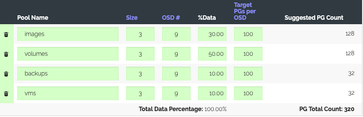

# 硬件环境准备

1. 最少节点个数3个
2. 最低配置8C/16G/100G测试环境
3. 最低网卡个数2个
4. 磁盘个数，每台节点上3块空余的盘，用作ceph，大小无所谓（测试环境）
5. centos操作系统，最好使用目前最新系统centos7.6
6. 系统能够访问外部网络

# 安装 kolla-ansible 前的准备

1. 关闭selinux和firewalld（所有节点）
2. 修改对应的host和ip地址（control01）

    ```bash
    [root@control01 ~]# cat /etc/hosts
    127.0.0.1   localhost localhost.localdomain localhost4 localhost4.localdomain4
    ::1         localhost localhost.localdomain localhost6 localhost6.localdomain6
    10.211.55.13  control01
    10.211.55.14  control02
    10.211.55.15  control03
    ```
3. 在control01节点上安装 epel

    ```bash
    sudo yum install epel-release -y
    ```
4. 安装python依赖(control01)

    ```bash
    sudo yum install -y python-devel libffi-devel gcc openssl-devel libselinux-python
    ```
5. 安装ansible（2.5+版本）(control01节点上)
    - 目前 kolla 已经不再支持 2.5 以下的 ansible 的版本

        ```bash
        yum install -y python-pip    //安装pip
        pip install -U pip  //确保使用最新的pip
        pip install ansible  //安装ansible
        ```
    - 国内 pip 安装速度较慢的话，可以使用国内的 pip 源

        ```bash
        pip install ansible  -i https://pypi.tuna.tsinghua.edu.cn/simple
        ```
6. 验证ansible版本

    ```bash
    [root@control01 ~]# ansible --version
    ansible 2.8.2
    config file = None
    configured module search path = [u'/root/.ansible/plugins/modules', u'/usr/share/ansible/plugins/modules']
    ansible python module location = /usr/lib/python2.7/site-packages/ansible
    executable location = /usr/bin/ansible
    python version = 2.7.5 (default, Jun 20 2019, 20:27:34) [GCC 4.8.5 20150623 (Red Hat 4.8.5-36)]
    ```
7. 设置deploy节点(control01)免密登录其他的节点
    - 首先创建临时host文件，内容为所有的节点主机名

        ```bash
        [root@control01 ~]# cat host
        control01
        control02
        control03
        ```
    - 生成ssh公钥（control01）

        ```bash
        [root@control01 ~]# ssh-keygen //一直回车即可
        ```
    - 批量设置免密（control01）

        ```bash
        [root@control01 ~]# ssh-copy-id root@control01
        [root@control01 ~]# ssh-copy-id root@control02
        [root@control01 ~]# ssh-copy-id root@control03
        ```
    - 测试免密是否通过

        ```bash
        [root@control01 ~]# ansible all -i ~/host  -m ping
        ```
8. 拷贝hosts文件到其他的节点上

    ```bash
    ansible all -i ~/host  -m copy -a "src=/etc/hosts dest=/etc/hosts"
    ```

# 安装 kolla-ansible 工具

1. 本次安装最新的发布版本 stein 版本，所以我们使用 stein 版本的 kolla-ansible
2. 如果操作系统没有安装 git 需要首先安装 git

    ```bash
    yum install -y git
    ```
3. 之后克隆 kolla-ansible 的代码

    ```bash
    git clone https://github.com/openstack/kolla-ansible.git -b stable/stein
    ```
4. 该步骤如果克隆较慢，可以自己下载压缩包，或者配置 git 代理

    ```bash
    [root@openstack-allinone kolla-ansible]# git branch //检查分支
    * stable/stein
    [root@openstack-allinone kolla-ansible]# pwd
    /root/kolla-ansible
    [root@openstack-allinone kolla-ansible]#
    ```
5. 安装 kolla-ansible

    ```bash
    cd ~/kolla-ansible
    pip install . -i https://pypi.tuna.tsinghua.edu.cn/simple
    ```
6. 创建配置文件目录

    ```bash
    sudo mkdir -p /etc/kolla
    sudo chown $USER:$USER /etc/kolla
    ```
7. 拷贝 globals.yml 和 passwords.yml 文件到 /etc/kolla 目录下

    ```bash
    cp -r /usr/share/kolla-ansible/etc_examples/kolla/* /etc/kolla
    ```
8. 拷贝 allinone 和 mutinode 文件到当前家目录下

    ```bash
    cp /usr/share/kolla-ansible/ansible/inventory/* ~/
    ```

# 部署 OpenStack 前的配置

1. 修改multinode文件

    ```ini
    vi ~/multinode
    [control]
    # These hostname must be resolvable from your deployment host
    control01
    control02
    control03
    # The above can also be specified as follows:
    #control[01:03]     ansible_user=kolla
    # The network nodes are where your l3-agent and loadbalancers will run
    # This can be the same as a host in the control group
    [network]
    control01
    control02
    control03
    [compute]
    control01
    control02
    control03
    [monitoring]
    #monitoring01
    # When compute nodes and control nodes use different interfaces,
    # you need to comment out "api_interface" and other interfaces from the globals.yml
    # and specify like below:
    #compute01 neutron_external_interface=eth0 api_interface=em1 storage_interface=em1tunnel_interface=em1
    [storage]
    control01
    control02
    control03
    ```
2. 修改globals.yml文件

    ```yaml
    vi /etc/kolla/globals.yml
    修改如下选项
    kolla_install_type: "source"
    openstack_release: "stein"
    kolla_internal_vip_address: "10.211.55.200" //这个ip需要是管理网同一个网段的
    network_interface: "eth0"
    neutron_external_interface: "eth1"
    enable_cinder: "yes"
    enable_ceph: "yes"
    enable_ceph_dashboard: "no"
       ......其他的默认即可
    enable_neutron_provider_networks: "yes" //如果开启octavia，最好开启neutron的二层网络功能，否则octavia的boot_network不好处理。
    ceph_osd_store_type: "filestore" //在文件中添加该行，默认是bulesotre
    ```
3. 准备ceph
    - 查看要被ceph使用的盘，本例是sdb sdc sdd

        ```bash
        [root@control01 kolla-ansible]# lsblk
        NAME                 MAJ:MIN RM   SIZE RO TYPE MOUNTPOINT
        sda                    8:0    0   100G  0 disk
        ├─sda1                 8:1    0   500M  0 part /boot
        └─sda2                 8:2    0  99.5G  0 part
          ├─VolGroup-lv_root 253:0    0    50G  0 lvm  /
          ├─VolGroup-lv_swap 253:1    0     2G  0 lvm  [SWAP]
          └─VolGroup-lv_home 253:2    0  47.6G  0 lvm  /home
        sdb                    8:16   0    10G  0 disk
        sdc                    8:32   0    10G  0 disk
        sdd                    8:48   0    10G  0 disk
        sr0                   11:0    1 119.3M  0 rom
        sr1                   11:1    1   918M  0 rom
        ```
    - 给磁盘打上标签(在所有的存储节点上)

        ```bash
        parted /dev/sdb -s -- mklabel gpt mkpart KOLLA_CEPH_OSD_BOOTSTRAP 1 -1
        parted /dev/sdc -s -- mklabel gpt mkpart KOLLA_CEPH_OSD_BOOTSTRAP 1 -1
        parted /dev/sdd -s -- mklabel gpt mkpart KOLLA_CEPH_OSD_BOOTSTRAP 1 -1
        ```
    - 检查磁盘是否打标记成功，检查是否多一个分区

        ```bash
        [root@control01 kolla-ansible]# lsblk
        NAME                 MAJ:MIN RM   SIZE RO TYPE MOUNTPOINT
        sda                    8:0    0   100G  0 disk
        ├─sda1                 8:1    0   500M  0 part /boot
        └─sda2                 8:2    0  99.5G  0 part
          ├─VolGroup-lv_root 253:0    0    50G  0 lvm  /
          ├─VolGroup-lv_swap 253:1    0     2G  0 lvm  [SWAP]
          └─VolGroup-lv_home 253:2    0  47.6G  0 lvm  /home
        sdb                    8:16   0    10G  0 disk
        └─sdb1                 8:17   0    10G  0 part
        sdc                    8:32   0    10G  0 disk
        └─sdc1                 8:33   0    10G  0 part
        sdd                    8:48   0    10G  0 disk
        └─sdd1                 8:49   0    10G  0 part
        sr0                   11:0    1 119.3M  0 rom
        sr1                   11:1    1   918M  0 rom
        ```

# 部署 openstack

1. 执行 bootstrap，会安装 docker 一类所需要的工具(control01节点上)

    ```bash
    kolla-ansible  -i ~/multinode bootstrap-servers
    ```
2. 确认cpu是否支持硬件虚拟化（control01）

    ```bash
    grep -E 'svm|vmx' /proc/cpuinfo
    #如果有回显，则下面的操作不需要，如果没有回显，说明cpu不支持硬件虚拟化，需要修改virt_type
    mkdir -p /etc/kolla/config/nova
    cat << EOF > /etc/kolla/config/nova/nova-compute.conf
    [libvirt]
    virt_type=qemu
    cpu_mode = none
    EOF
    ```
3. docker 是从 docker hub 上面 pull openstack 镜像，国内的环境有点慢，所以这里配置了 docker 加速，当然也可以不配置这个步骤(所有节点)

    ```bash
    sudo mkdir -p /etc/docker
         sudo tee /etc/docker/daemon.json <<-'EOF'
    {
      "registry-mirrors": ["https://registry.docker-cn.com"]
    }
    EOF
    sudo systemctl daemon-reload
    sudo systemctl restart docker
    ```
4. 生成 kolla 密码

    ```bash
    kolla-genpwd
    ```
5. 执行 precheck

    ```bash
    kolla-ansible -i ~/multinode prechecks
    ```
6. 执行 pull（可以不执行，deploy 的时候会自动 pull）

    ```bash
    kolla-ansible -i ~/multinode pull
    ```
7. 执行deploy

    ```bash
    kolla-ansible -i ~/multinode deploy
    ```

# 调整 ceph

1. 查看ceph状态

    ```bash
    [root@control01 ~]# docker exec ceph_mon ceph -s
      cluster:
        id:     8b0dd7b5-da1e-434c-bbc2-aa1963c3bdaf
        health: HEALTH_WARN
                too few PGs per OSD (10 < min 30)
      services:
        mon: 3 daemons, quorum 10.211.55.13,10.211.55.14,10.211.55.15    (age 44m)
        mgr: control01(active, since 44m), standbys: control02,control03
        osd: 9 osds: 9 up (since 43m), 9 in (since 43m)
      data:
        pools:   4 pools, 32 pgs
        objects: 0 objects, 0 B
        usage:   9.0 GiB used, 81 GiB / 90 GiB avail
        pgs:     32 active+clean
    ```
2. 计算pg数
    - 参考[ceph官网的pg计算器](https://ceph.com/pgcalc/)，调整`pg_num`和`pgp_num`
    - 

    ```bash
    [root@control01 ~]# docker exec -it -u root ceph_mon bash
    (ceph-mon)[root@control01 /]# ceph osd pool set images pg_num 128
    set pool 1 pg_num to 128
    (ceph-mon)[root@control01 /]# ceph osd pool set images pgp_num 128
    set pool 1 pgp_num to 128
    (ceph-mon)[root@control01 /]# ceph osd pool set volumes pg_num 128
    set pool 2 pg_num to 128
    (ceph-mon)[root@control01 /]# ceph osd pool set volumes pgp_num 128
    set pool 2 pgp_num to 128
    (ceph-mon)[root@control01 /]# ceph osd pool set backups pg_num 32
    set pool 3 pg_num to 32
    (ceph-mon)[root@control01 /]# ceph osd pool set backups pgp_num 32
    set pool 3 pgp_num to 32
    (ceph-mon)[root@control01 /]# ceph osd pool set vms pg_num 32
    set pool 4 pg_num to 32
    (ceph-mon)[root@control01 /]# ceph osd pool set vms pgp_num 32
    set pool 4 pgp_num to 32
    (ceph-mon)[root@control01 /]# ceph -s
    cluster:
        id:     8b0dd7b5-da1e-434c-bbc2-aa1963c3bdaf
       health: HEALTH_OK

    services:
       mon: 3 daemons, quorum 10.211.55.13,10.211.55.14,10.211.55.15     (age 52m)
       mgr: control01(active, since 52m), standbys: control02, control03
       osd: 9 osds: 9 up (since 51m), 9 in (since 51m)

    data:
        pools:   4 pools, 320 pgs
       objects: 0 objects, 0 B
       usage:   9.1 GiB used, 81 GiB / 90 GiB avail
       pgs:     320 active+clean

    (ceph-mon)[root@control01 /]#
    ```

# 使用 openstack

1. 安装openstack client

    ```bash
    pip install python-openstackclient -i https://pypi.tuna.tsinghua.edu.cn/simple
    ```
2. 生成admin-rc文件

    ```bash
    kolla-ansible -i ~/multinode post-deploy
    默认是生成的文件名是: /etc/kolla/admin-openrc.sh
    ```

# 配置 octavia

1. 克隆octavia仓库

    ```bash
    git clone https://github.com/openstack/octavia.git -b stable/stein
    ```
2. 创建证书

    ```bash
    [root@control01 ~]# cd octavia/
    [root@control01 ~]# grep octavia_ca /etc/kolla/passwords.yml
    octavia_ca_password: OgY7o4XSLqRIrEWkQOJPeuGeDZgMI8zpyYPIlxvE
    [root@control01 octavia]# sed -i 's/foobar/OgY7o4XSLqRIrEWkQOJPeuGeDZgMI8zpyYPIlxvE/g' bin/create_certificates.sh
    [root@control01 octavia]# ./bin/create_certificates.sh cert $(pwd)/etc/certificates/openssl.cnf
    ```
    - 之后会得到一个cert文件夹

    ```bash
    [root@control01 octavia]# ls -al cert/
    总用量 60
    drwxr-xr-x.  4 root root 4096 7月  22 02:45 .
    drwxr-xr-x. 19 root root 4096 7月  22 02:45 ..
    -rw-r--r--.  1 root root 1294 7月  22 02:45 ca_01.pem
    -rw-r--r--.  1 root root  989 7月  22 02:45 client.csr
    -rw-r--r--.  1 root root 1704 7月  22 02:45 client.key
    -rw-r--r--.  1 root root 4405 7月  22 02:45 client-.pem
    -rw-r--r--.  1 root root 6109 7月  22 02:45 client.pem
    -rw-r--r--.  1 root root   71 7月  22 02:45 index.txt
    -rw-r--r--.  1 root root   21 7月  22 02:45 index.txt.attr
    -rw-r--r--.  1 root root    0 7月  22 02:45 index.txt.old
    drwxr-xr-x.  2 root root 4096 7月  22 02:45 newcerts
    drwx------.  2 root root 4096 7月  22 02:45 private
    -rw-r--r--.  1 root root    3 7月  22 02:45 serial
    -rw-r--r--.  1 root root    3 7月  22 02:45 serial.old
    ```
    - 接下来将认证文件放到kolla部署节点上的/etc/kolla/octavia目录里

    ```bash
    [root@control01 octavia]# mkdir /etc/kolla/config/octavia
    [root@control01 octavia]# cp cert/{private/cakey.pem,ca_01.pem,client.pem} /etc/kolla/config/octavia/
    [root@control01 octavia]# ls -al /etc/kolla/config/octavia/
    总用量 24
    drwxr-xr-x. 2 root root 4096 7月  22 02:59 .
    drwxr-xr-x. 4 root root 4096 7月  22 02:57 ..
    -rw-r--r--. 1 root root 1294 7月  22 02:59 ca_01.pem
    -rw-r--r--. 1 root root 1743 7月  22 02:59 cakey.pem
    -rw-r--r--. 1 root root 6109 7月  22 02:59 client.pem
    ```
3. 构建镜像

    ```bash
    [root@control01 ~]# cd ~
    [root@control01 ~]# git clone https://github.com/openstack/diskimage-builder
    #克隆disk-builder工具，目录在/root/diskimage-builder下
    [root@control01 ~]# pip install diskimage-builder/ -i https://pypi.tuna.tsinghua.edu.cn/simple
    [root@control01 ~]# pwd
    /root
    [root@control01 ~]# yum install qemu-img -y
    #构建镜像的时候需要改工具
    [root@control01 ~]# cd octavia/diskimage-create/
    [root@control01 diskimage-create]# ./diskimage-create.sh  -i centos -s 3
    ```
    - 构建完成后，当前目录下会生成`amphora-x64-haproxy.qcow2`文件。改步骤过程较慢，使用的是国外的源，而且可能会失败。实际上没必要每次去构建这个镜像，直接使用现有的镜像即可。[镜像下载地址](ftp://99cloudftp@172.16.20.14/builder-images/octavia/amphora-x64-haproxy.raw)
4. 上传镜像到openstack中

    ```bash
    source  /etc/kolla//admin-openrc.sh
    openstack image create --container-format bare --disk-format qcow2 --private --file amphora-x64-haproxy.qcow2 --tag amphora amphora
    [root@control01 ~]# openstack image list
    +--------------------------------------+--------- +--------+
    | ID                                   | Name    |  Status |
    +--------------------------------------+--------- +--------+
    | 16c35d86-9e05-4a24-94ec-0884ea69ccef | amphora |  active |
    +--------------------------------------+--------- +--------+
    ```
5. 创建openstack网络，该网络必须要和network节点，双向通信。

    ```bash
    [root@control01 ~]# openstack network create --provider-physical-network physnet1 --provider-network-type flat --external --share lb-net
    [root@control01 ~]# openstack subnet create --allocation-pool start=10.211.55.150,end=10.211.55.200 --network lb-net --subnet-range 10.211.55.0/24 --gateway 10.211.55.1 lb-subnet
    ```
    - 根据回显，我们拿到该网络的id（而不是子网的id），后面会用到，本次的id：`21f243d8-606d-4430-8bfd-16e9e0d3acab`
6. 创建octavia虚拟机flavor

    ```bash
    [root@control01 ~]# openstack flavor create --disk 40 --private --ram 1024 --vcpus 1 octavia_flavor
    ```
    - 拿到该flavor的id，后面会用到，本例为：`2354f1c2-fc2d-487e-bef0-b12b7f095718`
7. 创建安全组并配置安全组规则

    ```bash
    [root@control01 ~]# openstack security group create --description 'used by Octavia amphora instance' octavia
    [root@control01 ~]# openstack security group rule create --protocol icmp ec40be6f-bad2-4c2c-b014-a95c362d24a1
    [root@control01 ~]# openstack security group rule create --protocol tcp --dst-port 5555 --egress ec40be6f-bad2-4c2c-b014-a95c362d24a1
    [root@control01 ~]# openstack security group rule create --protocol tcp --dst-port 9443 --ingress ec40be6f-bad2-4c2c-b014-a95c362d24a1
    ```
    - 其中ec40be6f-bad2-4c2c-b014-a95c362d24a1为安全组的id。
8. 部署octavia（主要目的是为了创建octavia的用户）
    - 修改vim /etc/kolla/globals.yml

        ```yaml
        enable_octavia: "yes"
        ```
    - 开始部署octaiva

        ```bash
        [root@control01 ~]# kolla-ansible deploy -i ~/multinode  --tags octavia,horizon,haproxy
        ```
9. 创建octavia虚拟机的key，其中key的名字必须为`octavia_ssh_key`

    ```bash
    [root@control01 ~]# grep octavia_keystone_password /etc/kolla/passwords.yml
    octavia_keystone_password:       5RPTorrBeNeLt5a0WBG5OXAPGHTsnSv7jqpxnD0O
    [root@control01 ~]# openstack --os-username octavia --os-password 5RPTorrBeNeLt5a0WBG5OXAPGHTsnSv7jqpxnD0O  keypair create --public-key ~/.ssh/id_rsa.pub octavia_ssh_key
    ```
10. 更新globas.yml文件并reconfigure
    - vim /etc/kolla/globals.yml在文件最后增加如下字段

        ```yaml
        octavia_loadbalancer_topology: "ACTIVE_STANDBY"
        octavia_amp_boot_network_list: 21f243d8-606d-4430-8bfd-16e9e0d3acab
        octavia_amp_secgroup_list: ec40be6f-bad2-4c2c-b014-a95c362d24a1
        octavia_amp_flavor_id: 2354f1c2-fc2d-487e-bef0-b12b7f095718
        ```
    - reconfigure octavia

        ```bash
        [root@control01 ~]# kolla-ansible -i ~/multinode  reconfigure --tags octavia
        ```

# octavia 的使用

1. 登录到horizon创建router和子网，并把子网绑定到router上
    - 项目->网络->路由->创建
    - 项目->网络->网络->创建网络和子网
    - 项目->网络->路由->选中路由器->接口->添加接口
2. 创建loadbalancer
    - 项目->网络->负载均衡器中根据提示创建即可。
