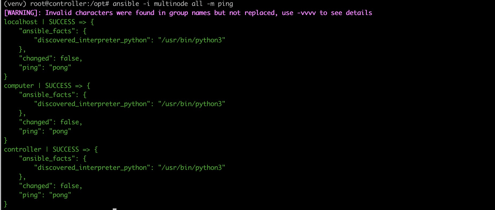
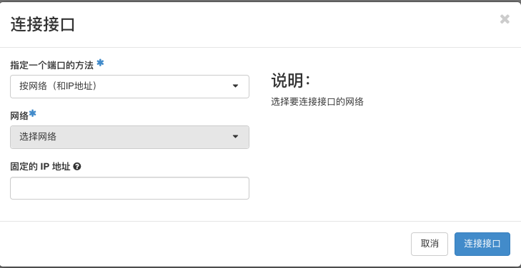

# 使用 `kolla` 部署 `openstack`

## 1. 注意事项

- 操作系统使用的是 `Ubuntu20.04`
- 部署 `openstack` 版本是 `Wallaby`，若想部署 `Xena` 版，在 `3.1 下载源码` 这一步将下载的分支改为 `xena`
- 本文部署主要是基于 `all-in-one` 的方式，若需增加计算节点请参考额外可选步骤，或根据可选步骤一次部署多节点
- 建议最低配置内存和硬盘为 `4C 8G 80G`
- 本文安装 `kolla` 和 `kolla-ansible` 是基于 `python` 虚拟环境的方式，还有一种是直接安装在本机
- 本文部署方式是以源码形式部署，同样还有不基于源码形式部署
- 官方文档地址 <https://docs.openstack.org/kolla-ansible/latest/user/quickstart.html>

## 2. 部署准备

### 2.1 `ubuntu` 换源（可选）

```shell
# 先备份以防以后需要使用
sudo mv /etc/apt/sources.list /etc/apt/sources.list.bak
# 添加阿里的镜像源
cat << EOF > /etc/apt/sources.list
deb http://mirrors.aliyun.com/ubuntu/ focal main restricted universe multiverse
deb-src http://mirrors.aliyun.com/ubuntu/ focal main restricted universe multiverse
deb http://mirrors.aliyun.com/ubuntu/ focal-security main restricted universe multiverse
deb-src http://mirrors.aliyun.com/ubuntu/ focal-security main restricted universe multiverse
deb http://mirrors.aliyun.com/ubuntu/ focal-updates main restricted universe multiverse
deb-src http://mirrors.aliyun.com/ubuntu/ focal-updates main restricted universe multiverse
deb http://mirrors.aliyun.com/ubuntu/ focal-proposed main restricted universe multiverse
deb-src http://mirrors.aliyun.com/ubuntu/ focal-proposed main restricted universe multiverse
deb http://mirrors.aliyun.com/ubuntu/ focal-backports main restricted universe multiverse
deb-src http://mirrors.aliyun.com/ubuntu/ focal-backports main restricted universe multiverse
EOF
# 更新源
sudo apt update
```

### 2.2 安装依赖并创建虚拟环境

```shell
# 安装依赖
sudo apt install -y python3-dev libffi-dev gcc libssl-dev
# 安装python虚拟环境
sudo apt install -y python3-venv
# 创建虚拟环境
python3 -m venv /path/to/venv
# 进入虚拟环境
source /path/to/venv/bin/activate
# 更新或安装最新版本的pip
pip install -U pip
# 安装 ansible
pip install matplotlib -i https://pypi.douban.com/simple/ 'ansible<3.0'
```

### 2.3 (可选)多节点

- 除控制节点外，在计算节点也执行 `2.1` 和 `2.2`，并下载 `docker`

  ```shell
  pip install docker
  ```

## 3. 安装 `kolla` 和 `kolla-ansible`

1. 下载源码

   ```bash
   cd /opt
   git clone -b stable/wallaby https://github.com/openstack/kolla
   git clone -b stable/wallaby https://github.com/openstack/kolla-ansible
   ```

2. 安装项目所需要的 `python` 包

   ```bash
   pip install matplotlib -i https://pypi.douban.com/simple/ /opt/kolla
   pip install matplotlib -i https://pypi.douban.com/simple/ /opt/kolla-ansible
   ```

3. 创建 `/etc/kolla` 目录，并修改目录权限

   ```shell
   sudo mkdir -p /etc/kolla
   sudo chown $USER:$USER /etc/kolla
   ```

4. 把 `globals.yml` 和 `password.yml` 复制到 `/etc/kolla` 文件夹下

   ```shell
   cp -r /opt/kolla-ansible/etc/kolla/* /etc/kolla
   ```

5. 将单节点和多节点的配置文件复制到该目录下

   ```shell
   cp /opt/kolla-ansible/ansible/inventory/* .
   ```

6. 配置 `ansible`

   ```shell
   mkdir /etc/ansible
   cat << EOF > /etc/ansible/ansible.cfg
   [defaults]
   host_key_checking=False
   pipelining=True
   forks=100
   ansible_python_interpreter=/path/to/venv/bin/python3
   EOF
   ```

7. （可选）增加计算节点

- 如需再加入计算节点，例如主机名为 `computer`，那么在 `/opt/multinode` 文件中 `[ovscompute]` 和 `[monitoring]` 和 `[storage]`
  等按具体情况加入或者替换上 `computer` 相关信息，以下为示例：

  ```conifg
  [control]
        controller node_id=163 ansible_host=192.168.122.163

  [network]
        controller node_id=163 ansible_host=192.168.122.163

   [compute]
        computer node_id=27 ansible_host=192.168.122.27

   [monitoring]
        controller node_id=163 ansible_host=192.168.122.163

   [storage]
        controller node_id=163 ansible_host=192.168.122.163
        computer node_id=27 ansible_host=192.168.122.27
  ```

8. （可选）各节点配置免密登录并 ping 通

- 各节点均需打开，分别在各节点执行

  ```shell
  ssh-keygen
  ssh-copy-id -i /root/.ssh/id_rsa.pub root@controller
  ssh-copy-id -i /root/.ssh/id_rsa.pub root@computer
  ```

- 若出现 SSH 报错：Permission denied, please try again，进入 `/etc/ssh/sshd_config` 修改或增加 PermitRootLogin
  的配置如下：

  ```config
  PermitRootLogin yes
  ```

- 使用如下指令重启 SSH 服务：

  ```shell
  service sshd restart
  ```

## 4. 初始化配置

1. 检查配置

   ```shell
   ansible -i all-in-one all -m ping
   ```

- （可选）若是多节点，则执行以下步骤检查配置

  ```shell
  ansible -i multinode all -m ping
  ```

- 须所有节点都显示成功，如图



2. 初始化密码

   ```shell
   cd /opt/kolla-ansible/tools
   ./generate_passwords.py
   ```

3. 把 `/etc/kolla/globals.yml` 文件的内容全部删除并替换为下面内容，其中配置项 `kolla_internal_vip_address network_interface`
   可以使用 `ifconfig` 命令查看，`neutron_external_interface` 不需要有真实的网卡

   ```conifg
   kolla_base_distro: "ubuntu"
   kolla_install_type: "source"
   network_interface: "ens3"
   neutron_external_interface: "ens4"
   kolla_internal_vip_address: "192.168.100.99"
   enable_cinder: "yes"
   enable_cinder_backend_lvm: "yes"
   enable_haproxy: "no"
   enable_openvswitch: "no"
   enable_prometheus: "yes"
   ```

4. (可选)单节点开启 `haproxy`

   单节点开启 `haproxy` 需要新添加一张网卡，使用同一个网卡 `haproxy` 会占用 `mariadb rabbitmq`等服务的端口导致这些服务启动失败。在
   `openstack ui` 中添加网卡方式如下图  在执行第六步部署环节的 `deploy` 时需要把
   `koall-ansible` 生成的各个服务的配置文件进行修改，需要修改的文件目录为 `/etc/kolla/haproxy/services.d` ，以 `mariadb` 为例，修改
   `frontend` 的 `bind` 把 `ip` 修改为新增网卡的 `ip`

   ```cfg
   frontend mariadb_front
      mode tcp
      option clitcpka
      timeout client 3600s
      option tcplog
      bind 192.168.100.210:3306
      default_backend mariadb_back

   backend mariadb_back
      mode tcp
      option srvtcpka
      timeout server 3600s
      option httpchk
      server kolla 192.168.100.125:3306 check port 4569 inter 2000 rise 2 fall 5
   ```

## 5. 配置 `cinder` 的 `backend`

1. 需要挂载一个新的磁盘在此机器上面，然后使用 `fdisk -l` 查看机器上挂载磁盘的详细信息
2. 使用 `sdb` 创建 `pv` 和 `vg`

   ```shell
   pvcreate /dev/sdb
   vgcreate cinder-volumes /dev/sdb
   ```

3. (可选)若是在 kvm 内二次创建的虚拟机内部署，需手工建立卷。loop 后的数字根据 `losetup -f` 显示的具体信息调整。需要注意的是控制节点和计算节点均需执行此步骤

   ```shell
   dd if=/dev/zero of=./disk.img count=4096 bs=1MB
   losetup -f
   losetup /dev/loop0 disk.img
   pvcreate /dev/loop0
   vgcreate cinder-volumes /dev/loop0
   ```

## 6. 部署

- （可选）若部署多节点，将以下执行 all-in-one 的步骤改为执行 multinode

```shell
cd /opt/kolla-ansible/tools
./kolla-ansible -i /opt/all-in-one bootstrap-servers
./kolla-ansible -i /opt/all-in-one prechecks -e 'ansible_python_interpreter=/path/to/venv/bin/python3'
./kolla-ansible -i /opt/all-in-one deploy -e 'ansible_python_interpreter=/path/to/venv/bin/python3'
cd /opt/kolla-ansible/tools
./kolla-ansible post-deploy
```

## 7. 测试

```shell
# 安装客户端
pip install matplotlib -i https://pypi.douban.com/simple/ python-openstackclient
# 把admin用户信息添加到环境变量中
. /etc/kolla/admin-openrc.sh
# 创建示范网络和下载所需要的测试镜像
/opt/kolla-ansible/tools/init-runonce
```

## 8. 配置 `cinder` 的 `metric`

默认 `openstack-exporter cinder metric` 使用的是 `v2` 版本的 `api` ，在没有 `v2` 版本时要修改配置文件
`/etc/kolla/prometheus-openstack-exporter/clouds.yml` 在文件中添加`volume_api_version: v3`，添加示例如下。添加后重启
`openstack-exporter` 容器即可，重启命令为 `docker restart prometheus_openstack_exporter`

```yaml
clouds:
 default:
   region_name: RegionOne
   volume_api_version: v3
   identity_api_version: 3
   identity_interface: internal
   auth:
     username: admin
     password: VC7J5ZUD2WLSqmL2VxR0wErUWLhRvEB9ZSkq7FC5
     project_name: admin
     project_domain_name: 'Default'
     user_domain_name: 'Default'
     cacert:
     auth_url: http://192.168.100.60:35357/v3
```

## 9. 部署 `skyline`

1. 构建镜像

   可以直接从 `dockerhub` 拉取镜像，镜像名字为 `99cloud/skyline` 。如果想使用最新版本的镜像可以从社区代码仓库中拉取代码，然后使用 `make build`
   进行构建镜像，[代码仓库地址](https://opendev.org/skyline/skyline-apiserver)。

2. 部署流程

   详细的部署流程参考数据库使用 `mariaDB` 部署，文档地址为
   <https://opendev.org/skyline/skyline-apiserver/src/branch/master/README-zh_CN.md>

   启动容器后根据实际环境修改 `/etc/skyline/skyline.yaml` ，修改完毕查看 `skyline` 容器日志判断服务是否正常运行，如果出现 401 权限校验问题查看
   `system_user_password` 是否正确，出现 `url` 问题把 `localhost` 改为本机的 `ip` 地址，出现数据库问题查看 `database_url`
   是否配置正确
