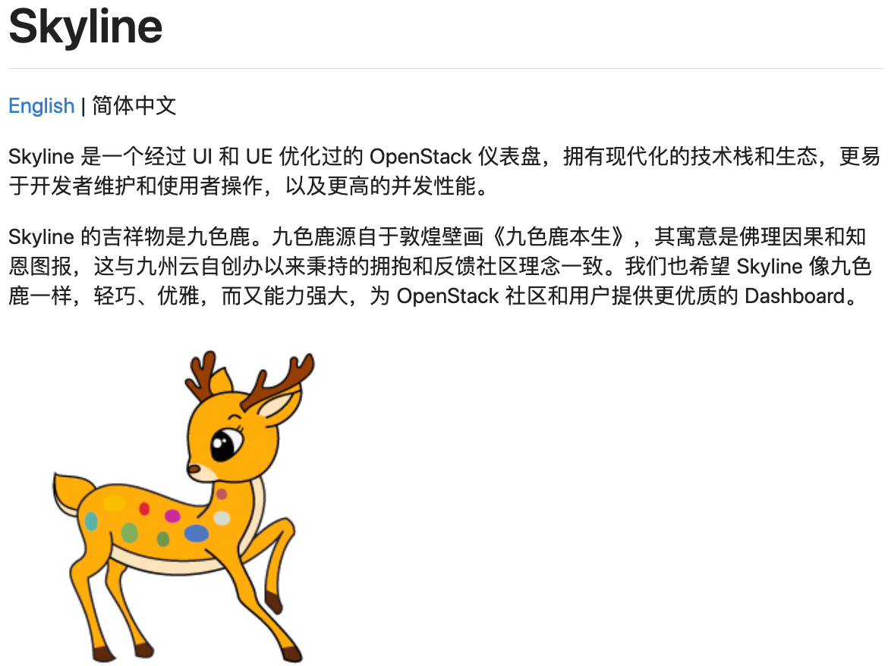
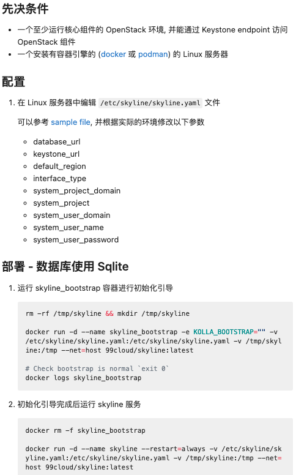
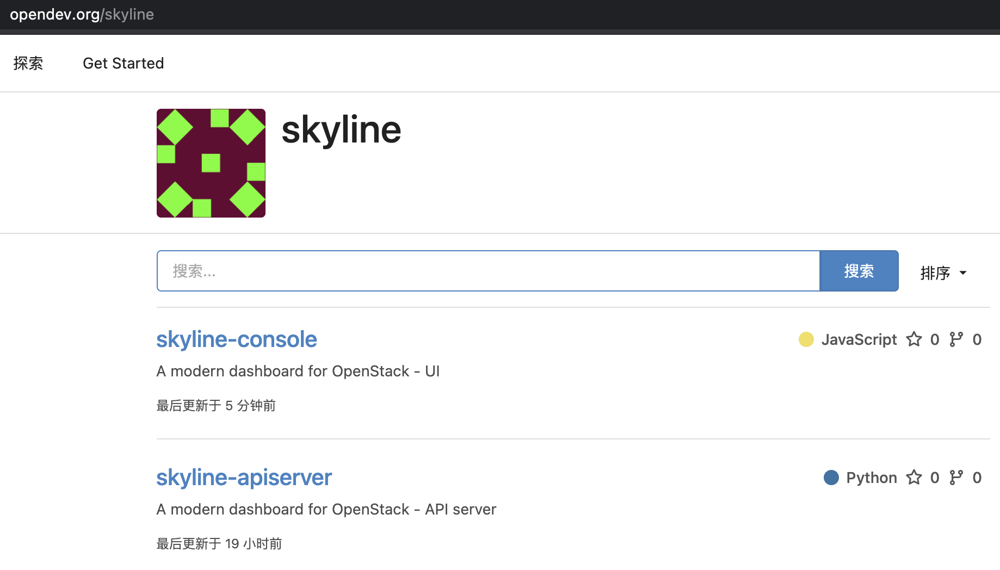
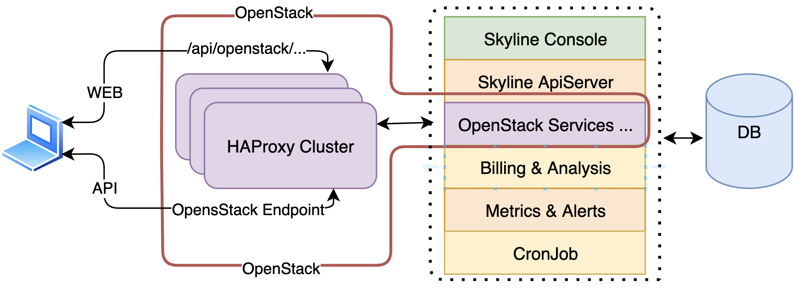
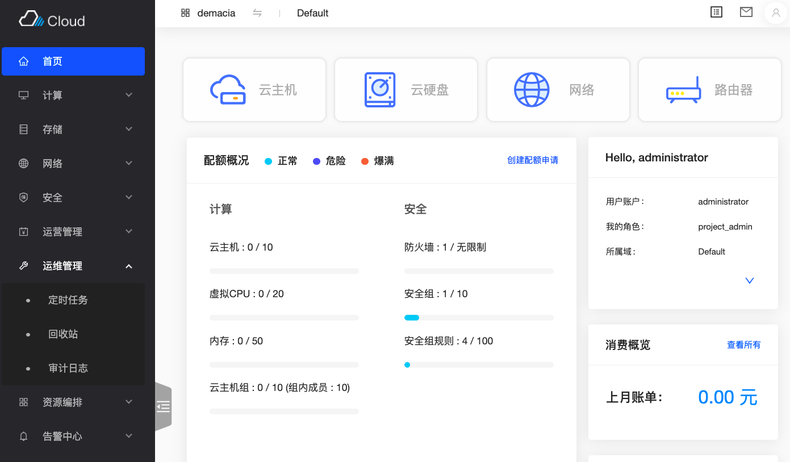
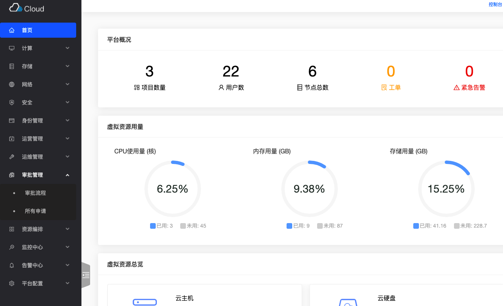
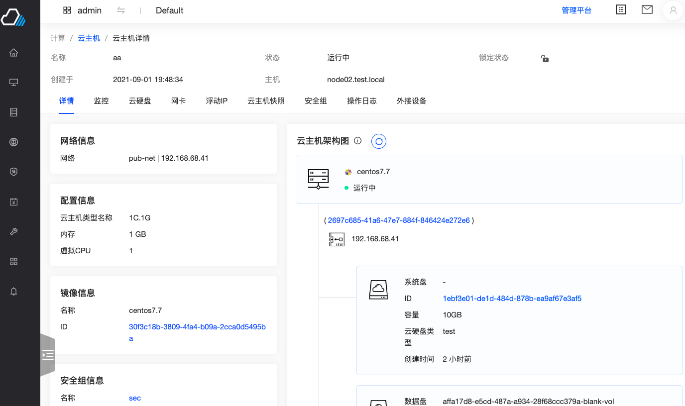
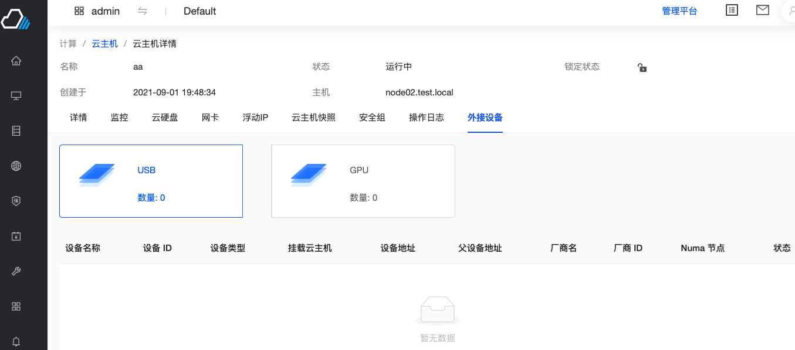
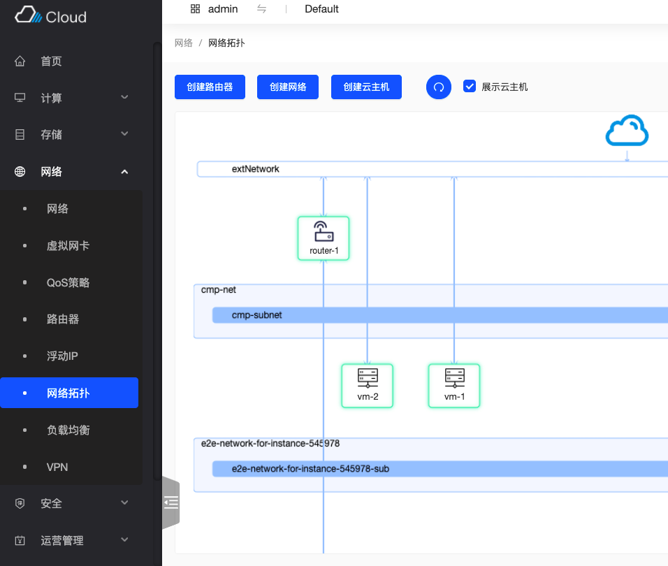
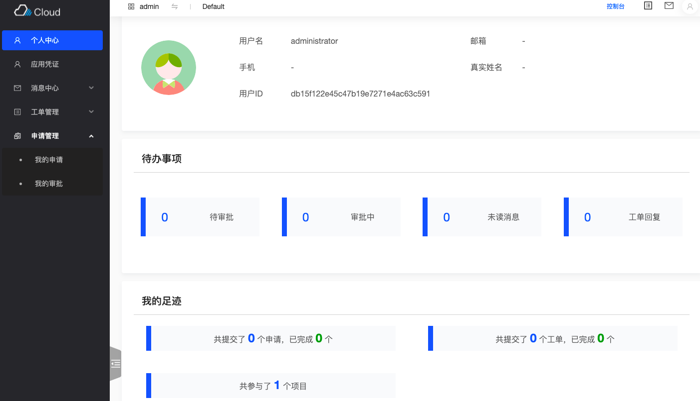

# Skyline：现代化的 OpenStack 管理界面

Skyline 是由深度参与 OpenStack 的厂商九州云捐献给 OpenStack 社区的一款现代化的 OpenStack 管理界面（Dashboard）。我们可以在 OpenStack
社区代码托管网站 OpenDev
上看到它，地址：<https://opendev.org/skyline/skyline-apiserver/src/branch/master/README-zh_CN.md>。

OpenStack 自 2010 年问世以来，历经十多年的快速发展，其社区贡献者之多，参与厂商之广，影响之深远，可谓前不见古人，后难见来者。Horzion 是 OpenStack 社区默认推荐的
Dashboard 平台，但因其 UI 简陋、技术栈陈旧、性能和用户体验性较差等原因，被广大 OpenStack 用户诟病已久，可谓“天下苦 Horizon 久矣”。但遗憾的是，社区一直没能对
Horizon 进行整体技术升级，或者推出另一款更优秀和现代化的 Dashboard 供用户选择。今天我们很高兴看到，九州云捐献的 Skyline 项目填补了这一空白。

九州云是 OpenStack 黄家会员，自 2012 年开始参与 OpenStack 社区贡献，拥有多名 Core Developer 和 PTL，此次捐献的 Skyline 项目也另我们耳目一新。

## 1. 简单至上

Skyline 秉承了“Less is more”的设计哲学，保持“简单至上”，包括安装部署、用户操作、架构设计等方方面面。

### 1.1 简单上手：从一个 Docker 镜像开始

从官网可以看到，如果想试用 Skyline，可以从一个 Docker 镜像轻松开始。

### 1.2 框架简明清晰

从 Skyline 官网可以看到，Skyline 分为两个模块：apiserver 和 web console。

Skyline apiserver 模块基于 Python Fastapi 框架（一个高性能的 Python 异步 Web 框架）实现，相当于 Horizon API，但简单得多。Skyline
apiserver 将绝大多数 OpenStack API 直接透传给 OpenStack endpoints，而不像 Horizon API
一样增加适配层。这样一来，我们就可以轻松地从浏览器的开发者工具中看到绝大多数的 OpenStack API 请求被直接发送到 OpenStack
endpoints，请求和返回信息都会非常直观，这样就大大降低了系统出错时 Trouble Shooting 的难度。

Skyline console 是一个 JavaScript React 纯前端框架，不包含 Node.js，完全运行在浏览器上，非常轻量，且保持无状态。

Skyline 支持扩展，可以支持诸如计费、监控、计划任务等增值服务。

## 2. 功能强大

### 2.1 覆盖了 IaaS 云平台的几乎所有功能

得益于九州云多年来深耕 OpenStack 的技术和客户需求经验积累，Skyline
从捐献之初其功能就已经非常完整，除了对计算、存储、网络的虚拟化支持完备之外，对于安全中心、计费分析、运维管理、Heat 编排、监控告警也有了很全面的支持（部分模块需要企业扩展包支持）。

在管理界面上，Skyline 也覆盖了管理员需要的几乎所有功能模块，包括 workflow（需要企业扩展包支持）和全局设置等。

### 2.2 在细节上更懂你

Skyline 界面在很多细节颇具匠心，令人赞叹。

比如虚拟机详情页中，我们可以直观地看到 VM 的所有信息，包括 USB 和 GPU 信息。

在网络模块中，不仅包含了 VPN / 负载均衡 / QoS / 虚拟网卡，还以更清晰的 topo 展示了网络。

在个人中心，可以总览该用户相关的项目、工单、和审批流程。

## 3. Skyline 的发展动向

Skyline 还在快速成长中，预计 2021 年国庆前会完成与社区 Zuul CICD / DevStack / Kolla 等工具和项目的融合，届时 Skyline
会更稳定可靠，其部署安装也会更方便快捷。

Skyline 开发团队与 Horizon 项目开发者的合作讨论也在同步进行中，我们希望看到尽快看到社区开发团队能精诚合作，合力打造出优秀的 OpenStack Dashboard 项目。

## 4. 小结

Skyline 是九州云捐献到社区的诚意和匠心之作，正如其官网所述：“Skyline
的吉祥物是九色鹿。九色鹿源自于敦煌壁画《九色鹿本生》，其寓意是佛理因果和知恩图报，这与九州云自创办以来秉持的拥抱和反馈社区理念一致。我们也希望 Skyline
像九色鹿一样，轻巧、优雅，而又能力强大，为 OpenStack 社区和用户提供更优质的 Dashboard。”

我们很高兴看到国内的云计算企业开始向社区回馈贡献高质量的项目，希望这个项目能茁壮成长，也希望看到更多的优秀开源项目不断涌现出来。

再次感谢九州云！

# 获奖理由

周虽旧邦，其命维新。OpenStack 历经十年的打磨，越发成熟和稳定；我们不希望 OpenStack 固步自封，而是应该始终保持朝气蓬勃、锐意进取的少年模样。

Horizon 在过去很好地完成了 OpenStack Dashboard 的历史使命，但其 UI 简陋、技术栈陈旧、性能和用户体验性较差等原因，已不能符合 OpenStack
未来的发展趋势。九州云捐献的 Skyline 项目立足于扎实的行业基础，志在为 OpenStack 提供一个全新的、面向未来的 Dashboard。

Skyline 上手简单、架构清晰、设计简明、功能全面，如同它的吉祥物九色鹿一样，轻巧、优雅而又能力强大。

Skyline
开发团队（朱博祥、高瀚翔、陈柳飞扬、吴文相、张菁韡、朱越、徐松夫）视九州云捐献项目为起点，通过持之以恒、认真细致、精益求精的工作，逐步补全了一系列的开发和使用文档方便社区用户和开发者阅读，并完善了
docker 镜像、自动化测试、Zuul CI/CD 等工作，便于用户上手使用和开发者贡献。未来他们还会继续完成 Kolla 集成，以及协同 Horizon 开发团队一起通力合作。

# Skyline (社区版)、Animbus（企业版)组件列表

|         组件          |  功能   |                                      简介                                       |      类型       | Skyline (社区版) | Animbus (企业版) |
| :-----------------: | :---: | :---------------------------------------------------------------------------: | :-----------: | :-----------: | :-----------: |
|        Nova         | 云主机管理 |                                   云主机生命周期管理                                   | openstack基础组件 |       ✔       |       ✔       |
|       Ironic        | 裸机管理  |                                 裸金属物理机生命周期管理                                  | openstack基础组件 |       ✔       |       ✔       |
|       Cinder        |  块存储  |                                     块存储管理                                     | openstack基础组件 |       ✔       |       ✔       |
|       Neutron       | 网络管理  |                                     网络管理                                      | openstack基础组件 |       ✔       |       ✔       |
|       Octavia       | 负载均衡  |                                    云主机负载均衡                                    | openstack基础组件 |       ✔       |       ✔       |
|        Heat         | 服务编排  |                                      堆栈                                       | openstack基础组件 |       ✔       |       ✔       |
|      Keystone       | 身份认证  |                                     身份管理                                      | openstack基础组件 |       ✔       |       ✔       |
|       Glance        | 镜像管理  |                                     镜像管理                                      | openstack基础组件 |       ✔       |       ✔       |
|       Courier       | 消息系统  |                             提供了通知功能、工单功能、和告警推送功能                              |     自研组件      |       ❌       |       ✔       |
|       Gocron        | 任务系统  |                          异步任务系统,该系统支持即时任务、单次定时任务、循环                           |     自研组件      |       ❌       |       ✔       |
| Prometheus Sidercar | 监控系统  |                  监控告警系统，该系统对 Prometheus 规则定义进行了增强性封装，使其支持多租户                  |     自研组件      |       ❌       |       ✔       |
|   Billing System    | 计费系统  | 计费系统能扩展对接多种不同资源（云主机、云硬盘、镜像、快照、路由器、防火墙、浮动IP，对象存储，网络流量），并能根据同一资源的不同状态进行差异定价和计费。 |     自研组件      |       ❌       |       ✔       |
|      Workflow       | 流程系统  |                           创建部门的身份角色和审批流程，实现云平台多级审批                            |     自研组件      |       ❌       |       ✔       |
