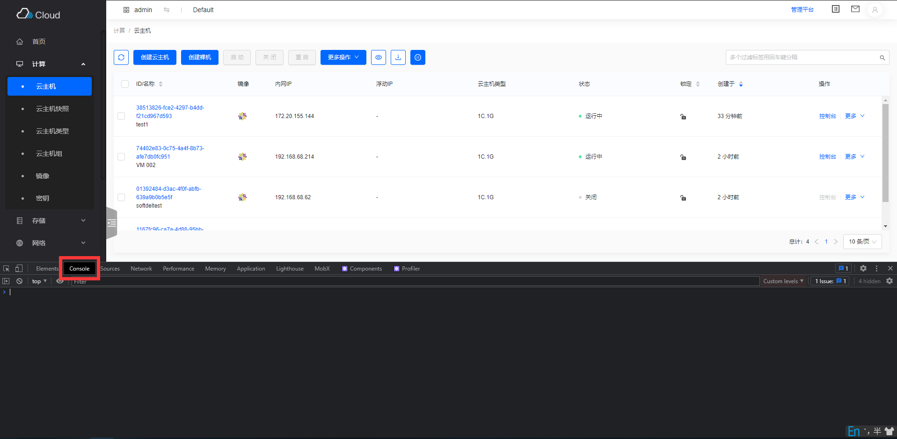
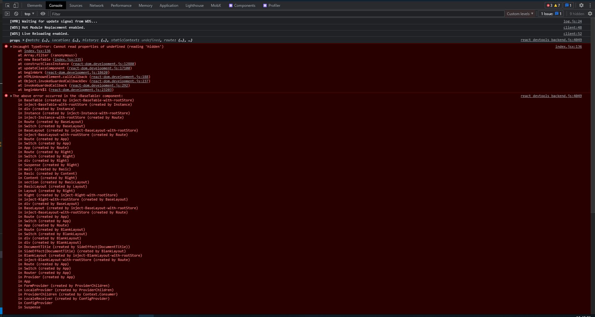
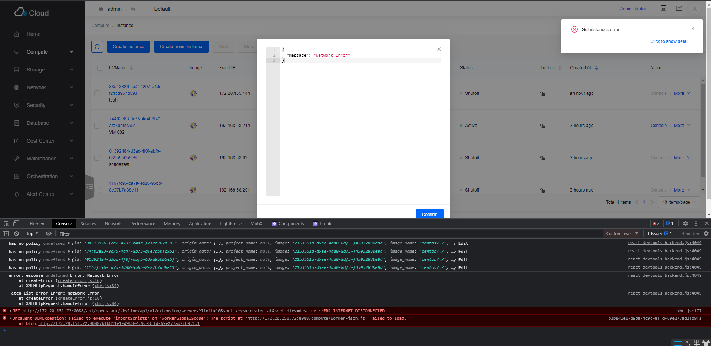
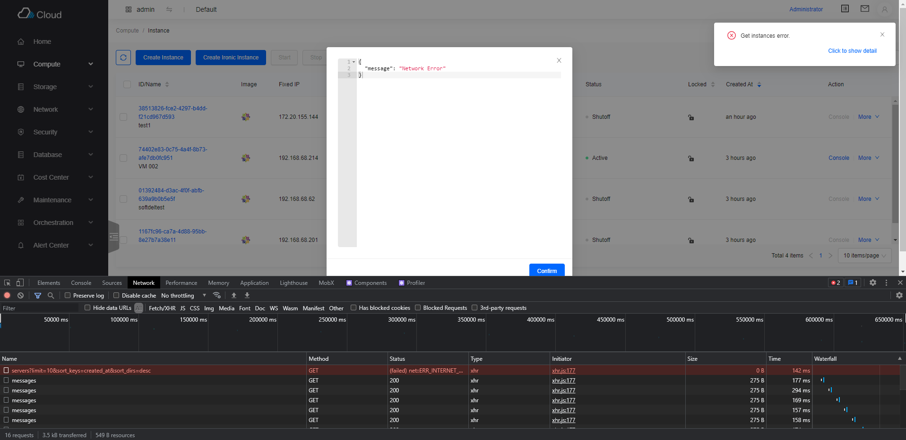
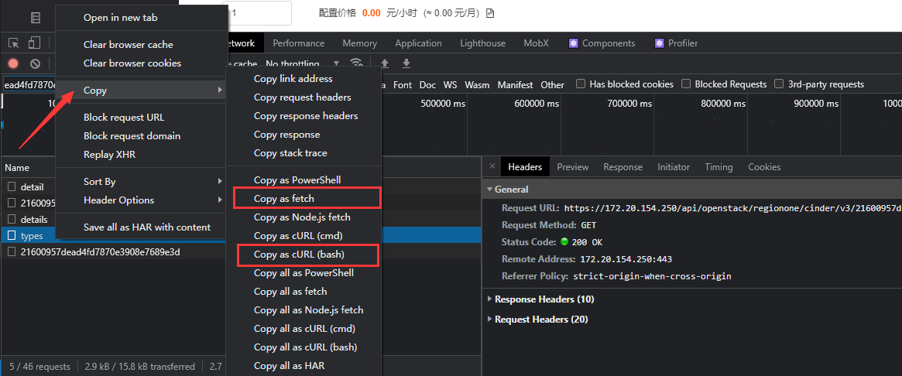
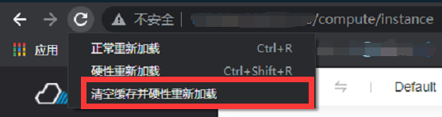

# Skyline 界面问题排错指南

## IaaS 界面上出现问题

如果 `IaaS` 界面上出现以下问题，当分情况讨论：

1. 界面 `Bug`
   1. 界面不显示了（白屏）
   2. 表单提示渲染失败
   3. 提示页面不存在
   4. 提示页面未开放（不属于 `Bug` ，请检查相应的服务有没有部署）
   5. 等
2. 网络 `Bug`
   1. 界面右上角有弹框提示，可以点击查看详情
   2. 操作后界面无响应或一直 `loading`
   3. 操作后 `loading` 之后出现界面 `Bug`
   4. 等
3. 后端 `Bug`
   1. 响应了，但是相应内容不对，会导致前端 `Bug`，此时的网络请求应该是`2xx`。
   2. 无法正常响应，一般会出现 `4xx`, `5xx`的网络问题

非界面操作产生的 `Bug` 可能出现在界面操作中，如：自行调用 `API` 创建资源 / 使用命令行创建资源。

## 问题排查

当页面上出现上述问题的时候（包括但不限于），应当优先使用 `Chrome` 的开发者工具来排查。 打开方式如下：

1. Windows：`Ctrl` + `Shift` + `I`
2. Mac：`Command` + `Shift` + `I`
3. 通用：`F12`，或者右上角点开`自定义及控制`，选择`更多工具`，`开发者工具`

即可打开 `Chrome` 开发者工具，点击 `Console` 按钮，即可进入控制台

界面如下：

如若页面有错误，会在这里展示报错信息。

**必须先打开控制台，再复现错误，`Network` 部分的错误才会显示，`Console` 部分才会正常显示**

例如：

### 前端报错

此处是开发环境做的示范，因此报错调用栈会比较详细，生产环境中不会有这么详细的内容。

### 网络报错

点击 `Network` 选项卡也能清晰的看到对应的请求报红。

以上模拟的网络不通的情况。

附，各种网络 `code` 对应的编码可能导致出错的原因：

> 1xx, 2xx：网络没有问题，并且相应内容正确，页面报错，大概率是前端问题\
> 3xx：本平台几乎没有3xx的请求情况\
> 401，403：权限问题，可能是后端配置错误，也可能是前端权限配置问题\
> 其他4xx：请参照[HTTP状态码列表](https://www.runoob.com/http/http-status-codes.html)自行判断\
> 5xx：服务器 / 后端问题

## 问题反馈

问题产生的原因千变万化，上面描述的也不一定是正确的，请根据实际情况反馈问题。

请按如下步骤反馈：

1. 详细说明复现问题的步骤，包括但不限于：
   1. 请求（创建，修改，拉取，删除）参数（可在 `Network` 中查看）
   2. 操作顺序（必须）
   3. 是否能复现
   4. 环境版本（必须）
   5. 和以下描述的内容，等
2. 如果是前端报错，请附上 `Console` 内的报错信息的截图
3. 如果是网络部分有错误，请附上 `Network` 内的请求的信息的截图。
   - 针对 `1xx` , `2xx`, `3xx`的请求，如果是可以导致问题复现的请求，请点击请求，打开 `Headers` ，`Preview` 或
     `Response`，将这三项的内容截图保存。
   - 针对 `4xx` ，`5xx` 的请求，请点击请求，打开 `Headers` ，`Preview` 或 `Response`，将这三项的内容截图保存。
4. 如果是网络错误，最好可以在 `Network` 中，右击该请求，复制为 `curl` 或者 `fetch` 放置在 `Issue` 内。以 `bash` 格式为准，如图：

   

## 关于缓存问题

如果你升级过平台，并在平台升级前、后都访问平台，并且在升级之后，出现了部分问题。

请**先打开 `F12`开发者工具**，再**右击**地址栏左侧的刷新按钮，选择`清空缓存并硬性重加载`，之后再尝试复现问题。

## 关于 source

平台生产环境的代码经过混淆，在 `source` 中基本不可阅读，如果非要看的话，也可以点开看。

## 拓展阅读

- [Chrome——F12 谷歌开发者工具详解](https://www.cnblogs.com/xiaowenshu/p/10450848.html)
