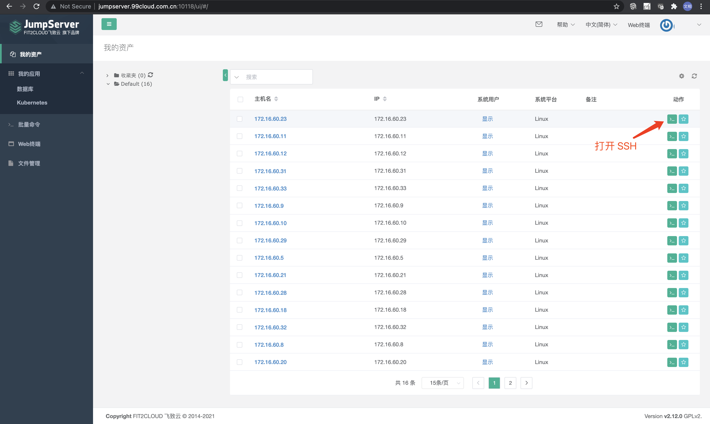
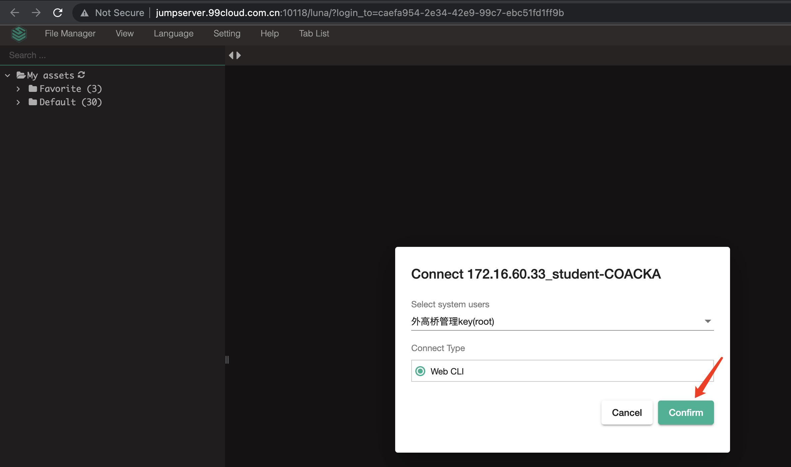

# Build DevStack Lab Environment

## 1. Topo 结构图


## 2. 环境访问方式

### 2.1 从外部访问 SSH

- 外部主机 ssh 登录 <http://jumpserver.99cloud.com.cn:10118>，输入用户名和密码，点击右侧视窗图案登陆 SSH

    

    

- 然后登陆内部 openstack 主机：`ssh trystack@172.25.0.10`，密码：trystack
- 内部 openstack 主机切换 root：`sudo -s`，密码 trystack

### 2.2 访问 OpenStack

1. SSH

    登陆内部 openstack 主机：`ssh trystack@172.25.0.10` 后

    ```console
    root@openstack:~# source /home/devstack/openrc admin

    root@openstack:~# senv | grep OS_
    OS_USER_DOMAIN_ID=default
    OS_AUTH_URL=http://172.25.0.10/identity
    OS_PROJECT_DOMAIN_ID=default
    OS_REGION_NAME=RegionOne
    OS_PROJECT_NAME=demo
    OS_IDENTITY_API_VERSION=3
    OS_TENANT_NAME=demo
    OS_AUTH_TYPE=password
    OS_PASSWORD=trystack
    OS_USERNAME=admin
    OS_VOLUME_API_VERSION=3
    OS_CACERT=

    root@openstack:~# openstack token issue
    ```

1. 访问网页界面 Horizon Dashboard，比如 `http://211.152.62.6:10119`，这里的 IP 和端口号需要按实际分配到的项来填写。

    openstack 网页，帐号：`admin`，密码：`trystack`

## 3. 如何恢复环境？

### 3.1 虚拟机重启

在外部主机上输入 iptables 命令完成端口转发

```bash
iptables -t nat -A PREROUTING -p tcp --dport 80 -j DNAT --to-destination 172.25.0.10:80
iptables -t nat -A PREROUTING -p tcp --dport 6080 -j DNAT --to-destination 172.25.0.10:6080
iptables -t nat -A POSTROUTING -o eth0 -j MASQUERADE
```

### 3.2 OpenStack 环境损坏

可以 Revert KVM Snapshot

```console
[root@coa-student-batchc-3 ~]# virsh list --all
 Id    Name                           State
----------------------------------------------------
 1     openstack-devstack             running


[root@coa-student-batchc-3 ~]# virsh snapshot-list openstack-devstack  
 Name                 Creation Time             State
------------------------------------------------------------
 openstack-ready      2021-07-21 17:24:57 +0800 running
 ready-to-devstack    2021-07-21 14:51:34 +0800 shutoff


[root@coa-student-batchc-3 ~]# virsh snapshot-revert openstack-devstack --snapshotname openstack-ready --force
```
